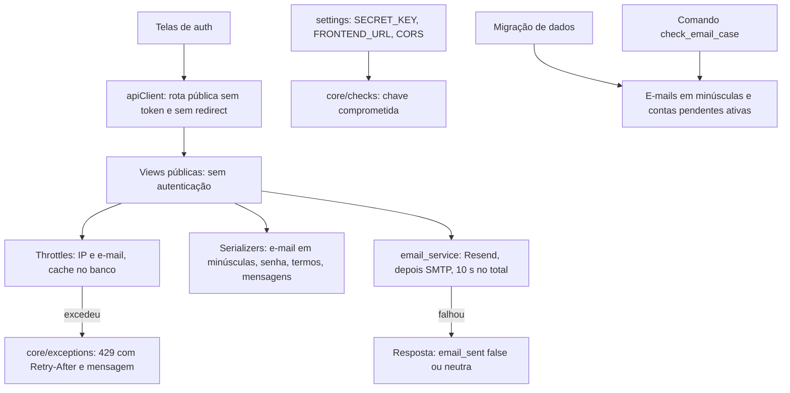

# Autenticacao Design

**Spec**: `.specs/features/autenticacao/spec.md`
**Status**: Approved

---

## Architecture Overview

As regras ficam no backend, nas views e nos serializers de `api/`, com três peças novas em `core/`: as classes de limite de tentativas, o tratamento do 429 no handler de exceções e uma checagem de sistema para a `SECRET_KEY`. O envio de e-mail passa a ser síncrono, com orçamento de 10 segundos para todos os provedores e retorno de sucesso ou falha para a view decidir a resposta. No frontend, o `apiClient` deixa de mandar token e de redirecionar nas rotas públicas, as telas passam a mostrar os erros do backend no campo certo, e um componente de reenvio da verificação aparece onde a spec pede.

### Abordagens consideradas para os limites

| Abordagem | Como funciona | Decisão |
| --------- | ------------- | ------- |
| **Throttles do DRF com cache no banco (escolhida)** | Classes derivadas de `SimpleRateThrottle` e uma classe própria para as falhas por e-mail, gravando no `DatabaseCache` | Usa o mecanismo que o DRF já tem, dá o `Retry-After` pronto e o contador vale para todos os workers e sobrevive a reinícios |
| Throttles do DRF com cache em memória | O mesmo, com `LocMemCache` | Cada worker do Gunicorn teria o próprio contador, e um reinício zera tudo |
| Modelo próprio de tentativas | Uma tabela com cada tentativa | Mais código para o mesmo resultado; o cache no banco já é uma tabela |

---

## Code Reuse Analysis

### Existing Components to Leverage

| Component | Location | How to Use |
| --------- | -------- | ---------- |
| `UserRegisterSerializer`, `ResetPasswordSerializer` | `api/serializers.py:8-38` e `:167-175` | Mantidos, com as mensagens e validações da spec |
| `CustomTokenObtainPairSerializer` | `api/serializers.py:127-162` | Passa a decidir a mensagem só depois de conferir a senha (AUTH-13 a AUTH-16) |
| Validadores de senha do Django | `core/settings.py:108-121` | Já cobrem AUTH-04; faltam as mensagens em português, com `LANGUAGE_CODE = 'pt-br'` |
| `_mask_email` | `api/utils/email_service.py:19-27` | Usado em todo log de e-mail |
| `EmailVerificationToken` e `PasswordResetToken` | `api/models.py:91-109` | Mantidos; o reenvio marca os anteriores como usados |
| `core/exceptions.py` | criado na atualização de dependências | Recebe o tratamento do 429 |
| Base de testes com dois usuários | `tests/isolamento/base.py` | Referência de estilo; a autenticação tem a própria base em `tests/autenticacao/` |

### Integration Points

| System | Integration Method |
| ------ | ------------------ |
| DRF | `throttle_classes` e `authentication_classes = []` nas views públicas; `EXCEPTION_HANDLER` já aponta para `core/exceptions.py` |
| Cache | `CACHES` com `DatabaseCache`; `createcachetable` no `entrypoint.sh`. O runner de testes do Django cria a tabela sozinho |
| Resend | Chamada HTTP direta a `https://api.resend.com/emails` com `requests` e timeout, no lugar da biblioteca, que não aceita timeout por chamada |
| SMTP | `get_connection(timeout=...)` do Django com o tempo que sobra do orçamento |
| Render | `SECRET_KEY` nova e `FRONTEND_URL` nas variáveis de ambiente; `NUM_PROXIES` para ler o IP do cliente |
| Frontend | `src/services/apiClient.ts`, as cinco telas em `src/app/auth/` e o componente novo de reenvio |

---

## Components

### Configuração de segurança (`core/settings.py`)

- **Purpose**: impedir que o backend suba em produção com configuração que falhe aberta (AUTH-37 a AUTH-39).
- **Interfaces**:
  - Com `DEBUG` desligado, a falta de `SECRET_KEY` ou de `FRONTEND_URL` levanta `ImproperlyConfigured` com o nome da variável. Com `DEBUG` ligado, continuam os valores de desenvolvimento.
  - Sem `CORS_ALLOWED_ORIGINS`, a lista fica vazia e `CORS_ALLOW_ALL_ORIGINS` fica `False`.
  - `CACHES` com `DatabaseCache` (tabela `fluxar_cache`).
  - `REST_FRAMEWORK['NUM_PROXIES']` lido de `NUM_PROXIES`, com padrão 1.
  - `LOGGING` com saída no console, nível INFO para `api` e `core`, para os logs de e-mail aparecerem.
  - `LANGUAGE_CODE = 'pt-br'`, para as mensagens dos validadores de senha saírem em português.

### Checagem da chave (`core/checks.py`)

- **Purpose**: impedir a chave antiga do histórico em produção (AUTH-42).
- **Interfaces**: `check_secret_key(app_configs, **kwargs)`, registrada como checagem de segurança. Com `DEBUG` desligado, dá erro quando o SHA-256 da `SECRET_KEY` está na lista `CHAVES_COMPROMETIDAS` ou quando a chave começa com `django-insecure`.
- A lista guarda só os hashes das chaves que aparecem no histórico do repositório, nunca a chave.

### Serviço de e-mail (`api/utils/email_service.py`)

- **Purpose**: montar e enviar os e-mails transacionais com segurança e prazo (AUTH-24, AUTH-25, AUTH-28 a AUTH-30).
- **Interfaces**:
  - `send_verification_email(user, token) -> bool` e `send_password_reset_email(user, token) -> bool`: devolvem `True` se algum provedor enviou.
  - `_send_with_fallback_chain(...)`: tenta Resend e depois SMTP com um prazo único de 10 segundos, medido com `time.monotonic()`. O EmailJS só entra com `DEBUG` ligado e a flag de teste.
  - Todo texto do usuário passa por `django.utils.html.escape` antes de entrar no HTML.
  - Os links usam `settings.FRONTEND_URL`.
  - Cada tentativa gera um log com o tipo do e-mail, o provedor, o resultado e o endereço mascarado.

### Gerenciador de usuários (`api/models.py`)

- **Purpose**: e-mail sem diferença de caixa (AUTH-02).
- **Interfaces**:
  - `UserManager.normalize_email` passa o endereço inteiro para minúsculas.
  - `UserManager.get_by_natural_key(email)` busca primeiro o e-mail em minúsculas e, se não achar, o e-mail exato. O segundo caso cobre as contas antigas que só diferem na caixa e aguardam resolução manual (AUTH-44).

### Cadastro (`api/serializers.py` e `api/views.py`)

- **Purpose**: AUTH-01 a AUTH-06 e AUTH-26.
- **Interfaces**:
  - `UserRegisterSerializer`:
    - confere o e-mail já cadastrado com `email__iexact`, com a mensagem de AUTH-03;
    - põe os erros de senha no campo `password`;
    - exige `terms_accepted` verdadeiro;
    - valida o nome vazio ou com mais de 255 caracteres.
  - `RegisterView`:
    - cria a conta com `email_verified=False` e `is_active=True`;
    - trata o `IntegrityError` de dois cadastros simultâneos como AUTH-03;
    - envia o e-mail na própria requisição e responde 201 com `email_sent`, com a mensagem de AUTH-26 quando o envio falha.

### Verificação e reenvio (`api/views.py`)

- **Purpose**: AUTH-08 a AUTH-12.
- **Interfaces**:
  - `VerifyEmailView.get`:
    - trata como inválido o token inexistente, usado, vencido ou substituído;
    - responde 400 com `{"detail": "Link inválido ou expirado.", "code": "invalid_link"}`;
    - com um link válido, confirma o e-mail e devolve os tokens como hoje.
  - `ResendVerificationView.post` (`/api/auth/resend-verification/`, novo):
    - com uma conta pendente, invalida os tokens anteriores, cria um novo e envia;
    - responde sempre a mensagem neutra de AUTH-11.
  - O comando `cleanup_inactive_users` é removido (AUTH-12).

### Login (`api/serializers.py` e `api/urls.py`)

- **Purpose**: AUTH-13 a AUTH-17.
- **Interfaces**:
  - `CustomTokenObtainPairSerializer.validate`:
    1. busca a conta pelo e-mail em minúsculas e confere a senha com `check_password`;
    2. com a senha errada ou sem conta, responde a mensagem de AUTH-15;
    3. com a senha certa, a conta desativada recebe AUTH-16 (`code: account_disabled`) e a pendente recebe AUTH-13 (`code: email_not_verified`);
    4. só então gera os tokens.
  - A rota `/api/token/` e `api/serializers_auth.py` são removidos.

### Esqueci a senha e redefinição (`api/views.py` e `api/serializers.py`)

- **Purpose**: AUTH-18 a AUTH-22 e AUTH-27.
- **Interfaces**:
  - `ForgotPasswordView`:
    - responde sempre a mensagem de AUTH-18;
    - com uma conta cadastrada, invalida os links anteriores, cria um de 1 hora e envia na própria requisição;
    - registra no log a falha de envio, com o e-mail mascarado.
  - `ResetPasswordView`:
    - trata o token inexistente, usado ou vencido como AUTH-21;
    - com a senha válida, troca a senha, invalida o link e marca `email_verified=True`;
    - não mexe em `is_active`, então a conta desativada continua desativada.
  - `ResetPasswordSerializer`: os erros de senha e de confirmação vão para `new_password`.

### Limites de tentativas (`core/throttles.py`)

- **Purpose**: AUTH-31 a AUTH-35.
- **Interfaces**:

  | Classe | Chave | Taxa | Onde |
  | ------ | ----- | ---- | ---- |
  | `LoginIPThrottle` | IP | 5 por minuto | login |
  | `LoginFalhasEmailThrottle` | e-mail em minúsculas | 10 falhas por hora; só a falha conta, e o bloqueio vale também para a senha certa | login |
  | `CadastroIPThrottle` | IP | 5 por hora | cadastro |
  | `PedidoEmailThrottle` | e-mail em minúsculas, por rota | 3 por hora | "esqueci a senha" e reenvio |
  | `PedidoIPThrottle` | IP, por rota | 10 por hora | "esqueci a senha" e reenvio |
  | `LinkIPThrottle` | IP | 20 por hora | verificação e redefinição |

- `LoginFalhasEmailThrottle` expõe `registrar_falha(email)`. O serializer de login chama esse método quando a senha está errada ou a conta não existe.

### Resposta 429 (`core/exceptions.py`)

- **Purpose**: AUTH-36.
- **Interfaces**: o `exception_handler` troca a mensagem do `Throttled` por "Muitas tentativas. Tente novamente em N minutos.", com N = teto de `wait / 60` e no mínimo 1. O DRF já coloca o `Retry-After`.

### Rotas públicas (`api/views.py`)

- **Purpose**: AUTH-40.
- **Interfaces**: `authentication_classes = []` nas seis views públicas (cadastro, login, verificação, reenvio, "esqueci a senha" e redefinição). A renovação fica com a feature `sessao`.

### Dados existentes

- **Migração `api/migrations/0010_email_minusculo_e_pendentes`** (AUTH-43):
  - passa para minúsculas o e-mail das contas cujo e-mail em minúsculas não coincide com o de outra conta;
  - marca `is_active=True` nas contas com `email_verified=False` e `is_active=False`, que eram as pendentes no modelo antigo.
- **Comando `check_email_case`** (AUTH-44): lista os grupos de contas cujos e-mails só diferem na caixa, com ID e e-mail mascarado, sem alterar nada.

### Frontend

- **`src/services/apiClient.ts`** (AUTH-41):
  - uma lista `ROTAS_PUBLICAS` com os seis caminhos;
  - nessas rotas, o interceptor não põe o `Authorization`, e um 401 não tenta renovar nem redireciona;
  - uma função `mensagemDeErro(error)` devolve o `detail` do backend, inclusive o 429 (AUTH-36).
- **`src/components/auth/resend-verification.tsx`** (novo; AUTH-09, AUTH-10, AUTH-13, AUTH-26 na interface): botão que chama `/auth/resend-verification/` com o e-mail e mostra a mensagem neutra ou a do 429.
- **Telas**:
  - `register`: erros de campo do backend no campo e reenvio quando `email_sent` é `false` (AUTH-07, AUTH-26);
  - `login`: reenvio quando o `code` é `email_not_verified`, e mensagem do 429;
  - `verify-email`: reenvio quando o link é inválido (AUTH-09);
  - `reset-password`: campos `token`, `new_password` e `new_password_confirm`, erro no campo e oferta de novo link quando o link é inválido (AUTH-21 a AUTH-23);
  - `forgot-password`: mensagem neutra do backend e mensagem do 429.

---

## Data Models (if applicable)

Nenhuma mudança de esquema no `User` nem nos tokens. A migração 0010 só altera dados. A tabela de cache `fluxar_cache` é criada pelo `createcachetable`.

Muda o significado dos campos de estado da conta:

| Estado | `email_verified` | `is_active` |
| ------ | ---------------- | ----------- |
| Pendente de verificação | `False` | `True` |
| Verificada e ativa | `True` | `True` |
| Desativada pelo administrador | qualquer | `False` |

---

## Error Handling Strategy

| Error Scenario | Handling | User Impact |
| -------------- | -------- | ----------- |
| E-mail já cadastrado, inclusive com outra caixa ou em cadastro simultâneo | 400 em `email` | "Este e-mail já está cadastrado. Se a conta é sua, use \"Esqueci a senha\"." no campo |
| Senha fraca ou confirmação diferente | 400 em `password` ou `new_password` | Motivo do validador, em português, no campo |
| Termos não aceitos ou nome inválido | 400 no campo | Motivo no campo |
| Senha errada ou e-mail inexistente | 400, `detail` | "E-mail ou senha incorretos." |
| Conta pendente, senha certa | 400, `code: email_not_verified` | Mensagem e botão de reenvio |
| Conta desativada, senha certa | 400, `code: account_disabled` | "Esta conta está desativada." |
| Link inválido, vencido, usado ou substituído | 400, `code: invalid_link` | "Link inválido ou expirado." e oferta de reenvio ou de novo link |
| Nenhum provedor enviou a verificação | 201, `email_sent: false` | Mensagem de AUTH-26 e botão de reenvio |
| Nenhum provedor enviou a redefinição | 200 neutro, falha no log | Mensagem de AUTH-18 |
| Limite excedido | 429, `Retry-After` | "Muitas tentativas. Tente novamente em N minutos." |
| Produção sem `SECRET_KEY` ou `FRONTEND_URL`, ou com chave comprometida | A inicialização para com `ImproperlyConfigured` ou com o erro da checagem | O deploy falha e nomeia a variável |

---

## Risks & Concerns

| Concern | Location (file:line) | Impact | Mitigation |
| ------- | -------------------- | ------ | ---------- |
| O IP atrás do proxy do Render depende de quantos proxies há na frente (o Render usa Cloudflare) | `core/settings.py` (novo `NUM_PROXIES`) | Com o valor errado, o limite por IP usa o IP do proxy e bloqueia todos juntos, ou aceita IP forjado | `NUM_PROXIES` por variável de ambiente, com padrão 1. Depois do deploy, conferir no log de uma tentativa bloqueada qual IP foi usado. **Incerto:** não achei documentação do Render que diga quantos endereços chegam no `X-Forwarded-For` |
| Sem fila, o cadastro espera o envio | `api/views.py:41-64` | A resposta pode levar até 10 segundos a mais com provedor lento | É o trade-off aceito na AD-011; o orçamento de 10 s limita a espera |
| A biblioteca `resend` não aceita timeout por chamada | `api/utils/email_service.py:54-66` | Uma chamada travada passaria do orçamento | Chamada HTTP direta com `requests` e timeout. O pacote `resend` fica no `requirements.txt` sem uso até uma limpeza |
| Contas pendentes no modelo antigo têm `is_active=False` | `api/views.py:44` | Sem a migração, continuariam barradas como desativadas | A migração 0009 marca as pendentes como ativas; uma conta desativada pelo admin que nunca verificou o e-mail volta a ficar ativa, mas continua sem entrar até verificar |
| Chave antiga no histórico público (SEG-03) | `core/settings.py:17` e histórico do git | Com a chave antiga, qualquer um forja tokens | A checagem recusa a chave antiga em produção, e a troca no Render entra no checklist do PR. A troca encerra as sessões abertas, como aceito na spec |
| `print` e logs com e-mail inteiro nas views de auth | `api/views.py:60-64`, `:146-156` | Dado pessoal em log (AD-019) | As tarefas que reescrevem essas views usam o e-mail mascarado; os demais `print` do projeto ficam com a spec `lgpd` |
| Throttle por e-mail com e-mail malformado | `core/throttles.py` | Uma chave vazia juntaria todos os pedidos sem e-mail num contador só | Sem e-mail válido no corpo, vale só o limite por IP |

---

## Tech Decisions (only non-obvious ones)

| Decision | Choice | Rationale |
| -------- | ------ | --------- |
| Estado da conta pendente | `is_active=True` e `email_verified=False` | Com `is_active` indicando só a desativação pelo administrador, o login distingue AUTH-13 de AUTH-16 sem ambiguidade |
| Contador dos limites | `DatabaseCache` | Vale para todos os workers e sobrevive a reinício, sem Redis |
| Conferência da senha no login | O serializer confere a senha antes de olhar o estado da conta | O aviso de conta pendente ou desativada só aparece com a senha certa (SEG-10) |
| Chave comprometida | Hash SHA-256 no código, nunca a chave | Barra a chave antiga sem repeti-la no repositório |
| Testes do frontend | Vitest e Testing Library, em `tests/<feature>/` no repositório do frontend | Decisão do usuário; roda no CI sem navegador. O fluxo completo é testado pela API no backend |

Duas decisões valem para as próximas features e foram registradas em `.specs/STATE.md`:
- **AD-034**: os testes do frontend usam Vitest e Testing Library, em `tests/<feature>/`, e rodam no CI.
- **AD-035**: conta pendente de verificação tem `is_active=True`; `is_active=False` é só desativação pelo administrador.
