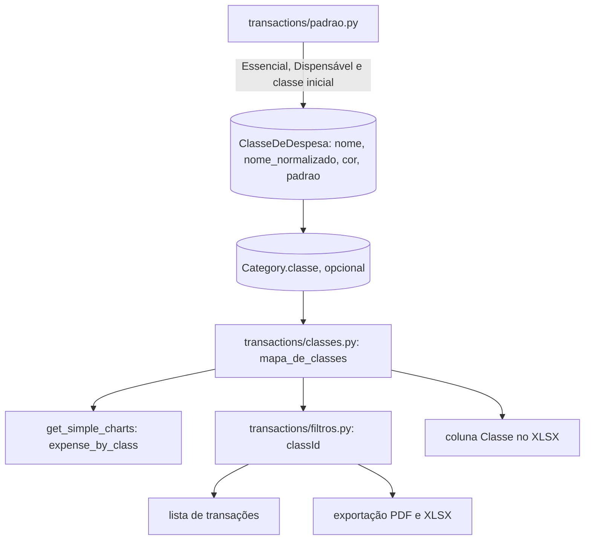

# Classes de despesa Design

**Spec**: `.specs/features/classes-de-despesa/spec.md`
**Status**: Approved

---

## Architecture Overview

A classe é um modelo novo do usuário (`ClasseDeDespesa`). A categoria de despesa ganha um campo opcional com a classe própria.

A classe efetiva (CLASSE-16) nunca é gravada: ela é calculada na hora. Um mapa por usuário liga cada categoria à classe efetiva dela. O usuário tem poucas categorias, então o mapa sai de uma consulta e é resolvido em Python, subindo a árvore até achar uma classe própria.

Relatórios, filtro e exportação usam o mesmo mapa. Os relatórios somam as despesas por categoria no banco e juntam as somas por classe. O filtro troca as classes pedidas pelos ids das categorias que têm essas classes. Assim, a soma por classe usa sempre as mesmas transações da soma por categoria (CLASSE-29), e mudar a classe de uma categoria muda também os meses passados (CLASSE-30).



### Abordagens consideradas

| Abordagem | Prós | Contras | Decisão |
| --------- | ---- | ------- | ------- |
| Gravar a classe efetiva em cada categoria e propagar nas mudanças | Consulta simples | Toda mudança de classe, de mãe ou exclusão de classe precisa propagar para a árvore; o risco de ficar desatualizada é alto | Recusada |
| Classe efetiva por subconsulta recursiva no banco (CTE) | Tudo no SQL | O ORM não tem CTE recursiva; SQL cru em três lugares | Recusada |
| Mapa categoria → classe efetiva resolvido em Python por usuário | Uma consulta pequena; o mesmo mapa serve aos relatórios, ao filtro e à exportação; inclui as categorias excluídas (CLASSE-27) | Carrega todas as categorias do usuário a cada uso | **Escolhida (AD-052)** |
| Nome único comparado na hora, com `unaccent` | Sem coluna extra | Exige a extensão no Postgres; não garante a unicidade com pedidos simultâneos | Recusada |
| Coluna `nome_normalizado` com restrição única por usuário | A restrição do banco segura pedidos simultâneos (CLASSE-12) | Uma coluna derivada | **Escolhida** |

---

## Code Reuse Analysis

### Existing Components to Leverage

| Component | Location | How to Use |
| --------- | -------- | ---------- |
| `OwnedPrimaryKeyRelatedField` | `core/fields.py:27-50` | Campo `expense_class` da categoria; nova mensagem `CLASSE_NAO_ENCONTRADA = 'Classe não encontrada.'` (CLASSE-23, AD-010); o teste de inventário de `tests/isolamento` exige esse campo |
| `normalizar` | `data_exchange/importacao/texto.py:18-25` | Nome normalizado da classe e casamento dos nomes na implantação (CLASSE-07, CLASSE-25); a função vai para `core/texto.py` e a importação passa a importar de lá |
| `criar_padrao_do_cadastro` | `transactions/padrao.py:39-69` | Cria Essencial e Dispensável e dá a classe inicial às categorias padrão; a limpeza do painel já chama (AD-050) |
| `regras.despesas` | `reports/regras.py:84-93` | Mesmas transações da divisão por categoria |
| `filtrar_transacoes` | `transactions/filtros.py:52-111` | Recebe o filtro `classId`; a lista e as exportações já chamam |
| `ParametrosConhecidosMixin` | `core/filtros.py:25-47` | `classId` entra na lista de transações e em `PARAMETROS_DA_EXPORTACAO` |
| `ExportService._linhas_de_transacoes` | `data_exchange/services.py:100-129` | Ganha a coluna "Classe"; `generate_dados_da_conta` acrescenta a coluna na lista explícita |
| `select_for_update` no usuário | `core/travas.py:313-328` | Trava o usuário ao criar classe, antes de contar (CLASSE-12) |
| `MODELOS_DO_USUARIO` | `api/exclusao.py:25-45` | `ClasseDeDespesa` entra na lista; o teste de completude obriga (CLASSE-14) |
| `CategoryDistributionChart` | `fluxar-frontend/src/components/dashboard/CategoryDistributionChart.tsx` | Base visual do novo gráfico por classe |
| `TransactionFilters` | `fluxar-frontend/src/components/transactions/transaction-filters.tsx` | Ganha a seleção de classes, usada na lista e na exportação |
| `tratarErro` | `fluxar-frontend/src/lib/erros.ts` | Erros de nome e de limite no gerenciamento de classes |

### Integration Points

| System | Integration Method |
| ------ | ------------------ |
| Gráficos simples | `GET /api/reports/charts/simple/` ganha `expense_by_class` |
| Lista e exportação | Parâmetro `classId` repetido, com `sem_classe` para "Sem classe" (AD-022) |

---

## Components

### Modelo e implantação

- **Purpose**: guardar as classes e a classe própria de cada categoria; dar as classes a quem já existe.
- **Location**: `transactions/models.py`, `transactions/migrations/`, `api/exclusao.py`
- **Interfaces**:
  - `ClasseDeDespesa`: `id` (UUID), `user` (FK, CASCADE), `nome` (30), `nome_normalizado` (30), `cor` (7), `padrao` (bool), `criada_em`. Restrição única em `(user, nome_normalizado)`.
  - `Category.classe`: FK opcional para `ClasseDeDespesa`, `SET_NULL`. Excluir a classe tira a classe própria das categorias (CLASSE-10), e a herança volta a valer.
  - Migração de dados (CLASSE-25):
    - cria Essencial e Dispensável para cada usuário;
    - dá a classe inicial às categorias de despesa sem mãe cujo nome normalizado é o de uma categoria padrão de CLASSE-24;
    - a regra e a lista ficam copiadas na migração.
  - `ClasseDeDespesa` entra em `MODELOS_DO_USUARIO`, depois de `Category`.
  - Na limpeza do painel, as classes não ficam em `MANTIDOS_NA_LIMPEZA`: são apagadas e recriadas pelo padrão.

### Padrão do cadastro

- **Location**: `transactions/padrao.py`
- **Interfaces**:
  - `criar_padrao_do_cadastro` cria Essencial (`#16A34A`) e Dispensável (`#F97316`).
  - Essencial vai para Casa, Comida, Transporte e Educação; Dispensável vai para Lazer, Eletrônicos, Doces, Doação e Presente (CLASSE-01, CLASSE-24).
  - Aluguel e Energia ficam sem classe própria e herdam Essencial de Casa.

### Classe efetiva (AD-052)

- **Location**: `transactions/classes.py` (novo)
- **Interfaces**:
  - `mapa_de_classes(usuario)` devolve `{categoria_id: classe | None}` para todas as categorias do usuário, ativas e excluídas (CLASSE-27).
    - Usa a classe própria da categoria; sem ela, a classe efetiva da mãe (CLASSE-16).
    - Categorias de receita ficam com `None`.
    - Protege contra ciclos na árvore.
  - `categorias_das_classes(usuario, ids_de_classe, sem_classe)` devolve os ids de categoria com classe efetiva entre as pedidas e, com `sem_classe`, os sem classe.
  - `SEM_CLASSE = 'sem_classe'`.

### API das classes

- **Location**: `transactions/views.py`, `transactions/serializers.py`, `transactions/urls.py`
- **Interfaces**:
  - `GET /api/expense-classes/` lista sem paginação (CLASSE-02), com `id`, `name`, `color`, `is_default` e `categories_count`. A contagem são as categorias ativas com essa classe própria (CLASSE-09).
  - `POST` aceita `{name, color}`:
    - Trava o usuário com `select_for_update` e conta as classes.
    - Com 5, responde 400 `{"detail": "Limite de 5 classes atingido."}` (CLASSE-05).
    - Nome vazio ou com mais de 30 caracteres recebe 400 no campo `name` (CLASSE-06).
    - Nome repetido, sem diferença de maiúsculas e acentos, recebe 400 `{"name": ["Já existe uma classe com esse nome."]}` (CLASSE-07). O mesmo vale quando a restrição única do banco recusar.
  - `PATCH` muda o nome e a cor. Nas classes padrão, mudar o nome recebe 400 `{"detail": "As classes padrão não podem ser excluídas nem renomeadas."}`, e a cor pode mudar (CLASSE-08).
  - `DELETE`:
    - Na classe padrão, recebe o mesmo 400 de CLASSE-08.
    - Na classe criada pelo usuário, apaga dentro da transação da requisição (CLASSE-10, CLASSE-11).
  - Nenhum log grava o nome da classe (CLASSE-15).
  - Nenhuma trava de plano (CLASSE-13).
  - As sugestões (CLASSE-03) são uma lista fixa no frontend: Dívidas, Impostos e taxas, Profissional.

### Classe das categorias

- **Location**: `transactions/serializers.py` (`CategorySerializer`)
- **Interfaces**:
  - Campo gravável `expense_class` (`OwnedPrimaryKeyRelatedField`, nulo permitido) (CLASSE-17, CLASSE-23).
  - Campos de leitura (CLASSE-18):
    - `effective_class`: `{id, name, color}` ou `null`;
    - `class_inherited`: verdadeiro quando a efetiva vem da mãe.
  - O mapa de classes vai no contexto do serializer, para as subcategorias aninhadas não repetirem consultas.
  - Categoria de receita com classe recebe 400 `{"expense_class": ["Categorias de receita não têm classe."]}` (CLASSE-21).
  - Uma categoria de despesa que passa a ser de receita perde a classe própria (CLASSE-22).
  - A importação continua criando categorias sem classe própria (CLASSE-26).

### Divisão por classe nos gráficos

- **Location**: `reports/services.py` (`get_simple_charts`)
- **Interfaces**:
  - `expense_by_class: [{class_id, class_name, color, amount}]`.
    - Soma `regras.despesas` do período por `category_id` e junta pelo mapa (CLASSE-28, CLASSE-29, CLASSE-30).
    - As despesas sem classe efetiva ou sem categoria vão para `{class_id: null, class_name: "Sem classe", color: "#94A3B8"}`.
    - A ordem é do maior valor para o menor.
    - Os valores são texto com duas casas (CONTRATO-16).
  - A soma de `expense_by_class` é igual à de `expense_by_category`.
  - Período sem despesas devolve a lista vazia.

### Filtro por classe

- **Location**: `transactions/filtros.py`, `transactions/views.py`, `data_exchange/views.py`
- **Interfaces**:
  - `classId` repetido.
    - Aceita ids de classe do usuário e `sem_classe`.
    - Restringe a `TIPOS_DE_DESPESA` (CLASSE-34, CLASSE-35, CLASSE-36).
    - Combina com o filtro de categoria por "e" (CLASSE-37).
  - Um valor que não é classe do usuário nem `sem_classe` recebe 400 `{"classId": ["Classe inválida no filtro: <valor>."]}` (CLASSE-38).
  - A lista de transações e as duas exportações aceitam `classId` (CLASSE-39). Nenhum relatório aceita o filtro de categoria hoje, então nenhum relatório ganha o de classe.

### Coluna Classe no XLSX

- **Location**: `data_exchange/services.py`
- **Interfaces**:
  - `_linhas_de_transacoes(queryset, mapa)` ganha "Classe". Despesas e compras no cartão mostram a classe efetiva ou "Sem classe"; as demais ficam vazias (CLASSE-40).
  - O XLSX das transações e o download dos dados da LGPD mostram a coluna. O PDF continua sem ela.
  - A view do XLSX ganha `select_related` da categoria, da mãe e da conta.

### Frontend

- **Location**:
  - `src/services/expense-classes.ts` e `src/types/categories.ts`;
  - `src/app/(app)/categorias/page.tsx`, `src/components/categories/CategoryForm.tsx` e `src/components/categories/GerenciarClasses.tsx` (novo);
  - `src/components/dashboard/ClassDistributionChart.tsx` (novo), `dashboard/page.tsx`, `relatorios/page.tsx`;
  - `transaction-filters.tsx`, `transacoes/page.tsx`, `services/import-export.ts`.
- **Gerenciar classes** (CLASSE-03 a CLASSE-09):
  - Botão no cabeçalho da página de categorias, ao lado de "Nova Categoria".
  - A lista mostra as classes com a cor. As padrão aparecem marcadas e sem renomear nem excluir.
  - As sugestões que o usuário ainda não criou ficam como atalhos. Criar mostra os erros de nome no campo e o limite pelo `tratarErro`.
  - Excluir mostra "N categorias usam esta classe" e pede confirmação.
- **Categorias** (CLASSE-17, CLASSE-19, CLASSE-20):
  - O formulário de despesa ganha a seleção da classe.
  - Na subcategoria, a primeira opção é "Herdar da categoria-mãe (<classe>)", escolhida por padrão.
  - Na receita, a seleção não aparece.
  - A lista mostra a classe efetiva com a cor e "(herdada)" quando vier da mãe.
- **Gráfico por classe** (CLASSE-31, CLASSE-32, CLASSE-33):
  - Fica no dashboard e na tela Relatórios, ao lado do gráfico de despesas por categoria.
  - Mostra o valor e a porcentagem de cada classe sobre o total, com uma casa decimal, calculada em centavos (AD-041). Cada classe aparece na sua cor, e "Sem classe" em cinza.
  - Sem despesas, mostra "Nenhuma despesa no período.".
  - Clicar abre `/transacoes?classId=<id ou sem_classe>&startDate=&endDate=` com o período devolvido pelos gráficos.
- **Filtro** (CLASSE-33 a CLASSE-35, CLASSE-39):
  - `TransactionFilters` ganha a seleção de classes com "Sem classe".
  - A lista lê `classId` da URL.
  - A lista e a exportação enviam `classId` repetido.

---

## Data Models

```python
class ClasseDeDespesa(models.Model):
    id = models.UUIDField(primary_key=True, default=uuid.uuid4, editable=False)
    user = models.ForeignKey(settings.AUTH_USER_MODEL, on_delete=models.CASCADE, related_name='classes_de_despesa')
    nome = models.CharField(max_length=30)
    nome_normalizado = models.CharField(max_length=30)
    cor = models.CharField(max_length=7)
    padrao = models.BooleanField(default=False)
    criada_em = models.DateTimeField(auto_now_add=True)

    class Meta:
        constraints = [models.UniqueConstraint(fields=['user', 'nome_normalizado'], name='classe_nome_unico_por_usuario')]

# Category
classe = models.ForeignKey('ClasseDeDespesa', null=True, blank=True, on_delete=models.SET_NULL, related_name='categorias')
```

---

## Error Handling Strategy

| Error Scenario | Handling | User Impact |
| -------------- | -------- | ----------- |
| Sexta classe | 400 `{detail: "Limite de 5 classes atingido."}` | Toast com a mensagem |
| Nome vazio, longo ou repetido | 400 no campo `name` | Erro no campo |
| Renomear ou excluir classe padrão | 400 `{detail}` | Toast; a interface nem oferece a ação |
| Classe de outro usuário na categoria | 400 `{expense_class: ["Classe não encontrada."]}` | Erro no campo |
| Classe em categoria de receita | 400 no campo `expense_class` | Erro no campo |
| Filtro com classe inválida | 400 `{classId: ["Classe inválida no filtro: <valor>."]}` | Toast pelo `tratarErro` |
| Falha no meio da exclusão da classe | Transação da requisição desfeita | Classe e categorias como estavam |

---

## Tech Decisions

| Decision | Choice | Rationale |
| -------- | ------ | --------- |
| AD-052 | Classe efetiva calculada por `mapa_de_classes`, nunca gravada; relatórios, filtro e exportação usam o mesmo mapa; o filtro usa `classId` com `sem_classe` | A herança muda com a classe, a mãe e a exclusão de classes; calcular na hora não deixa nada desatualizado e garante o mesmo conjunto de transações da divisão por categoria |
| Nome único | `nome_normalizado` com restrição única por usuário; `normalizar` vai para `core/texto.py` | Segura pedidos simultâneos sem depender de extensão do Postgres |
| Cores padrão | Essencial `#16A34A`, Dispensável `#F97316`, Sem classe `#94A3B8` | Verde para o necessário, laranja para o que dá para cortar, cinza para o que falta classificar |
| Porcentagem | Calculada no frontend em centavos | A API devolve valores; a tela já soma em centavos (AD-041) |
| Teste da limpeza | `assert_cadastro_novo` passa a contar as duas classes | A limpeza recria o padrão, que agora tem classes (AD-050) |
