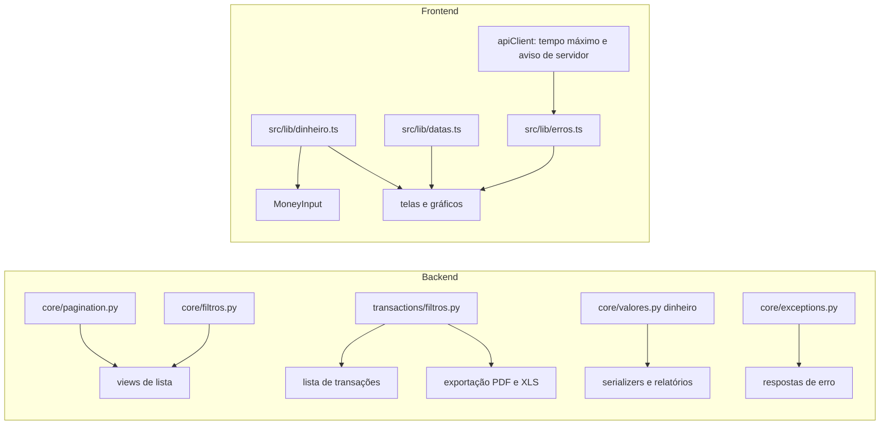

# Contratos frontend backend Design

**Spec**: `.specs/features/contratos-frontend-backend/spec.md`
**Status**: Approved

---

## Architecture Overview

O contrato entre os dois repositórios hoje é decidido tela por tela. O design cria um ponto único para cada assunto, dos dois lados, e faz as telas usarem esse ponto:

| Assunto | Backend | Frontend |
| ------- | ------- | -------- |
| Paginação | `core/pagination.py` (`PaginacaoPadrao`) e `DEFAULT_PAGINATION_CLASS = None` | Coleções lidas como array; listas paginadas lidas por `results` |
| Filtros | `core/filtros.py` (parâmetros conhecidos) e `transactions/filtros.py` (filtro de transações da lista e da exportação) | Parâmetros repetidos com `URLSearchParams` |
| Dinheiro | `core/valores.py` (`dinheiro()`: `Decimal` para "1234.56") | `src/lib/dinheiro.ts` (centavos inteiros, leitura AD-009, formatador único) e `MoneyInput` em texto |
| Datas | Datas sem hora em `AAAA-MM-DD`, lidas por `core/datas.py` (`ler_data`) | `src/lib/datas.ts` (`lerData`, `paraApi`) |
| Preferências | `UserProfileSerializer` lê e grava `preferences` | Configurações enviam só `preferences`; o tema do usuário é aplicado ao carregar |
| Erros | `core/exceptions.py` acrescenta `code`; views sem `{"error": ...}` e sem `str(e)` | `src/lib/erros.ts` (erro de campo no formulário, `detail` no Sonner, rede/5xx/tempo com "Tentar de novo"); só o Sonner |

### Abordagens consideradas

| Abordagem | Prós | Contras | Decisão |
| --------- | -------- | ------- | ------- |
| Dinheiro como texto por um encoder JSON global para todo `Decimal` | Uma linha | Percentuais e taxas em `Decimal` também viram texto com duas casas e perdem precisão | Recusada |
| Função `dinheiro()` aplicada aos campos de dinheiro | Explícito, testável por campo, percentuais continuam números | Varre os relatórios e os `SerializerMethodField` | **Escolhida (AD-041)** |
| `MoneyInput` em centavos digitados (como hoje) | Sem parse | Não aceita "1.500", negativo nem colagem (FE-14) | Recusada |
| `MoneyInput` em texto livre, lido por AD-009 e formatado ao sair do campo | Atende CONTRATO-19 a 21 | Parse na digitação | **Escolhida** |
| Total do dia somado no frontend com mais requisições | Sem mudança no backend | N requisições, ainda limitado à página | Recusada |
| Total do dia na própria resposta da lista (`day_totals`) | Uma consulta agregada | Campo a mais no formato paginado das transações | **Escolhida** |
| Recusa de filtro desconhecido com `django-filter` | Biblioteca pronta | Dependência nova e reescrita de todos os filtros | Recusada; um mixin com a lista de parâmetros de cada rota |

---

## Code Reuse Analysis

### Existing Components to Leverage

| Component | Location | How to Use |
| --------- | -------- | ---------- |
| `StandardResultsSetPagination` | `core/pagination.py` | Vira `PaginacaoPadrao`, com `next` e `previous` no nível de cima e página além da última com 200 |
| `ler_valor`, `ler_saldo` | `core/valores.py` | Ganham a vizinha `dinheiro()` para a saída |
| `hoje()` | `core/datas.py` | Ganha `ler_data(texto, campo)`; aporte e resgate de meta usam `hoje()` quando a data falta |
| Handler de exceções | `core/exceptions.py` | Acrescenta `code` às respostas com `detail` |
| `mensagemDeErro` | `src/services/apiClient.ts:60-66` | Passa a ser chamado por `src/lib/erros.ts` |
| `lerData`, `nomeDoMes` | `src/lib/datas.ts` (feature faturas) | Usados em todas as datas sem hora; ganha `paraApi` |
| `MoneyInput` | `src/components/ui/money-input.tsx` | Reescrito por dentro; os 7 formulários continuam usando o mesmo componente |
| `formatCurrency` de `src/lib/utils.ts:27` | `src/lib/utils.ts` | Passa a reexportar `formatarMoeda` de `src/lib/dinheiro.ts`; as 20 cópias locais saem |
| Aviso de conexão com "Tentar de novo" | `src/components/sessao/aviso-de-conexao.tsx` | Mesmo texto e padrão no aviso do Sonner de `src/lib/erros.ts` |
| Overlay de servidor acordando | `src/components/ui/server-wakeup-overlay.tsx` e `src/services/serverStatus.ts` | Ganha o botão de fechar |

### Integration Points

| System | Integration Method |
| ------ | ------------------ |
| Faturas e saldo | `available_limit`, `current_invoice_total` e `signed_amount` passam a sair como texto; as telas leem por `src/lib/dinheiro.ts`. `day_totals` usa os mesmos sinais de `accounts/saldo.py` |
| Relatórios (feature `relatorios`) | Só o formato muda: valores de dinheiro em texto e o mesmo significado de "despesa" (`TIPOS_DE_DESPESA`) que a lista e a exportação. O cálculo fica com a feature `relatorios` |
| Isolamento | Os filtros novos (`categoryId` com descendentes, `transfer_id`, `is_recurring`) partem do queryset já filtrado pelo usuário; descendentes só de categorias do próprio usuário |
| Permissões e planos | 403 de trava de plano (PERM-19) ainda não existe; `src/lib/erros.ts` mostra o `detail` do 403, e a feature `permissoes-e-planos` acrescenta o tratamento do plano |

---

## Components

### Paginação (`core/pagination.py`, `core/settings.py`)

- `PaginacaoPadrao`: 20 por padrão, `page_size` até 100, resposta `{count, total_pages, current_page, next, previous, results}` (CONTRATO-02, CONTRATO-03).
- Página além da última: `paginate_queryset` captura a página inválida e devolve uma página vazia com os totais corretos e `current_page` igual ao pedido; resposta 200 (CONTRATO-04). Página que não é número segue o mesmo caminho, 200 vazio, para que a tela nunca mostre um erro falso.
- `REST_FRAMEWORK['DEFAULT_PAGINATION_CLASS'] = None`: toda coleção vem completa (CONTRATO-01). `PaginacaoPadrao` é ligada explicitamente em transações, usuários do admin, logs globais do admin e logs de um usuário no admin (AD-021).

### Parâmetros conhecidos (`core/filtros.py`)

- `FILTRO_DESCONHECIDO = 'Filtro desconhecido: {nome}.'`
- `conferir_parametros(request, permitidos)`: levanta `ValidationError({'detail': ...})` com o primeiro nome fora de `permitidos` (ordem alfabética, para a mensagem ser estável) (CONTRATO-14).
- `ParametrosConhecidosMixin`: atributo `parametros_permitidos` (conjunto) e chamada em `initial()` só para `GET`; rotas paginadas incluem `page` e `page_size`. Aplicado em todas as rotas `GET` de lista, detalhe, relatórios e exportação. Rotas de detalhe e coleções sem filtro aceitam conjunto vazio.

| Rota | Parâmetros permitidos |
| ---- | --------------------- |
| `/transactions/` | `page`, `page_size`, `accountId`, `credit_card`, `invoice`, `month`, `year`, `startDate`, `endDate`, `type`, `categoryId`, `tagIds`, `search`, `is_recurring`, `transfer_id` |
| `/export/transactions/pdf/` e `/xls/` | `accountId`, `categoryId`, `type`, `startDate`, `endDate`, `tagIds`, `search` |
| `/categories/` | `type` |
| `/budgets/` | `month`, `year`, `category`, `start_month`, `start_year`, `end_month`, `end_year` |
| `/admin/users/` | `page`, `page_size`, `search`, `show_archived`, `role`, `plan` |
| `/admin/logs/` e `/admin/users/{id}/logs/` | `page`, `page_size` |
| `/reports/dashboard/` | `month`, `year`, `days` |
| `/reports/calendar/`, `charts/simple/`, `charts/tag-distribution/` | `month`, `year`, `period`, `days` |
| `/reports/charts/advanced/` | `period`, `days` |
| `/reports/charts/monthly-comparison/` | `months`, `month`, `year` |
| `/reports/charts/tag-insights/` | `tag_id`, `months` |
| Demais rotas `GET` (contas, cartões, faturas, tags, metas, monitores, perfil) | nenhum |

Os aliases que nenhuma tela usa (`account`, `category` na lista, `tagIds[]`, `tagIds` separado por vírgula) saem.

### Filtro de transações (`transactions/filtros.py`)

- `TIPOS_DE_DESPESA = ('EXPENSE', 'CREDIT_CARD')`, `TIPOS_DE_TRANSFERENCIA = ('TRANSFER_OUT', 'TRANSFER_IN')`; os relatórios importam `TIPOS_DE_DESPESA` no lugar das listas locais (CONTRATO-13).
- `filtrar_transacoes(qs, params, usuario)`, usada pela lista e pelas duas exportações:
  - `type`: `ALL` ignora; `EXPENSE` usa `TIPOS_DE_DESPESA`; `TRANSFER` usa as duas pernas; `INCOME` exato; outro valor dá 400 no campo `type`.
  - `categoryId` repetido (`getlist`): as categorias do usuário com esses ids e todas as descendentes; transações de qualquer uma, uma vez cada (CONTRATO-10, CONTRATO-11). Id que não é do usuário é ignorado, como hoje um id sem transações.
  - `tagIds` repetido.
  - `startDate` e `endDate` por `ler_data` (`AAAA-MM-DD`; outro formato dá 400 no campo) (CONTRATO-22, CONTRATO-25).
  - `is_recurring=true` filtra `recurring_source` não nulo (CONTRATO-15); `transfer_id` filtra as pernas.
  - `accountId`, `credit_card`, `invoice`, `month`+`year`, `search` como hoje.

### Total do dia (`transactions/views.py`)

- A resposta paginada das transações ganha `day_totals`: para cada data presente em `results`, a soma de todas as transações do filtro naquele dia, com sinal (entradas `INCOME` e `TRANSFER_IN` positivas, as demais negativas, a mesma regra que a tela usa hoje), como texto de `dinheiro()` (CONTRATO-09). Uma consulta agregada por `date` restrita às datas da página.

### Dinheiro (`core/valores.py` e usos)

- `dinheiro(valor) -> str`: `Decimal` (ou `int`/`float` vindo de agregação) quantizado em duas casas, `ROUND_HALF_UP`, ponto como separador; `None` vira "0.00" (CONTRATO-16; edge case "0.00").
- Aplicado em:
  - `SerializerMethodField` de dinheiro: `CreditCardSerializer.available_limit` e `current_invoice_total`, `TransactionSerializer.signed_amount`, `BudgetSerializer.total_spent`, `GoalSerializer.current_amount`, `amount_remaining` e `suggested_monthly_saving`;
  - `reports/services.py`: todo valor de dinheiro de `get_dashboard_summary`, `get_financial_health_metrics` (saldos), `get_calendar_data`, `get_simple_charts`, `get_advanced_charts`, `get_monthly_comparison`, `get_user_financial_stats`, `get_tag_insights` e `get_tag_distribution`. Percentuais e razões (`savings_rate`, `liquidity_ratio`, `progress_percentage`, `percentage_used` e afins) continuam números;
  - `AdminStatsView.estimated_revenue`.
- Os campos `DecimalField` dos `ModelSerializer` já saem como texto.

### Datas (`core/datas.py`, `goals/`, `data_exchange/`)

- `ler_data(texto, campo) -> date`: aceita só `AAAA-MM-DD`; outro formato levanta `ValidationError({campo: ['Data inválida. Use o formato AAAA-MM-DD.']})`.
- Aporte e resgate de meta: `date` no corpo, lido por `ler_data`; sem data, `hoje()`. O fallback silencioso para `date.today()` sai. `datetime` deixa de ser aceito (CONTRATO-25).
- Exportação: `startDate` e `endDate` por `ler_data` (via `filtrar_transacoes`).
- Datas com hora já saem em ISO 8601 com `Z` (`USE_TZ`); um teste fixa isso (CONTRATO-23).

### Preferências (`api/serializers.py`)

- `UserProfileSerializer` ganha o campo de escrita `preferences`, um serializer aninhado:
  - `currency`: `ChoiceField(['BRL'])`;
  - `theme`: `ChoiceField(['light', 'dark', 'system'])`;
  - `language`: `ChoiceField(['pt-BR'])`;
  - `notifications`: `DictField(child=BooleanField())`.
  Todos opcionais; `update` grava em `currency`, `theme_preference`, `language` e `notification_settings` (as notificações são mescladas, não substituídas). Valor inválido dá 400 com o erro em `preferences.<campo>` (CONTRATO-26, CONTRATO-28). A leitura continua como hoje.

### Erros no backend (`core/exceptions.py` e views)

- O handler acrescenta `code` às respostas cujo corpo é `{'detail': ...}` (o código do DRF, como `not_found`, `permission_denied`, `invalid`).
- As respostas `{"error": ...}` (budgets, data_exchange, goals, reports, transactions, api) viram `ValidationError`, `NotFound` ou `PermissionDenied` com `detail` em português; nenhuma resposta leva `str(e)` (CONTRATO-29). Erro inesperado sobe e vira 500 sem detalhe interno.
- Orçamento duplicado para a mesma categoria e mês responde 400 com o erro no campo `category` (independent test de CONTRATO-30).
- Os `print` de depuração de `transactions/views.py` e `goals/views.py` saem junto, porque ficam nas linhas reescritas.

### Frontend: dinheiro (`src/lib/dinheiro.ts`, `src/components/ui/money-input.tsx`)

- `paraCentavos(valor: string | number): number` e `deCentavos(centavos: number): string` ("1234.56"); toda conta de dinheiro que vai para a API é feita em centavos inteiros (CONTRATO-17).
- `lerValorDigitado(texto, { negativo }): string | null`: regra de AD-009 ("1.500" → "1500.00"; "12,5" → "12.50"; "0.50" → "0.50"); com `negativo`, aceita o sinal de menos (CONTRATO-19, CONTRATO-20).
- `formatarMoeda(valor)`: `Intl.NumberFormat('pt-BR', { style: 'currency', currency: 'BRL' })` sobre os centavos; `formatarMoedaCompacta` para eixos com valores grandes ("R$ 1,2 mil") (CONTRATO-18).
- `MoneyInput`: `value: string` (decimal da API) e `onValueChange(string | null)`; campo de texto livre; ao sair do campo e ao colar, lê por `lerValorDigitado` e mostra formatado; prop `permitirNegativo` (CONTRATO-19 a CONTRATO-21). Os formulários passam a enviar o texto decimal.

### Frontend: datas (`src/lib/datas.ts`)

- `paraApi(data: Date): string` com `format(data, 'yyyy-MM-dd')` (componentes locais) e `hojeNaApi()`.
- Toda data sem hora vinda da API passa por `lerData` (metas, recorrentes, relatórios, histórico de metas); todo envio de data sem hora passa por `paraApi` (aporte, resgate, meta, exportação) (CONTRATO-24, CONTRATO-25).
- A exportação manda `startDate` e `endDate` como texto, não como `Date` (o axios aplicava `toISOString`).

### Frontend: erros e avisos (`src/lib/erros.ts`, `apiClient`, overlay)

- `tratarErro(erro, { form?, campos?, tentarDeNovo?, mensagemPadrao })`:
  - 400 com erros por campo e `form`: `form.setError` em cada campo conhecido; os que sobram e `non_field_errors` vão para o Sonner (CONTRATO-30);
  - resposta com `detail`: `toast.error(detail)` (CONTRATO-31);
  - sem resposta (rede), 5xx ou tempo esgotado: `toast.error('Não foi possível falar com o servidor.', { action: { label: 'Tentar de novo', onClick: tentarDeNovo } })` (CONTRATO-33, CONTRATO-34).
- `apiClient`: tempo máximo de 30 s (já existe); `import-export.ts` passa `timeout: 120_000` (CONTRATO-34).
- Só o Sonner: os 9 arquivos de `useToast` passam a `toast` do Sonner; `src/components/ui/toaster.tsx`, `toast.tsx` (se só ele usa) e `use-toast.ts` saem (CONTRATO-32).
- `ServerWakeupOverlay` ganha um botão "Fechar"; fechado, ele não volta até o fim do episódio (as requisições ativas voltarem a zero) (CONTRATO-35).
- As 30 falhas silenciosas listadas no inventário passam a chamar `tratarErro` com `tentarDeNovo` quando a tela tem uma função de carga.

### Frontend: listas

- Services de coleção (`accounts`, `budgets`, `categories`, `tags`, `goals`, `focused-monitors`) e componentes leem `response.data` como array; `results || data` sai (CONTRATO-01). Os `console.warn` com `[]` dos services saem: o erro sobe para a tela.
- Admin: `getUsers`, `getSystemLogs` e os logs do usuário leem o formato paginado; a tela de logs ganha paginação; o mock de usuário em erro (`admin.ts:104-121`) sai (CONTRATO-02, CONTRATO-05).
- Tela de transações (CONTRATO-05 a CONTRATO-09):
  - um efeito só de busca, que depende de `{page, pageSize, filtros, buscaComEspera}`;
  - mudar filtro ou busca grava `page = 1` no mesmo `setState` que muda o filtro;
  - busca com espera de 300 ms;
  - cada busca leva um `AbortController`; a anterior é abortada e uma resposta abortada não mostra dados nem erro;
  - o total do dia vem de `day_totals`;
  - filtro de categorias com seleção múltipla; envia os ids escolhidos, repetidos (o backend inclui as descendentes).
- Recorrentes: `?is_recurring=true` com paginação e os mesmos controles (CONTRATO-15, CONTRATO-05).
- `transaction-form-dialog` troca `limit=50` por `page_size=50`; `transfer-form-dialog` usa `transfer_id` (agora filtrado); `SpareChangeBank` lê `results`.

### Frontend: preferências

- `configuracoes/page.tsx` envia `PATCH /users/me/` só com `{ preferences }`, sem espalhar o `user` (CONTRATO-26).
- Um componente no layout autenticado aplica `user.preferences.theme` ao `next-themes` quando o usuário carrega ou muda (CONTRATO-27).

---

## Error Handling Strategy

| Error Scenario | Handling | User Impact |
| -------------- | -------- | ----------- |
| Filtro desconhecido | 400 `{detail: "Filtro desconhecido: <nome>.", code: "invalid"}` | Aviso do Sonner (só acontece com tela fora do contrato) |
| Página além da última | 200 com `results` vazio | Lista vazia, sem erro |
| Data fora de `AAAA-MM-DD` | 400 no campo | Mensagem no campo ou no aviso |
| Preferência inválida | 400 em `preferences.<campo>` | Mensagem no campo |
| Erro de validação de formulário | 400 por campo | Mensagem embaixo do campo |
| Rede, 5xx, tempo esgotado | Sem resposta útil | Aviso com "Tentar de novo" |
| Requisição substituída | Abortada | Nada aparece |
| Servidor acordando | Overlay depois de 5 s | Pode fechar |

---

## Risks & Concerns

| Risk | Likelihood | Impact | Mitigation |
| ---- | ---------- | ------ | ---------- |
| Valores que viram texto quebram contas no frontend (`a + b` concatena) | Alta | Alto | Toda leitura de dinheiro passa por `paraCentavos`; busca por operações aritméticas sobre campos de dinheiro na fase de telas; `tsc` tipa os campos como `string` |
| Recusa de filtro desconhecido quebra uma tela não mapeada | Média | Médio | Inventário dos params de cada chamada; testes de cada rota com os params que a tela envia |
| Frontend e backend sobem em momentos diferentes | Média | Médio | Os dois PRs entram juntos; o backend não aceita os formatos antigos (decisão da spec) |
| Coleções sem paginação crescem | Baixa | Baixo | Trade-off aceito em AD-021 |
| Testes antigos leem `results` em coleções | Alta | Baixo | Ajuste exigido pelo contrato (AD-021), registrado no resumo da task |

---

## Tech Decisions

| Decision | Choice | Rationale |
| -------- | ------ | --------- |
| Dinheiro na saída | `dinheiro()` aplicada por campo; no frontend, centavos inteiros e formatador único (AD-041) | Percentuais continuam números; uma regra de conta no frontend |
| Erros no frontend | `src/lib/erros.ts` como caminho único para campo, `detail` e falha de rede (AD-042) | Acaba com as falhas silenciosas e os formatos lidos de cada jeito |
| Recusa de filtro desconhecido | Mixin com a lista de parâmetros de cada rota | Sem dependência nova; a lista documenta o contrato |
| Total do dia | `day_totals` na resposta das transações | Uma consulta agregada; o total não depende da página |
