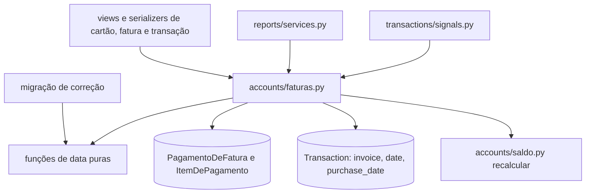

# Faturas Design

**Spec**: `.specs/features/faturas/spec.md`
**Status**: Approved

---

## Architecture Overview

Hoje a regra das datas da fatura está espalhada em três lugares que discordam entre si: `CreditCardService.calculate_due_date` quebra em meses curtos (FIN-05), `TransactionService._get_or_create_invoice` ajusta o último dia mas a comparação do melhor dia não ajusta (FIN-31), e `get_next_due_date` usa o dia 28 como fallback (FIN-30). O pagamento muda as compras sem registrar o que fez, e por isso o estorno não consegue desfazer a divisão nem a rolagem (FIN-02).

O design junta tudo num módulo de domínio, `accounts/faturas.py`, com três camadas:

1. **Datas, sem banco.** Funções puras sobre os dias do cartão: o dia ajustado ao mês (AD-006), as datas de fechamento e vencimento de uma fatura, e em qual fatura cai uma data de compra. A migração de correção usa as mesmas funções.
2. **Faturas e compras.** Obter ou criar a fatura, achar a primeira fatura não paga, colocar uma compra numa fatura, alocar as parcelas, recalcular o total, calcular o limite disponível e o status exibido.
3. **Pagamento e estorno.** `pagar()` e `estornar()` gravam e leem um registro do pagamento (`PagamentoDeFatura` com os itens), que guarda a chave de idempotência, o que foi pago, o que foi dividido e o que foi movido.



Duas invariantes valem depois de qualquer operação:

- **Uma compra no cartão tem `invoice` e `date` igual ao vencimento dessa fatura.** Toda mudança de fatura passa por `colocar(compra, fatura)`, que grava os dois campos juntos. A data real da compra fica em `purchase_date` (AD-039). Assim a tela de transações continua agrupando as compras pelo mês do vencimento, e os relatórios, que já filtram as compras pelo mês da fatura, não mudam.
- **`total_amount` é a soma das compras ligadas à fatura** (FATURA-18). O signal recalcula a fatura antiga e a nova, e quem usa `QuerySet.update()` chama `recalcular_totais()`.

### Abordagens consideradas

| Abordagem | Prós | Contras | Decisão |
| --------- | ---- | ------- | ------- |
| Trocar o significado de `date` para a data da compra | Um campo só | Todas as parcelas teriam a mesma data: a lista de transações e o filtro por mês passariam a mostrar as 12 parcelas no mês da compra, e os relatórios mudariam junto | Recusada |
| Campo novo `purchase_date`, com `date` igual ao vencimento | Nada muda para relatórios e lista; a data real fica guardada | Dois campos de data na compra | **Escolhida (AD-039)** |
| Estorno que deduz o que desfazer pelo texto "(Parcial)" e "(Restante)" | Sem tabela nova | Frágil: depende da descrição, não sabe o que foi movido e quebra com a edição do usuário | Recusada |
| Registro do pagamento com itens (pago, dividido, movido) | Estorno exato; o mesmo registro serve à idempotência e à FATURA-27 | Duas tabelas novas | **Escolhida (AD-040)** |
| Idempotência por cabeçalho `Idempotency-Key` e cache | Padrão HTTP | O cache local não é compartilhado entre instâncias e expira; o resultado precisa durar além do estorno | Recusada; a chave vai no corpo e fica no registro do pagamento |

---

## Code Reuse Analysis

### Existing Components to Leverage

| Component | Location | How to Use |
| --------- | -------- | ---------- |
| Saldo sob trava | `accounts/saldo.py` (`recalcular`) | Pagamento e estorno recalculam a conta de pagamento e a conta do cartão (AD-038) |
| Data de hoje em Brasília | `core/datas.py` (`hoje`) | Status aberta ou fechada (FATURA-08, FATURA-09) e próximo vencimento (FATURA-06), AD-008 |
| Valor positivo com duas casas | `core/valores.py` (`validar_valor_positivo`) | Valor do pagamento, como já está em `InvoicePaymentSerializer` |
| Relação do próprio usuário | `core/fields.py` (`OwnedPrimaryKeyRelatedField`) | Conta do pagamento e cartão da compra (AD-032) |
| Recusa de conta excluída | `transactions/services.py` (`create_credit_card_expense`) | Mantém a regra do saldo (SALDO-35) e ganha a recusa do cartão excluído |
| Mensagens de recusa da fatura | `accounts/services.py` (`FATURA_JA_PAGA`, `FATURA_NAO_PAGA`) | Mesmas mensagens; SALDO-26 e SALDO-27 continuam valendo |
| Padrão de migração com regra repetida | `transactions/migrations/0008_corrige_saldos.py` e `tests/saldo/test_migracao.py` | A migração de correção chama as funções de data puras e é testada importando o módulo |
| Validação dos dias 1 a 31 | `accounts/serializers.py` (`validate_closing_day`, `validate_due_day`) | Já existe; ganha teste (FATURA-05) |

### Integration Points

| System | Integration Method |
| ------ | ------------------ |
| Saldo (spec `saldo`) | O pagamento continua efetivando as compras na conta de pagamento e o estorno continua devolvendo o valor (SALDO-23 a SALDO-27). Os testes de `tests/saldo/test_fatura.py` seguem passando |
| Dashboard (`reports/services.py:131-165`) | Troca `calculate_due_date` pela função nova, que não quebra em meses curtos (FIN-05), e o limite disponível pela função única (FATURA-42) |
| Isolamento (spec `isolamento-entre-usuarios`) | As somas e as compras consideradas continuam filtradas pelo dono do cartão (ISOL-14); os testes de `tests/isolamento/` rodam no gate full |
| Frontend | Corpo do pagamento ganha `idempotency_key`; a fatura ganha `credit_card_id`, `payment` e o status derivado; a compra ganha `purchase_date`; novo `GET /api/invoices/{id}/transactions/` |

---

## Components

### Datas da fatura (`accounts/faturas.py`, camada sem banco)

- **Purpose**: calcular as datas sem acessar o banco, para o código da aplicação e para a migração.
- **Interfaces**:
  - `dia_no_mes(ano, mes, dia) -> date`: o dia pedido, ou o último dia do mês quando ele não existe (FATURA-01, FATURA-02, AD-006).
  - `datas_da_fatura(dia_fechamento, dia_vencimento, mes, ano) -> (fechamento, vencimento)`: `mes` e `ano` são os do vencimento, como `CreditCardInvoice.month` e `year` já são hoje. O fechamento cai no mesmo mês quando o dia de vencimento é maior que o de fechamento (FATURA-03) e no mês anterior quando é menor ou igual (FATURA-04).
  - `mes_da_fatura(dia_fechamento, dia_vencimento, data_compra) -> (mes, ano)`: a compra antes do fechamento ajustado do mês fica na fatura que fecha nesse mês (FATURA-10); no dia do fechamento ou depois, na que fecha no mês seguinte (FATURA-11).
  - `mes_seguinte(mes, ano) -> (mes, ano)`.
- **Dependencies**: só `datetime` e `calendar`.

### Faturas e compras (`accounts/faturas.py`, camada com banco)

- **Purpose**: o único caminho para criar fatura, mudar a fatura de uma compra e recalcular totais.
- **Interfaces**:
  - `obter_fatura(cartao, mes, ano)`: `get_or_create` com as datas de `datas_da_fatura` e os dias atuais do cartão. Fatura existente mantém as datas gravadas (FATURA-07). Substitui `TransactionService._get_or_create_invoice`, que sai com o `print` de depuração.
  - `fatura_da_compra(cartao, data_compra)`: o mês de `mes_da_fatura`; se a fatura desse mês já existe e fecha na data da compra ou antes (dias do cartão alterados depois que ela foi criada), avança para a seguinte.
  - `primeira_nao_paga(cartao, mes, ano)`: a partir do mês dado, a primeira fatura que não está paga, criando-a se faltar (FATURA-15, FATURA-25).
  - `alocar_parcelas(cartao, data_compra, quantidade) -> [fatura]`: a primeira parcela em `primeira_nao_paga(fatura_da_compra(...))`; cada seguinte em `primeira_nao_paga` do mês seguinte ao da anterior (FATURA-12, FATURA-15).
  - `dividir_valor(valor, quantidade) -> [Decimal]`: cada parcela arredondada a centavos e a diferença somada à primeira (FATURA-13). É a fórmula atual, extraída.
  - `colocar(compra, fatura)`: grava `invoice` e `date = fatura.due_date` juntos (AD-039).
  - `recalcular_totais(*fatura_ids)`: `total_amount` igual à soma das compras `CREDIT_CARD` do dono do cartão ligadas a cada fatura; ignora `None` (FATURA-18, ISOL-14).
  - `status_exibido(fatura)`: `PAID` se paga; senão `OPEN` quando `hoje()` é anterior ao fechamento e `CLOSED` a partir dele (FATURA-08, FATURA-09, AD-008). O banco grava só `OPEN` e `PAID`.
  - `proximo_vencimento(cartao)`: o primeiro vencimento igual ou posterior a `hoje()`, calculado pelos dias atuais do cartão (FATURA-06). Testa o vencimento do mês anterior, do atual e do seguinte e devolve o primeiro que não passou.
  - `limite_disponivel(cartao)`: limite menos a soma das compras pendentes do cartão, de todas as faturas (FATURA-42).
- **Dependencies**: `CreditCardInvoice`, `Transaction`, `core/datas.py`.

### Signals das compras (`transactions/signals.py`)

- `capture_old_transaction_state` passa a guardar também o `invoice_id` anterior.
- `update_invoice_total` chama `recalcular_totais(antiga, nova)` em vez de recalcular só a fatura nova. Hoje uma compra movida pelo pagamento parcial deixa o total da fatura antiga desatualizado (FIN-07, nota pendente do `saldo`).

### Compra no cartão (`transactions/services.py` e `transactions/serializers.py`)

- **Criação** (`create_credit_card_expense`): usa `alocar_parcelas` e `dividir_valor`; grava `purchase_date` com a data informada e `date` pelo `colocar` (FATURA-12 a FATURA-16). O cartão excluído passa a ser recusado com "Cartão não encontrado." (`CreditCardExpenseSerializer` filtra `is_active=True`, nota pendente do `saldo`). Cartão sem conta de pagamento continua aceito: a conta é escolhida no pagamento (edge case da spec).
- **Grupo da compra**: a compra é a parcela raiz (`parent_transaction` nulo) e as que apontam para ela. O restante criado por um pagamento parcial aponta para a mesma raiz, para que exclusão e edição o tratem como parte da compra.
- **Edição** (`editar_compra(parcela, dados, escopo)`, chamado por `TransactionSerializer.update` quando o tipo é `CREDIT_CARD`):
  - Qualquer alteração numa parcela de fatura paga recebe 400 com "Estorne o pagamento da fatura antes de alterar esta compra." (FATURA-19).
  - `purchase_date` ou `credit_card` diferente do atual vale para a compra inteira: se alguma parte está em fatura paga, 400 com a mesma mensagem; senão todas as parcelas recebem a data e o cartão novos e são realocadas por `alocar_parcelas` (FATURA-17).
  - O `date` enviado numa compra no cartão é ignorado: ele vem da fatura. A comparação da data da compra usa `purchase_date or date`, para que um formulário que carregou uma compra antiga (sem `purchase_date`) e salvou sem mudar a data não mova nada.
  - Valor, categoria e descrição continuam com o escopo atual (`SINGLE` e `ALL_FUTURE`); `ALL_FUTURE` também recusa se alguma parcela afetada estiver em fatura paga.
- **Exclusão** (`TransactionViewSet.destroy` para `CREDIT_CARD`): exclui o grupo inteiro (FATURA-20); se alguma parte está em fatura paga, 400 com a mensagem da FATURA-19.

### Pagamento (`accounts/faturas.py` `pagar`, chamado por `CreditCardInvoiceViewSet.pay`)

```
pagar(usuario, fatura, conta, valor, data, chave):
  atomic:
    trava a fatura (select_for_update)
    se chave:
      anterior = PagamentoDeFatura do usuário com essa chave
      se existe: mesmos fatura, valor, conta e data -> devolve anterior (FATURA-30)
                 senão -> 400 "Este identificador de pagamento já foi usado com outros dados." (FATURA-32)
    fatura paga -> 400 "Fatura já está paga." (FATURA-33, SALDO-26)
    recalcula o total; valor > total -> 400 "O valor pago não pode ser maior que o total da fatura." (FATURA-26)
    cria o PagamentoDeFatura
    compras pendentes em ordem de (purchase_date ou date), valor e criação (FATURA-22)
      cabe inteira -> paga: COMPLETED, conta do pagamento, payment_date; item PAGA (FATURA-21)
      cabe em parte -> divide: a original fica com a parte paga e "(Parcial)"; o restante,
                       pendente, vai para primeira_nao_paga(mês seguinte); item DIVIDIDA
                       com o valor e a descrição originais e o restante (FATURA-23)
      não cabe -> colocar na primeira_nao_paga(mês seguinte); item MOVIDA (FATURA-24)
    fatura PAID; recalcula totais e saldos
```

- A chave chega no corpo como `idempotency_key` (UUID, opcional). Sem chave, o pedido é uma tentativa nova (suposição da spec).
- A trava na fatura serializa dois pedidos com a mesma chave para a mesma fatura: o segundo só lê depois do primeiro confirmar e encontra o registro (FATURA-31). Dois pedidos com a mesma chave para faturas diferentes esbarram na restrição única `(user, chave)`; o `IntegrityError` vira a recusa da FATURA-32.
- A resposta é montada a partir do registro, nunca do estado atual da fatura: a repetição recebe o mesmo corpo, inclusive depois de um estorno (suposição da spec).
- A view deixa de recusar a fatura paga antes de chamar o service, porque isso impediria a repetição idempotente; a recusa fica dentro do `pagar`, sob trava. O `except Exception` genérico que devolvia o texto da exceção com 400 sai: erro inesperado vira 500 e desfaz tudo (FATURA-28).

### Estorno (`accounts/faturas.py` `estornar`, chamado por `CreditCardInvoiceViewSet.unpay`)

```
estornar(usuario, fatura):
  atomic:
    trava a fatura; não paga -> 400 "Esta fatura não está paga." (SALDO-27)
    pagamento = o registro ativo (sem estornado_em) da fatura
    sem registro (pagamento anterior a esta feature) -> caminho antigo: compras pagas voltam a pendentes
    seguinte = a fatura que recebeu restante ou compras movidas; paga -> 400
      "Estorne primeiro o pagamento da fatura seguinte." (FATURA-38)
    PAGA     -> pendente, conta do cartão, sem payment_date (FATURA-34)
    DIVIDIDA -> a parte paga volta a pendente com o valor original e a descrição original,
                e o restante é excluído (FATURA-35)
    MOVIDA   -> se a compra ainda existe, pendente e na fatura seguinte: colocar de volta
                na fatura original (FATURA-36)
    fatura OPEN; pagamento.estornado_em = agora; recalcula totais e saldos (FATURA-37)
```

- Na DIVIDIDA, se o usuário editou o restante, a compra volta com a parte paga mais o valor atual do restante; se o restante foi excluído, volta só com a parte paga. Isso não reabre uma dívida que o usuário apagou. Com o restante intacto, o resultado é o valor original.
- O registro não é apagado: ele sustenta a resposta da repetição (FATURA-30).

### API de faturas (`accounts/views.py` e `accounts/serializers.py`)

- `CreditCardInvoiceViewSet` passa a `ReadOnlyModelViewSet` com as ações `pay` e `unpay`: `POST`, `PUT`, `PATCH` e `DELETE` em `/api/invoices/` e `/api/invoices/{id}/` recebem 405 (FATURA-45, FIN-41).
- Nova ação `GET /api/invoices/{id}/transactions/`: todas as compras da fatura, sem paginação, em ordem de data da compra (FATURA-44, CON-03).
- `CreditCardInvoiceSerializer` ganha:
  - `status` vindo de `status_exibido` (FATURA-08, FATURA-09);
  - `credit_card_id` (o diálogo de pagamento usa para preencher a conta; hoje lê um campo que não existe, nota pendente do `saldo`);
  - `payment`: `{amount, account_id, account_name, date}` do pagamento ativo, ou `null` (FATURA-27).
- `CreditCardSerializer`: `next_due_date` por `proximo_vencimento` e `available_limit` por `limite_disponivel`.
- `TransactionSerializer`: `purchase_date` gravável só em compras no cartão, ignorado nos outros tipos.

### Dashboard (`reports/services.py`)

- A fatura "de hoje" de cada cartão usa `fatura_da_compra(cartao, hoje())`, sem criar fatura (só lê), e o limite usa `limite_disponivel` (FATURA-42). O restante dos relatórios fica com a feature `relatorios`.

### Correção dos dados (`accounts/migrations/0006_corrige_faturas.py`)

Roda no `migrate` do deploy, com os modelos históricos e as funções de data puras:

1. Compra no cartão sem fatura e com cartão: `purchase_date` recebe o `date` gravado, e a compra vai para a fatura de `mes_da_fatura`; se a compra está pendente e essa fatura está paga, para a primeira não paga seguinte (FATURA-39, FATURA-15).
2. Compras com duas ou mais parcelas pendentes na mesma fatura: percorre as parcelas em ordem de número; a primeira fica onde está, as pagas ficam onde estão e servem de referência, e cada pendente seguinte vai para a primeira fatura não paga depois da fatura da parcela anterior (FATURA-40). `date` acompanha o vencimento da fatura nova.
3. O total de todas as faturas é recalculado (FATURA-41).

As compras antigas mantêm a data gravada: `purchase_date` fica nulo, e a interface mostra o `date` (suposição da spec). Faturas criadas pela migração usam os dias atuais do cartão.

### Frontend

| Arquivo | Mudança | Requisitos |
| ------- | ------- | ---------- |
| `src/lib/datas.ts` (novo) | `lerData("2026-10-01")` devolve a data local, sem o deslocamento de `new Date(string)`, e `nomeDoMes(mes)` sem depender do dia de hoje (hoje `setMonth` no dia 31 pula o mês) | FATURA-43 |
| `src/components/transactions/invoice-payment-dialog.tsx` | Gera um `idempotency_key` com `crypto.randomUUID()` ao abrir e o reusa nos reenvios até o sucesso; preenche a conta pelo `credit_card_id` da fatura; datas por `lerData`; mostra a mensagem do backend | FATURA-29, FATURA-43 |
| `src/components/cards/invoice-list.tsx` | Datas por `lerData` e `nomeDoMes`; mostra o pagamento da fatura paga | FATURA-27, FATURA-43 |
| `src/components/cards/invoice-details-dialog.tsx` | Lista por `GET /invoices/{id}/transactions/`; mostra a data da compra (`purchase_date` ou `date`) | FATURA-16, FATURA-44 |
| `src/components/transactions/card-expense-form-dialog.tsx` | Na edição, carrega e envia `purchase_date`; mostra a mensagem de recusa do backend; o aviso de exclusão diz que todas as parcelas saem | FATURA-17, FATURA-19, FATURA-20 |
| `src/app/(app)/transacoes/page.tsx` | Na linha da compra no cartão, mostra "Compra em dd/mm" quando há `purchase_date` | FATURA-16 |
| `src/app/(app)/cartoes/[id]/page.tsx` | Mostra `next_due_date` no lugar de "Vence em {dia}/{mês atual}"; usa só o `available_limit` do backend | FATURA-06, FATURA-42 |

---

## Data Models

```python
# transactions/models.py
class Transaction(models.Model):
    ...
    purchase_date = models.DateField(null=True, blank=True)  # data real da compra no cartão (AD-039)

# accounts/models.py
class PagamentoDeFatura(models.Model):
    id = UUIDField(primary_key=True)
    user = FK(User, CASCADE)
    fatura = FK(CreditCardInvoice, CASCADE, related_name='pagamentos')
    conta = FK(Account, PROTECT)
    valor = DecimalField(15, 2)
    data = DateField()
    chave = UUIDField(null=True, blank=True)        # idempotency_key
    fatura_seguinte = FK(CreditCardInvoice, SET_NULL, null=True, related_name='+')
    estornado_em = DateTimeField(null=True, blank=True)
    criado_em = DateTimeField(auto_now_add=True)

    class Meta:
        constraints = [UniqueConstraint(fields=['user', 'chave'], condition=Q(chave__isnull=False))]

class ItemDePagamento(models.Model):
    PAGA, DIVIDIDA, MOVIDA
    pagamento = FK(PagamentoDeFatura, CASCADE, related_name='itens')
    tipo = CharField(choices)
    compra = FK(Transaction, SET_NULL, null=True)    # a compra paga, a parte paga ou a movida
    restante = FK(Transaction, SET_NULL, null=True, related_name='+')  # só DIVIDIDA
    valor_original = DecimalField(15, 2, null=True)  # só DIVIDIDA
    descricao_original = CharField(255, blank=True)  # só DIVIDIDA
```

Migrações: `transactions/0009_transaction_purchase_date`, `accounts/0005_pagamentodefatura_itemdepagamento` e `accounts/0006_corrige_faturas` (dados, depende da `transactions/0009`).

---

## Error Handling Strategy

| Error Scenario | Handling | User Impact |
| -------------- | -------- | ----------- |
| Pagamento maior que o total | 400 com a mensagem da FATURA-26, nada muda | Toast com a mensagem |
| Fatura já paga, chave nova ou sem chave | 400 "Fatura já está paga." (FATURA-33) | Toast com a mensagem |
| Mesma chave com outros dados | 400 com a mensagem da FATURA-32 | Toast com a mensagem |
| Repetição da mesma tentativa | 200 com a resposta original | Sucesso, sem cobrança dupla |
| Estorno com a fatura seguinte paga | 400 com a mensagem da FATURA-38 | Toast com a mensagem |
| Estorno de fatura não paga | 400 "Esta fatura não está paga." (SALDO-27) | Toast com a mensagem |
| Editar ou excluir compra de fatura paga | 400 com a mensagem da FATURA-19 | Toast com a mensagem |
| Falha no meio do pagamento ou do estorno | Exceção sobe; o `atomic` desfaz tudo; 500 sem detalhe interno | Erro genérico, dados intactos (FATURA-28) |
| Criar, editar ou excluir fatura pela API | 405 (FATURA-45) | Nenhum: a interface não faz isso |
| Dia de fechamento ou vencimento fora de 1 a 31 | 400 do serializer (FATURA-05) | Mensagem no campo |

---

## Risks & Concerns

| Risk | Likelihood | Impact | Mitigation |
| ---- | ---------- | ------ | ---------- |
| Frontend antigo, sem `idempotency_key`, durante o deploy | Média | Baixo | Sem chave é tentativa nova (suposição da spec); continua protegido pela trava e pela recusa da fatura paga |
| Frontend antigo envia `date` (o vencimento carregado) ao editar compra | Média | Médio | `date` é ignorado em compra no cartão; a data da compra só muda por `purchase_date` |
| Pagamentos anteriores à feature não têm registro | Certa | Médio | Estorno cai no caminho antigo (compras pagas voltam a pendentes) e não junta as divisões antigas; documentado |
| Migração move parcelas em produção | Média | Alto | Só parcelas pendentes de compras com duplicidade; testada com cenários de FIN-06 antes do deploy |
| Dias do cartão mudados com faturas futuras já criadas | Baixa | Baixo | `fatura_da_compra` avança quando a fatura existente já fechou na data da compra |

---

## Tech Decisions

| Decision | Choice | Rationale |
| -------- | ------ | --------- |
| Data da compra | Campo `purchase_date`; `date` é o vencimento da fatura (AD-039) | Não muda relatórios nem a lista de transações |
| Registro do pagamento | `PagamentoDeFatura` com itens (AD-040) | Estorno exato, idempotência e FATURA-27 com uma fonte só |
| Status da fatura | Banco grava `OPEN` e `PAID`; `CLOSED` é derivado na leitura | Hoje `CLOSED` nunca é gravado; derivar evita uma tarefa agendada |
| Mês da fatura | `month` e `year` continuam sendo os do vencimento | É o que os dados gravados usam; nenhuma migração de chave |
| Restante e compras movidas | Ficam no grupo da compra (mesma raiz) | Exclusão e FATURA-19 tratam a compra inteira |
