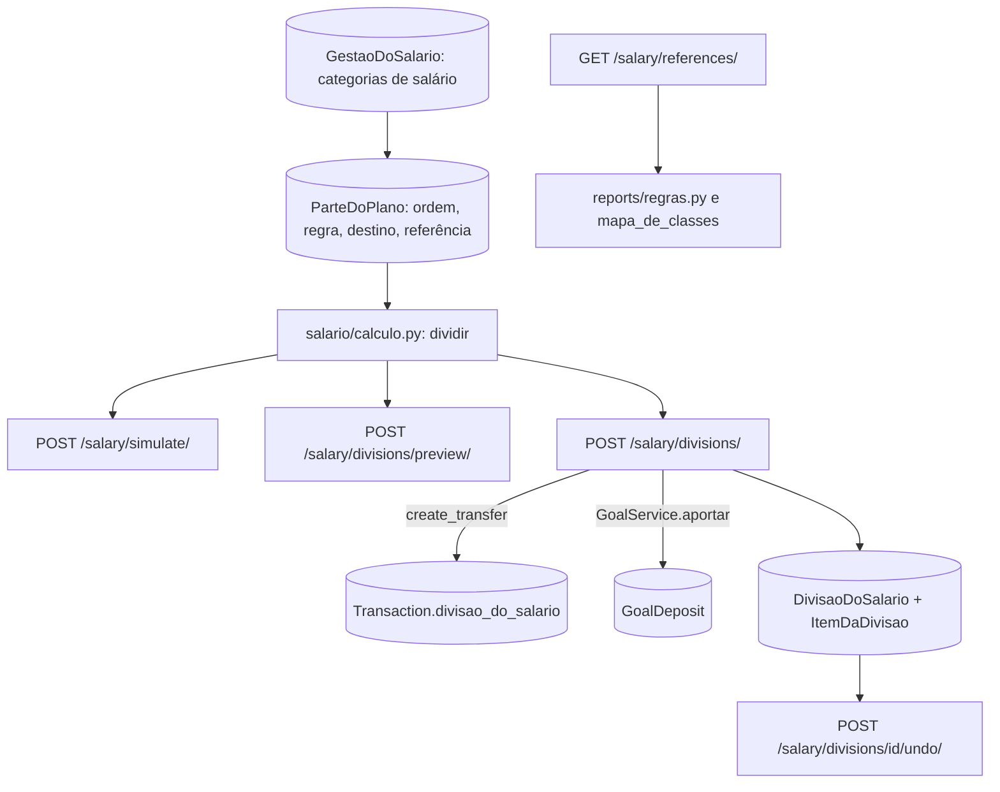

# Gestão do salário Design

**Spec**: `.specs/features/gestao-do-salario/spec.md`
**Status**: Approved

---

## Architecture Overview

A feature vira um app novo no backend, `salario`, com quatro modelos:

- **Gestão do salário:** uma por usuário, com as categorias de salário.
- **Parte do plano:** cada uma com a ordem, a regra e o destino.
- **Divisão:** uma por recebimento dividido.
- **Item da divisão:** o que cada parte gerou.

O cálculo da divisão é uma função pura. A simulação, a revisão e a geração usam a mesma função.

A geração reaproveita o que já existe:

- `TransactionService.create_transfer` para as partes com destino numa conta;
- `GoalService.aportar` para as partes com destino numa meta. O aporte já conta só na meta escolhida (AD-045, AD-028), o que atende a SALARIO-33.

Tudo corre numa transação, com o recebimento travado. A idempotência segue o pagamento de fatura (AD-007, AD-040): chave única por usuário e resposta remontada a partir do registro.

O desfazer apaga as transações da divisão uma a uma. A exclusão de uma instância passa pelos sinais das metas, que recusam deixar uma meta negativa; a exclusão em lote, por queryset, não recusaria.



### Abordagens consideradas

| Abordagem | Prós | Contras | Decisão |
| --------- | ---- | ------- | ------- |
| Guardar a divisão só como uma marca nas transações | Sem modelo novo | Não guarda o valor aportado, a chave da tentativa nem o estado desfeito | Recusada |
| Modelo `DivisaoDoSalario` com itens, e as transações marcadas pelo id da divisão | Desfazer confere cada item contra o que foi gerado; a chave e o "já dividido" ficam em restrições do banco | Dois modelos a mais | **Escolhida (AD-053)** |
| Marca da divisão como FK em `Transaction` | Integridade referencial | Dependência circular entre os apps `transactions` e `salario` | Recusada; `divisao_do_salario` é um UUID indexado, como o `transfer_id` |
| Desfazer por `queryset.delete()` | Rápido | Os sinais das metas não recusam meta negativa num delete em lote (`goals/vinculo.py:91`) | Recusada; exclusão uma a uma |
| Guardar a resposta da geração para a repetição | Resposta idêntica byte a byte | Mais um campo; o pagamento de fatura já remonta a resposta do registro | Recusada; a resposta é remontada da divisão |
| Categorias de salário fixas pelo nome "Salário" | Sem configuração | O usuário renomeia ou tem outras categorias de salário | Recusada; configuráveis, com "Salário" e as subcategorias marcadas de início |

---

## Code Reuse Analysis

### Existing Components to Leverage

| Component | Location | How to Use |
| --------- | -------- | ---------- |
| `TransactionService.create_transfer` | `transactions/services.py:69-92` | Uma transferência efetivada por parte com destino numa conta; devolve o `transfer_id` |
| `GoalService.aportar` | `goals/services.py:53-84` | Aporte por parte com destino numa meta, com origem na conta do salário; o erro de Django vira 400 |
| `GoalService.get_progress` | `goals/services.py:120-155` | Quanto a meta pede por mês (SALARIO-55) |
| `travar` | `accounts/saldo.py:59-70` | Ordem das travas: contas, depois metas |
| Idempotência do pagamento | `accounts/faturas.py:259-354`, `accounts/models.py:90-121` | Chave única `(user, chave)` com savepoint para o `IntegrityError` |
| `hoje()` | `core/datas.py:20-22` | Data das transações geradas e prazo de 7 dias (AD-008) |
| `RecursoLiberado('gestao_do_salario')` | `core/travas.py:281-296` | Todas as rotas do app (SALARIO-16) |
| `OwnedPrimaryKeyRelatedField` | `core/fields.py:28-51` | Conta, meta, recebimento e categorias; nova mensagem `META_NAO_ENCONTRADA` e `RECEBIMENTO_NAO_ENCONTRADO` |
| `regras.faturas_do_mes`, `regras.despesas`, `regras.receitas` | `reports/regras.py` | Comprometido no mês e médias (SALARIO-52, SALARIO-53) |
| `mapa_de_classes` | `transactions/classes.py:59-61` | Gastos por classe no histórico; Essencial e Dispensável pelas classes padrão (`padrao=True` e `nome_normalizado`) |
| `dinheiro()` | `core/valores.py:68-80` | Valores em texto com duas casas (AD-041) |
| `MODELOS_DO_USUARIO` | `api/exclusao.py:25-46` | `GestaoDoSalario` e `DivisaoDoSalario` entram (SALARIO-17); a limpeza os apaga (AD-050) |
| `RecursoBloqueado`, `usePlan` | `fluxar-frontend/src/components/planos/recurso-bloqueado.tsx`, `src/hooks/use-plan.ts` | Página travada e aviso que não abre (SALARIO-16, SALARIO-25) |
| Chave da tentativa | `fluxar-frontend/src/components/transactions/invoice-payment-dialog.tsx:85-90` | Mesmo padrão na revisão da divisão |
| `src/lib/dinheiro.ts` | frontend | Contas em centavos e leitura do valor digitado |

### Integration Points

| System | Integration Method |
| ------ | ------------------ |
| Transações | `Transaction.divisao_do_salario` (UUID, nulo, indexado) marca as transações geradas (SALARIO-35) |
| Formulário de transação e "Efetivar" | Passam a transação criada ou efetivada para o aviso do salário |

---

## Components

### Modelos (AD-053)

- **Location**: `salario/models.py`, `salario/migrations/`, `transactions/models.py`, `api/exclusao.py`
- **Interfaces**:
  - `GestaoDoSalario`: `user` (OneToOne, CASCADE), `categorias` (M2M com `Category`), `categorias_configuradas` (bool), `atualizada_em`.
  - `ParteDoPlano`:
    - `gestao` (FK, CASCADE), `ordem`, `nome` (60);
    - `tipo_de_regra` (`FIXED` ou `PERCENT`), `valor` (Decimal);
    - `tipo_de_destino` (`ACCOUNT`, `GOAL`, `SALARY_ACCOUNT` ou nulo), `conta` (FK, SET_NULL), `meta` (FK, SET_NULL);
    - `referencia` (`ESSENCIAL`, `DISPENSAVEL` ou vazio).
  - O plano existe quando a gestão tem ao menos uma parte ou foi salva com o Personalizado. Para isso a gestão ganha `plano_salvo` (bool).
  - `DivisaoDoSalario`:
    - `user`, `recebimento` (FK para `Transaction`, SET_NULL), `recebimento_ref` (UUID), `conta_de_origem` (FK, SET_NULL);
    - `chave` (UUID, nulo);
    - `valor_recebido`, `total`, `livre`;
    - `criada_em`, `desfeita_em`.
  - Restrições da divisão:
    - única em `(user, chave)` quando a chave existe;
    - única em `recebimento_ref` quando `desfeita_em` é nulo (SALARIO-38, SALARIO-39).
  - `ItemDaDivisao`:
    - `divisao` (FK, CASCADE), `ordem`, `nome_da_parte`;
    - `tipo_de_destino`, `conta` e `meta` (SET_NULL);
    - `valor`, `reduzida`;
    - `transacao_saida` e `transacao_entrada` (FK para `Transaction`, SET_NULL), `transfer_id`.
  - `Transaction.divisao_do_salario`: UUID, nulo, indexado.
  - `GestaoDoSalario` e `DivisaoDoSalario` entram em `MODELOS_DO_USUARIO`, antes das transações (SALARIO-17). Nenhum dos dois é criado no cadastro, então a limpeza não muda o padrão.

### Modelos da literatura e cálculo

- **Location**: `salario/modelos.py`, `salario/calculo.py`
- **Interfaces**:
  - `MODELOS`: o código do modelo, o nome, a obra de origem e as partes, cada uma com nome, percentual, destino inicial e referência.
    - `pague_se_primeiro`: Guardar 10%, sem destino.
    - `50_30_20`:
      - Essenciais 50%, na conta do salário, referência Essencial;
      - Dispensáveis 30%, na conta do salário, referência Dispensável;
      - Guardar 20%, sem destino.
    - `seis_potes`:
      - Necessidades 55%, na conta do salário, Essencial;
      - Liberdade financeira 10%, sem destino;
      - Poupança para gastos futuros 10%, sem destino;
      - Educação 10%, na conta do salário;
      - Diversão 10%, na conta do salário, Dispensável;
      - Doações 5%, na conta do salário.
    - `personalizado`: sem partes.
  - Os três primeiros atendem SALARIO-02, SALARIO-03 e SALARIO-06.
  - `dividir(valor_recebido, partes, ajustes=None)` devolve uma `Divisao(itens, total, livre)`:
    - percentual arredondado para baixo no centavo (SALARIO-28);
    - valor fixo como está;
    - ajuste da revisão no lugar do valor da parte (SALARIO-30);
    - se a soma passar do recebido, reduz a partir da última parte, até zero, e marca `reduzida` (SALARIO-27).
  - Item que fica na conta do salário, com destino na própria conta do recebimento ou com valor zero não gera transação (SALARIO-34).

### API do plano

- **Location**: `salario/views.py`, `salario/serializers.py`, `salario/urls.py`
- **Interfaces** (todas com `RecursoLiberado('gestao_do_salario')`):
  - `GET /api/salary/models/` devolve os modelos com obra e partes (SALARIO-01, SALARIO-02).
  - `GET /api/salary/plan/` devolve:
    - `{has_plan, parts, salary_categories}`;
    - cada parte com `id`, `name`, `rule_type`, `value`, `destination_type`, `account`, `goal`, `reference`, `goal_monthly_needed` e `goal_target_date`;
    - sem configuração, `salary_categories` traz a categoria de receita "Salário" (nome normalizado) e as subcategorias dela (SALARIO-14).
  - `PUT /api/salary/plan/` substitui as partes na ordem do array (SALARIO-07, SALARIO-12) e as categorias. Erros:
    - soma dos percentuais acima de 100%: 400 `{"detail": "A soma dos percentuais passa de 100%."}` (SALARIO-08);
    - fixo abaixo de R$ 0,01 ou percentual fora de 0,01 a 100: 400 no campo `value` da parte (SALARIO-09);
    - conta ou meta de outro usuário ou inexistente: 400 com a mesma mensagem de um id inexistente (SALARIO-10);
    - conta inativa, cofrinho ou meta inativa: 400 `"Escolha uma conta ativa que não seja cofrinho ou uma meta ativa."` no campo do destino (SALARIO-11);
    - os erros das partes vêm como `{"parts": [{}, {"value": [...]}]}`;
    - categoria que não é de receita do usuário: 400 no campo `salary_categories`.
  - `POST /api/salary/simulate/ {amount, parts?}` calcula com as partes enviadas ou com o plano salvo e não grava nada (SALARIO-13). Partes sem destino são aceitas na simulação.
  - Os logs do app não levam valores nem nomes (SALARIO-18).

### Recebimentos, revisão e geração

- **Location**: `salario/divisao.py`, `salario/views.py`
- **Interfaces**:
  - `GET /api/salary/pending/` lista as receitas efetivadas, com conta, nas categorias de salário, do mês atual e do anterior, sem divisão ativa (SALARIO-24). As importadas entram.
  - `POST /api/salary/divisions/preview/ {receipt, adjustments?}` devolve `{receipt, items: [{part_id, name, destination_type, destination_name, origin_account, amount, reduced, generates_transaction}], total, free, date}` (SALARIO-29, SALARIO-30).
    - `adjustments` é `{part_id: valor}`. Ajustes que passam do recebido recebem 400 `{"adjustments": ["Os valores passam do salário recebido."]}`.
  - `POST /api/salary/divisions/ {receipt, idempotency_key, adjustments?}`, dentro de `transaction.atomic`:
    1. Trava a linha do recebimento com `select_for_update`.
    2. Com chave repetida, devolve a divisão já gravada (SALARIO-37).
    3. Recebimento que não é receita efetivada, com conta, numa categoria de salário do usuário: 400 `"Escolha um salário recebido para dividir."` (SALARIO-40).
    4. Recebimento com divisão ativa: 400 `"Este salário já foi dividido."` (SALARIO-38).
    5. Parte que precisa de destino e está sem destino: 400 `"Escolha o destino de todas as partes."` (SALARIO-41).
    6. Destino inativo: 400 `"O destino da parte <nome> não está mais disponível."` (SALARIO-42).
    7. Nenhum item gera transação: 400 `"Nenhuma parte do plano gera transação."` (SALARIO-43).
    8. Cria as transferências e os aportes com a data `hoje()`, efetivados, e marca cada transação com `divisao_do_salario` (SALARIO-32, SALARIO-33, SALARIO-35).
    9. Grava a divisão e os itens num savepoint; o `IntegrityError` da chave ou do recebimento remonta a resposta da divisão existente ou devolve o 400 de "já dividido" (SALARIO-39).
    10. Qualquer erro desfaz tudo (SALARIO-36).
  - A resposta (201) é `{id, receipt, items: [...], transactions: [...], total, free, created_at, can_undo_until}`. `GET /api/salary/divisions/<id>/` devolve o mesmo.

### Desfazer

- **Location**: `salario/divisao.py`
- **Interfaces**:
  - `POST /api/salary/divisions/<id>/undo/`, dentro de `atomic`, com a divisão travada:
    - já desfeita: 400 `{"detail": "Esta divisão já foi desfeita."}`, sem remover nada (SALARIO-51);
    - mais de 7 dias depois de `criada_em` em Brasília: 400 `"O prazo para desfazer esta divisão acabou."` (SALARIO-49);
    - um item com transação apagada, ou com valor, data, conta ou status diferente do gerado: 400 `"A transferência para <destino> mudou."` ou `"O aporte em <meta> mudou."`;
    - uma meta com `current_amount` menor que o aportado: 400 `"A meta <nome> não tem mais o valor aportado pela divisão."` (SALARIO-48).
  - Depois das conferências, apaga as transações uma a uma, o que recalcula saldos e metas pelos sinais, e grava `desfeita_em` (SALARIO-46, SALARIO-47).
  - Uma falha no meio desfaz tudo (SALARIO-50).
  - A tela mostra antes as transações da divisão pelo `GET` (SALARIO-45).
  - `GET /api/salary/divisions/?undoable=true`, com a mesma trava, lista as divisões do usuário não desfeitas e ainda no prazo (`hoje() <= can_undo_until`), da mais recente para a mais antiga, no formato do detalhe. Sem `undoable=true` responde 400; outro parâmetro recebe o 400 de filtro desconhecido. A seção "Divisões recentes" da página usa essa lista para oferecer o desfazer depois de fechado o resultado da geração (SALARIO-45, SALARIO-49).

### Referências do mês

- **Location**: `salario/referencias.py`
- **Interfaces**:
  - `GET /api/salary/references/` devolve `{committed: {recurring_pending, invoices_due, total}, history: {months_used, salary_average, expense_average, difference_average, by_class: [{class_id, class_name, reference, average}]}}`.
  - Comprometido no mês (SALARIO-52):
    - despesas recorrentes (`recurring_source` não nulo) pendentes do mês atual;
    - mais `regras.faturas_do_mes`.
  - Médias dos 3 últimos meses completos, ou dos que existem desde a primeira transação do usuário, com `months_used` (SALARIO-53, SALARIO-56):
    - receitas efetivadas nas categorias de salário;
    - `regras.despesas` por classe efetiva, incluindo "Sem classe";
    - a diferença entre as duas.
  - `reference` marca Essencial e Dispensável pelas classes padrão. A porcentagem de SALARIO-54 é calculada na tela.

### Frontend

- **Location**:
  - `src/services/salario.ts`, `src/types/salario.ts`;
  - `src/app/(app)/salario/page.tsx`;
  - `src/components/salario/*`;
  - `src/components/layout/header.tsx`, `src/components/transactions/transaction-form-dialog.tsx`, `src/app/(app)/transacoes/page.tsx`.
- **Página** (SALARIO-15, SALARIO-16):
  - "Gestão do salário" entra no menu de recursos.
  - A página fica dentro de `RecursoBloqueado chave="gestao_do_salario"`.
  - Mostra os salários a dividir, o comprometido no mês, o histórico com o aviso de meses e o plano.
- **Plano** (SALARIO-01 a SALARIO-07, SALARIO-13, SALARIO-14, SALARIO-54, SALARIO-55):
  - A escolha do modelo mostra os quatro modelos, com a obra de origem.
  - O editor tem as partes com ordem (subir e descer), regra e destino. Cada parte com referência mostra "X% no seu histórico"; a meta com data mostra quanto pede por mês.
  - Tem a escolha das categorias de salário e a simulação com um valor digitado.
- **Revisão** (SALARIO-29 a SALARIO-31, SALARIO-44):
  - Cada transação com origem, destino, valor e data, e as partes reduzidas marcadas.
  - Ajuste do valor por parte, com o total e o livre.
  - A marcação "Confirmo que fiz essas transferências no banco" e o botão "Gerar N transações de R$ X".
  - Uma chave da tentativa por abertura.
  - No fim, as transações criadas e "Desfazer divisão".
- **Desfazer** (SALARIO-45): confirmação com a lista das transações e o erro do backend no toast.
- **Aviso** (SALARIO-19 a SALARIO-23, SALARIO-25):
  - O formulário de transação passa a transação criada no `onSuccess`, e o "Efetivar" passa a efetivada.
  - Se for receita efetivada numa categoria de salário e o recurso estiver liberado, abre o aviso com o valor e os três benefícios.
  - "Dividir agora" leva a `/salario?dividir=<id>`, que abre a escolha do modelo quando não há plano e a revisão quando há.
  - "Agora não" fecha o aviso.
  - As categorias de salário vêm de `GET /salary/plan/`, lido só quando uma receita é criada.

---

## Data Models

```python
class GestaoDoSalario(models.Model):
    user = models.OneToOneField(settings.AUTH_USER_MODEL, on_delete=models.CASCADE, related_name='gestao_do_salario')
    categorias = models.ManyToManyField('transactions.Category', blank=True, related_name='+')
    categorias_configuradas = models.BooleanField(default=False)
    plano_salvo = models.BooleanField(default=False)
    atualizada_em = models.DateTimeField(auto_now=True)

class ParteDoPlano(models.Model):
    gestao = models.ForeignKey(GestaoDoSalario, on_delete=models.CASCADE, related_name='partes')
    ordem = models.PositiveIntegerField()
    nome = models.CharField(max_length=60)
    tipo_de_regra = models.CharField(max_length=10)        # FIXED | PERCENT
    valor = models.DecimalField(max_digits=12, decimal_places=2)
    tipo_de_destino = models.CharField(max_length=20, null=True, blank=True)  # ACCOUNT | GOAL | SALARY_ACCOUNT
    conta = models.ForeignKey('accounts.Account', null=True, blank=True, on_delete=models.SET_NULL, related_name='+')
    meta = models.ForeignKey('goals.Goal', null=True, blank=True, on_delete=models.SET_NULL, related_name='+')
    referencia = models.CharField(max_length=20, blank=True, default='')

class DivisaoDoSalario(models.Model):
    id = models.UUIDField(primary_key=True, default=uuid.uuid4, editable=False)
    user = models.ForeignKey(settings.AUTH_USER_MODEL, on_delete=models.CASCADE, related_name='divisoes_do_salario')
    recebimento = models.ForeignKey('transactions.Transaction', null=True, on_delete=models.SET_NULL, related_name='+')
    recebimento_ref = models.UUIDField(db_index=True)
    conta_de_origem = models.ForeignKey('accounts.Account', null=True, on_delete=models.SET_NULL, related_name='+')
    chave = models.UUIDField(null=True, blank=True)
    valor_recebido = models.DecimalField(max_digits=12, decimal_places=2)
    total = models.DecimalField(max_digits=12, decimal_places=2)
    livre = models.DecimalField(max_digits=12, decimal_places=2)
    criada_em = models.DateTimeField(auto_now_add=True)
    desfeita_em = models.DateTimeField(null=True, blank=True)
    # UniqueConstraint(user, chave) WHERE chave IS NOT NULL
    # UniqueConstraint(recebimento_ref) WHERE desfeita_em IS NULL

class ItemDaDivisao(models.Model):
    divisao = models.ForeignKey(DivisaoDoSalario, on_delete=models.CASCADE, related_name='itens')
    ordem = models.PositiveIntegerField()
    nome_da_parte = models.CharField(max_length=60)
    tipo_de_destino = models.CharField(max_length=20)
    conta = models.ForeignKey('accounts.Account', null=True, on_delete=models.SET_NULL, related_name='+')
    meta = models.ForeignKey('goals.Goal', null=True, on_delete=models.SET_NULL, related_name='+')
    valor = models.DecimalField(max_digits=12, decimal_places=2)
    reduzida = models.BooleanField(default=False)
    transacao_saida = models.ForeignKey('transactions.Transaction', null=True, on_delete=models.SET_NULL, related_name='+')
    transacao_entrada = models.ForeignKey('transactions.Transaction', null=True, on_delete=models.SET_NULL, related_name='+')
    transfer_id = models.UUIDField(null=True)

# Transaction
divisao_do_salario = models.UUIDField(null=True, blank=True, db_index=True)
```

---

## Error Handling Strategy

| Error Scenario | Handling | User Impact |
| -------------- | -------- | ----------- |
| Recurso travado | 403 `plan_locked` em todas as rotas | Página travada; aviso não abre |
| Percentuais acima de 100% | 400 `{detail}` | Toast |
| Regra ou destino inválido | 400 no campo da parte | Erro no campo |
| Recebimento inválido, já dividido, sem destino, destino indisponível, nada a gerar | 400 com as mensagens da spec | Toast na revisão |
| Pedido repetido com a mesma chave | 201 com a divisão já gravada | A tela mostra o resultado |
| Falha no meio da geração ou do desfazer | Transação desfeita | Nada muda |
| Desfazer fora do prazo, com item mudado ou já desfeito | 400 com a mensagem | Toast |

---

## Tech Decisions

| Decision | Choice | Rationale |
| -------- | ------ | --------- |
| AD-053 | App `salario`: divisão com itens, transações marcadas pelo UUID `divisao_do_salario`, idempotência por `(user, chave)` com resposta remontada, "já dividido" por restrição única parcial no recebimento, desfazer apagando as transações uma a uma | Garante tudo ou nada, nada em dobro e um desfazer que confere o que foi gerado, sem dependência circular entre apps |
| Arredondamento | `ROUND_DOWN` no centavo só nas partes percentuais | SALARIO-28: a divisão nunca passa do recebido |
| Erros das partes | `{"parts": [{...}, ...]}` na posição de cada parte | A tela mostra o erro na parte certa |
| Categorias de salário padrão | Categoria de receita ativa com nome normalizado "salario" e as subcategorias | "Salário" não tem marcador no cadastro |
| Teste de travas | `gestao_do_salario` sai de `SEM_ROTA` em `tests/permissoes/test_travas_de_recurso.py` | A chave passa a ter rotas |
