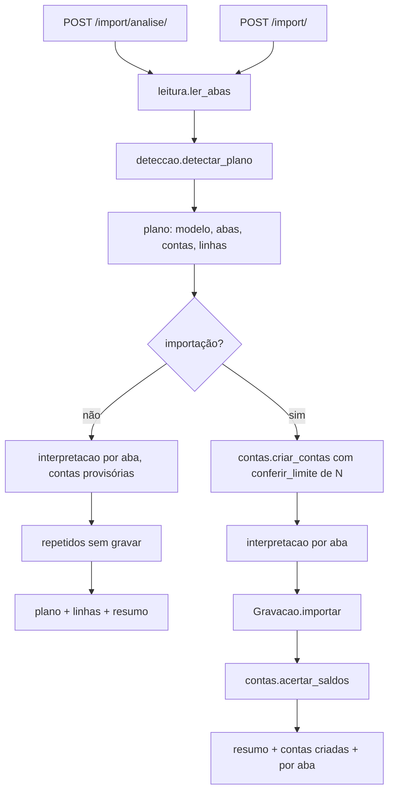

# Importação completa Design

**Spec**: `.specs/features/importacao-completa/spec.md`
**Status**: Approved

---

## Architecture Overview

A importação continua nas quatro etapas da AD-043: leitura, interpretação, repetidos e gravação. A feature acrescenta duas peças ao pipeline:

- a **detecção**, que monta o plano a partir do arquivo;
- as **contas**, que cria as contas novas e acerta o saldo delas.

Duas rotas novas formam um fluxo sem estado (AD-055):

- `POST /api/import/analise/` recebe o arquivo e um plano opcional e devolve o plano completo e as linhas interpretadas, sem gravar nada;
- `POST /api/import/` recebe o arquivo e o plano final e grava.

A tela chama a análise de novo a cada mudança no plano. As correções de linha também vão no plano.

O plano liga cada nome de conta do arquivo a uma conta existente ou a uma conta a criar:

- **Na análise:** a conta a criar entra no lugar de uma conta provisória. Ela passa pela interpretação, mas não conta nos repetidos, porque não tem transações.
- **Na importação:** as contas novas são criadas primeiro, numa transação, e o plano passa a apontar para elas. A gravação roda pelo `Gravacao.importar` atual. No fim, o saldo inicial de cada conta criada é acertado para o saldo atual informado.

### Abordagens consideradas

| Abordagem | Prós | Contras | Decisão |
| --------- | ---- | ------- | ------- |
| Guardar a análise no servidor e confirmar por id | Upload único | Arquivo guardado, expiração, limpeza e risco de estado divergente | Recusada |
| Fluxo sem estado: o arquivo vai na análise e na importação, com o plano | Reproduzível; nada guardado; a análise nunca grava | O arquivo sobe várias vezes (até 5 MB) | **Escolhida (AD-055)** |
| Saldo inicial informado pelo usuário | Simples | O usuário teria que calcular o saldo de antes da primeira transação | Recusada; decisão do usuário |
| Saldo atual informado, inicial calculado depois da gravação | O saldo bate com o banco | Um passo a mais depois da gravação | **Escolhida (AD-055)** |
| Uma importação por aba, reaproveitando a rota atual | Menos código | Várias requisições, sem contas criadas juntas | Recusada |

---

## Code Reuse Analysis

### Existing Components to Leverage

| Component | Location | How to Use |
| --------- | -------- | ---------- |
| `ler_csv`, `vazio`, `LinhaBruta`, limites | `data_exchange/importacao/leitura.py` | `ler_abas` reaproveita o CSV como aba única e a numeração das linhas |
| `Interpretador` | `data_exchange/importacao/interpretacao.py:141-248` | Uma instância por aba, com o papel da aba; a conta vem do plano |
| `Repetidos` | `data_exchange/importacao/repetidos.py` | Carrega os dois contadores quando o lote mistura tipos; a análise usa só a parte de contagem |
| `Gravacao.importar` | `data_exchange/importacao/gravacao.py:52-98` | Grava as linhas válidas com savepoint por linha |
| `calcular`, `recalcular`, `recalculo_adiado` | `accounts/saldo.py` | Acerto do saldo inicial das contas criadas depois da gravação |
| `conferir_limite` | `core/travas.py:313-329` | Ganha a quantidade a criar, para conferir N contas de uma vez |
| `get_owned_or_400`, `CONTA_NAO_ENCONTRADA` | `core/fields.py:62-68` | Conta vinculada (IMPCOMP-24) |
| `ler_saldo` | `core/valores.py:115-124` | Saldo atual das contas a criar (zero e negativo valem) |
| `normalizar` | `core/texto.py` | Base da comparação de cabeçalhos e de contas, com espaços internos juntados |
| `RecursoLiberado('importacao_planilha')`, trava de tags | `core/travas.py`, `data_exchange/views.py:95-96` | Mesmas travas nas rotas novas |
| `tratarErro`, `MoneyInput`, `Paginacao`, `AvisoDeLimite`, `usePlan`, `BANKS`, `Tabs` | frontend | Telas da revisão |

### Integration Points

| System | Integration Method |
| ------ | ------------------ |
| Contas | `Account.objects.create` com `initial_balance=0`, depois o acerto do saldo inicial |
| Uso do plano | O frontend chama `atualizarUso()` depois de criar contas |

---

## Components

### Leitura de todas as abas

- **Location**: `data_exchange/importacao/leitura.py`
- **Interfaces**:
  - `Aba(nome, cabecalho: list[str], linhas: list[LinhaBruta])`.
  - `ler_abas(arquivo) -> list[Aba]`:
    - o XLSX lê todas as planilhas;
    - o CSV vira uma aba com o nome do arquivo;
    - o cabeçalho é a primeira linha não vazia, e as linhas vazias continuam puladas com a numeração preservada.
  - O limite de 10.000 linhas vale para a soma das abas (IMPCOMP-03). O limite de 5 MB continua antes da leitura.
  - A linha de resumo (IMPCOMP-15) é reconhecida aqui: a primeira célula começa com "Total" e as colunas de descrição e de conta estão vazias. Como depende do mapeamento, a leitura só marca as candidatas, e a interpretação decide. A contagem sai em `summary_rows`.

### Detecção

- **Location**: `data_exchange/importacao/deteccao.py` (novo)
- **Interfaces**:
  - `nome_comparavel(texto)` é `normalizar` com espaços internos juntados.
  - `SINONIMOS`: campo → lista de nomes (IMPCOMP-04). Os campos são `date_column`, `description_column`, `amount_column`, `account_column`, `source_account_column`, `dest_account_column`, `type_column`, `status_column`, `category_column`, `subcategory_column`, `tags_column`, `income_column` e `expense_column`.
  - `colunas_da_aba(aba)` liga cada cabeçalho ao primeiro campo cujo sinônimo bate.
  - `papel_da_aba(colunas)` devolve `TRANSFERENCIAS`, `RECEITAS_DESPESAS` ou `IGNORAR` com o motivo "Colunas não reconhecidas" (IMPCOMP-05 a IMPCOMP-07).
  - `MODELO_MOBILLS` guarda os nomes das abas e os cabeçalhos exatos (IMPCOMP-08).
  - `abas_contidas(abas)` marca IGNORAR com "Contida na aba <nome>" quando o multiconjunto (data, valor, conta, descrição) de uma aba de receitas e despesas cabe em outra aba usada (IMPCOMP-09).
  - `contas_do_arquivo(abas, usuario)` devolve cada nome de conta uma vez, agrupado por `nome_comparavel`. Cada conta vem com linhas, soma, primeira e última data e a sugestão (IMPCOMP-10 a IMPCOMP-12):
    - vincular à conta ativa de mesmo nome;
    - ou criar com o tipo pelas palavras do nome.
  - `detectar_plano(abas, usuario, plano=None)` completa o plano. O que vier no plano editado prevalece (IMPCOMP-13, IMPCOMP-14).

### Plano e serializer

- **Location**: `data_exchange/serializers.py` (novo)
- **Interfaces**:
  - `PlanoSerializer`:
    - `modelo`;
    - `abas`: `[{nome, papel, colunas}]`;
    - `contas`: `{nome_no_arquivo: {acao: "vincular", id} | {acao: "criar", nome, tipo, saldo_atual, institution, color}}`;
    - `linhas`: `{"<aba>:<n>": {excluir: true} | {data, valor, descricao, conta, destino, tipo, situacao, categoria, subcategoria, tags}}`.
  - O plano chega como texto JSON no multipart. JSON inválido recebe 400 `{"plano": ["Plano inválido: JSON malformado."]}`, e um formato errado recebe 400 nos campos aninhados (IMPCOMP-36).
  - Conta a criar com nome vazio ou com mais de 100 caracteres, tipo fora de `ACCOUNT_TYPE_CHOICES` ou saldo atual ilegível recebe 400 em `plano.contas.<nome>.<campo>` (IMPCOMP-28).
  - Conta vinculada de outro usuário, inexistente ou excluída recebe 400 com `"Conta não encontrada."` (IMPCOMP-24).
  - Chave de linha que não existe no arquivo recebe 400 `{"plano": ["Linha inexistente no arquivo: <chave>."]}` (IMPCOMP-35).

### Interpretação

- **Location**: `data_exchange/importacao/interpretacao.py`
- **Interfaces**:
  - `Interpretador` passa a receber a aba, o papel e as colunas e um resolvedor de contas que vem do plano: conta existente ou conta provisória.
  - `Rejeicao` ganha `aba`, e `rejected_rows` ganha `sheet` (IMPCOMP-21).
  - `STATUS_PENDENTE` passa a ter "nao paga", "a pagar", "a receber", "agendada", "pendente" e "pending" (IMPCOMP-16, IMPCOMP-17).
  - Colunas de entrada e saída: a célula preenchida define o tipo, e as duas preenchidas ou nenhuma rejeitam com "Valor inválido" (IMPCOMP-18, IMPCOMP-19).
  - Tipo "transferencia" numa aba de receitas e despesas com destino mapeado vira transferência (IMPCOMP-20).
  - Correções do plano: os campos corrigidos substituem as células da `LinhaBruta` antes de interpretar (IMPCOMP-32, IMPCOMP-33). As linhas excluídas saem com o estado `EXCLUIDA` (IMPCOMP-34).
  - `description_column` passa a entrar nas colunas conferidas da transferência (IMPCOMP-22).

### Repetidos

- **Location**: `data_exchange/importacao/repetidos.py`
- **Interfaces**:
  - Carrega os contadores de receitas e despesas e o de transferências sempre que o lote tiver os dois tipos (IMPCOMP-46).
  - `marcar(linhas)` devolve, sem gravar, quais linhas seriam ignoradas. A análise usa para o estado `REPETIDA` (IMPCOMP-31).

### Contas e saldo

- **Location**: `data_exchange/importacao/contas.py` (novo), `core/travas.py`
- **Interfaces**:
  - `conferir_limite(usuario, chave, quantidade=1)` recusa quando `uso + quantidade > limite`. Uma importação que passaria do limite recebe 403 `plan_limit_reached` (IMPCOMP-27).
  - `criar_contas(usuario, plano)` cria as contas marcadas para criar, com `initial_balance=0`, e devolve `{nome_no_arquivo: conta}` (IMPCOMP-25).
  - `acertar_saldos(contas_criadas, saldos_atuais)` roda depois de `Gravacao.importar`, fora do `recalculo_adiado`. Para cada conta, `initial_balance = saldo_atual − (calcular(conta) − initial_balance)`, depois `recalcular` (IMPCOMP-26).
  - A importação roda na transação da requisição (`ATOMIC_REQUESTS`). Uma falha que sobe até a view desfaz as contas criadas (IMPCOMP-29). A falha de uma linha continua rejeitando só a linha (IMPORT-28).

### Rotas

- **Location**: `data_exchange/views.py`, `data_exchange/urls.py`
- **Interfaces**:
  - `ImportacaoAnaliseView` (`POST /api/import/analise/`) e `ImportacaoView` (`POST /api/import/`), com `RecursoLiberado('importacao_planilha')` (IMPCOMP-50). A trava de tags tira as tags das colunas e das correções do plano (IMPCOMP-51).
  - Resposta da análise:
    - `{plano, linhas: [{chave, aba, numero, estado: VALIDA|REJEITADA|REPETIDA|EXCLUIDA, motivo, data, descricao, conta, destino, tipo, categoria, subcategoria, valor, situacao}], resumo}`;
    - `resumo` traz validas, rejeitadas, repetidas, excluidas, contas_novas, receitas, despesas e transferencias, e `summary_rows`.
  - Resposta da importação: os campos de IMPORT-29 mais `accounts_created: [{id, name}]`, `by_sheet: {aba: {imported, ignored, rejected}}` e `summary_rows` (IMPCOMP-47).
  - As rotas antigas continuam como estão.
  - Os logs levam só contagens, ids e o número das linhas (IMPCOMP-52).

### Frontend

- **Location**:
  - `src/services/import-export.ts`, `src/types/importacao.ts` (novo);
  - `src/components/importacao/` (novo), com `AssistenteDePlanilha`, `PassoArquivo`, `RevisaoDeAbas`, `RevisaoDeContas`, `RevisaoDeLinhas` e `ResultadoDaImportacao`;
  - `src/app/(app)/importar/page.tsx`.
- **Serviço**: `analisarArquivo(file, plano?)` e `importarArquivo(file, plano)`, com 120 s.
- **Passo do arquivo** (IMPCOMP-43): arrastar e soltar; escolher o arquivo chama a análise.
- **Revisão** (IMPCOMP-37 a IMPCOMP-42, IMPCOMP-44):
  - O resumo fica fixo no topo, sobre três abas: Abas e colunas, Contas, Linhas.
  - Mudanças nas abas, colunas e contas pedem uma nova análise com debounce. As correções de linha vão no plano e pedem a análise.
  - **Contas:**
    - vincular, com as contas ativas, ou criar, com nome, tipo, instituição de `BANKS` e saldo atual (`MoneyInput` com negativo);
    - `AvisoDeLimite chave="limite_contas"` com `usado` somando as contas a criar;
    - `limiteAtingido` impede marcar mais uma conta para criar.
  - **Linhas:** `Paginacao` de 20 em 20, filtros e busca, edição na linha e excluir ou restaurar.
- **Resultado** (IMPCOMP-49): os quatro totais, as contas criadas, os totais por aba e as rejeitadas com a aba. Chama `atualizarUso()` quando contas foram criadas.
- **Página**: o card de planilha abre o assistente, e o guia de formatos passa a falar da detecção automática. O OFX continua no `import-dialog.tsx`.

---

## Error Handling Strategy

| Error Scenario | Handling | User Impact |
| -------------- | -------- | ----------- |
| Plano malformado ou com formato errado | 400 no campo `plano` | Toast pelo `tratarErro` |
| Conta vinculada inválida | 400 `"Conta não encontrada."` na conta do plano | Erro na conta |
| Conta a criar inválida | 400 no campo da conta | Erro no campo da linha da conta |
| Limite de contas | 403 `plan_limit_reached` | Aviso do plano |
| Chave de linha inexistente | 400 `"Linha inexistente no arquivo: <chave>."` | Toast |
| Linha inválida | Rejeitada com aba, número e motivo | Aparece em Rejeitadas |
| Falha que sobe até a view | Transação desfeita, nenhuma conta criada | Toast genérico |

---

## Tech Decisions

| Decision | Choice | Rationale |
| -------- | ------ | --------- |
| AD-055 | Importação de planilha sem estado: análise e importação recebem o arquivo e o plano; contas novas criadas na mesma requisição, com o saldo inicial acertado para o saldo atual informado | Nada guardado no servidor, importação reproduzível e saldo igual ao do banco |
| Comparação de nomes | `normalizar` com espaços internos juntados, só na detecção | A spec pede "sem espaços extras"; mudar `normalizar` afetaria as categorias e as correções |
| Limite de N contas | `conferir_limite` ganha `quantidade` | Uma conferência para todas as contas a criar, sob a mesma trava do usuário |
| Spec `importacao` | O "Out of Scope" passa a dizer que criar contas entra na `importacao-completa` | Mantém as duas specs coerentes |
