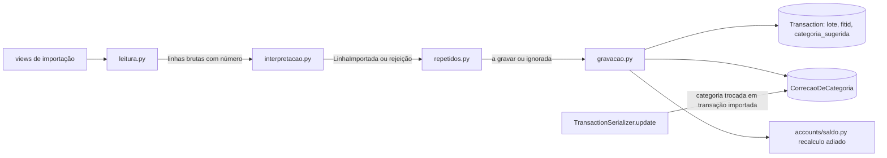

# Importacao Design

**Spec**: `.specs/features/importacao/spec.md`
**Status**: Approved

---

## Architecture Overview

Hoje `data_exchange/services.py` lê o arquivo, interpreta cada linha, procura repetidos e grava, tudo no mesmo laço e dentro de um único `atomic()`. Um erro de banco desfaz o arquivo inteiro e a resposta ainda diz que as linhas entraram (FIN-11). O design separa a importação em quatro etapas com fronteiras claras, num pacote novo `data_exchange/importacao/`:

1. **Leitura** (`leitura.py`): confere extensão e tamanho, lê OFX, CSV ou XLSX e devolve linhas brutas com o número de cada uma no arquivo. Nada é gravado; falhas do arquivo inteiro viram 400 (IMPORT-01 a IMPORT-08).
2. **Interpretação** (`interpretacao.py`): transforma cada linha bruta numa `LinhaImportada` (data, valor, tipo, descrição, status, conta ou contas, categoria, tags, `fitid`) ou num motivo de rejeição. Sem banco, exceto o mapa de contas e categorias carregado antes (IMPORT-09 a IMPORT-26).
3. **Repetidos** (`repetidos.py`): conta, por chave, quantas transações iguais a conta já tem e consome essa contagem na ordem do arquivo (IMPORT-34 a IMPORT-38).
4. **Gravação** (`gravacao.py`): trava as contas envolvidas, grava cada linha num savepoint próprio, sugere a categoria pelas correções do usuário e recalcula os saldos uma vez no fim (IMPORT-27, IMPORT-28, IMPORT-39, IMPORT-40, IMPORT-43, IMPORT-44).



A resposta é sempre o mesmo resumo (IMPORT-29, IMPORT-30): `{total, imported, ignored, rejected, suggested, batch_id, rejected_rows: [{line, reason}]}`.

### Abordagens consideradas

| Abordagem | Prós | Contras | Decisão |
| --------- | ---- | ------- | ------- |
| Fila assíncrona (Celery, RQ) para importar fora da requisição | Requisição curta | Exige worker e broker no Render; não há infraestrutura para isso hoje | Recusada |
| Dentro da requisição, com savepoint por linha, recálculo de saldo adiado e consultas limitadas ao período do arquivo | Sem infraestrutura nova; cabe em 30 s para 10.000 linhas | A requisição fica ocupada durante a importação | **Escolhida** |
| Gunicorn com um único worker síncrono (padrão atual do Render) | Nada a mudar | Uma importação bloqueia todos os usuários (IMPORT-41) | Recusada |
| `gunicorn.conf.py` com `gthread`: 2 workers e 4 threads | Atende outras requisições durante a importação; cabe na memória do plano gratuito | Mais memória que 1 worker | **Escolhida** |
| Chave de repetido como conjunto (como hoje) | Simples | Duas compras iguais no mesmo arquivo viram uma (FIN-21) | Recusada |
| Chave de repetido com contagem (multiconjunto) | Grava N − M (IMPORT-38) | Uma consulta agregada por chave | **Escolhida** |
| Marcar transação importada por um modelo `Importacao` | Histórico de cada importação | Tabela e telas que ninguém pediu | Recusada; `import_batch` (UUID) na transação basta para o atalho da IMPORT-45 e para saber o que é importado |

---

## Code Reuse Analysis

### Existing Components to Leverage

| Component | Location | How to Use |
| --------- | -------- | ---------- |
| Leitura AD-009 no frontend | `fluxar-frontend/src/lib/dinheiro.ts` (`lerValorDigitado`) | Mesma regra, reescrita em Python como `ler_valor_em_texto` em `core/valores.py`, com os mesmos exemplos nos testes |
| Saldo sob trava | `accounts/saldo.py` | Ganha `recalculo_adiado()`: durante a importação os signals anotam as contas, e o recálculo roda uma vez no fim (AD-038) |
| Criação de transferência | `transactions/services.py` (`create_transfer`) | IMPORT-25 e IMPORT-26: mesmas regras e mensagens da spec `saldo` |
| Normalização sem acento | `normalize_str` em `data_exchange/services.py` | Vai para `data_exchange/importacao/texto.py` e serve a nomes, tipos e descrições |
| Cache de categorias e tags | `process_spreadsheet` | Mantido, mas o cache só recebe o objeto depois que o savepoint da linha confirma |
| `ParametrosConhecidosMixin` e `filtrar_transacoes` | `core/filtros.py`, `transactions/filtros.py` | Ganham `import_batch` e `suggested_category` para o atalho da IMPORT-45 |
| `tratarErro`, `formatarMoeda` | `fluxar-frontend/src/lib/` | Diálogo de importação |

### Integration Points

| System | Integration Method |
| ------ | ------------------ |
| Saldo (AD-038) | Transações importadas seguem as regras do saldo; o recálculo de cada conta roda uma vez no fim do arquivo, dentro da mesma transação |
| Contratos (AD-021, AD-022, AD-041) | Novos filtros `import_batch` e `suggested_category` na lista de transações; o resumo segue o formato de erros do DRF para falhas do arquivo |
| Isolamento | Contas do mapeamento só do usuário (`get_owned_or_400` e consulta filtrada); correções lidas só do próprio usuário (IMPORT-49) |
| LGPD | `CorrecaoDeCategoria.user` com `CASCADE`: a exclusão definitiva do usuário apaga as correções (IMPORT-48). Nenhum outro uso existe, então IMPORT-49 vale enquanto o consentimento de LGPD-33 não existir |
| Deploy (Render) | `gunicorn.conf.py` na raiz, lido automaticamente pelo `gunicorn core.wsgi:application`; `WEB_CONCURRENCY` ajusta os workers sem mudar o Start Command |

---

## Components

### Leitura (`data_exchange/importacao/leitura.py`)

- `FORMATOS = {'.ofx', '.csv', '.xlsx'}`; outra extensão, inclusive `.xls`: 400 no campo `file` com "Formato não suportado. Envie um arquivo OFX, CSV ou XLSX." (IMPORT-02).
- `file.size > 5 * 1024 * 1024`: 400 com "O arquivo passa do limite de 5 MB.", antes de ler (IMPORT-04).
- CSV: tenta UTF-8 (com BOM) e depois Windows-1252; detecta o separador entre `;` e `,` pela primeira linha (`csv.Sniffer` restrito a esses dois); lê tudo como texto (`dtype=str`, `keep_default_na=False`, `skip_blank_lines=False`) para a interpretação aplicar AD-009 (IMPORT-08).
- XLSX: `openpyxl` em modo somente leitura, com os valores das células: números continuam números e datas continuam datas (IMPORT-11, IMPORT-14).
- Cada linha bruta leva o número dela no arquivo: cabeçalho na linha 1, dados a partir da 2; linhas totalmente vazias são descartadas aqui, sem contar (IMPORT-30, IMPORT-32).
- Mais de 10.000 linhas de dados: 400 com "O arquivo passa do limite de 10.000 linhas." (IMPORT-05).
- Arquivo ilegível: 400 com "Não foi possível ler o arquivo."; colunas mapeadas ausentes: 400 com "Colunas não encontradas no arquivo: <a>, <b>." (IMPORT-06).
- OFX: `OfxParser`; mais de uma conta em `ofx.accounts`: 400 com "O arquivo tem mais de uma conta. Exporte um arquivo por conta." (IMPORT-07). O número de cada transação é a posição dela no extrato, a partir de 1.
- A etapa de mapeamento (`preflight`) usa a mesma leitura, com os mesmos formatos e limites (edge case da spec).

### Valores e datas (`core/valores.py` e `data_exchange/importacao/texto.py`)

- `ler_valor_em_texto(texto) -> Decimal`: remove "R$" e espaços, aceita sinal; com vírgula, vírgula decimal e pontos de milhar; sem vírgula, AD-009 (IMPORT-09, IMPORT-10). Mais de duas casas, zero ou ilegível: `ValueError` → "Valor inválido" (IMPORT-12).
- Célula numérica do XLSX: `Decimal(str(numero))`, com a mesma recusa de zero e de mais de duas casas (IMPORT-11).
- `ler_data_em_texto(texto) -> date`: `dd/mm/aaaa`, `dd/mm/aa` (ano 2000 + aa) e `aaaa-mm-dd`; data inexistente ou outro formato → "Data inválida" (IMPORT-13, IMPORT-15). Célula de data do XLSX: a data da célula (IMPORT-14).

### Interpretação (`data_exchange/importacao/interpretacao.py`)

- `TIPOS_DE_RECEITA = {'receita', 'entrada', 'credito', 'c'}`, `TIPOS_DE_DESPESA = {'despesa', 'saida', 'debito', 'd'}`, comparados depois de normalizar maiúsculas e acentos; outro valor → "Tipo desconhecido: <valor original>" (IMPORT-16, IMPORT-17). O valor é gravado sem sinal.
- Sem coluna de tipo, ou no OFX: negativo é despesa, positivo é receita (IMPORT-18).
- OFX: descrição = memo, senão favorecido, senão "Sem descrição" (IMPORT-19); `fitid` = `tx.id` quando houver.
- Status: "pendente" ou "pending" (normalizados) → `PENDING`; qualquer outro valor ou sem coluna → `COMPLETED` (IMPORT-20).
- Conta da linha, em ordem: mapeamento explícito da tela; senão conta ativa do usuário com o mesmo nome normalizado; senão "Conta não mapeada: <nome>". Conta mapeada que está excluída → "Conta excluída: <nome>" (IMPORT-21). Sem coluna de conta e sem conta padrão → "Conta não informada" (IMPORT-22).
- Transferência: origem e destino pela mesma regra; iguais → "Origem e destino iguais" (IMPORT-26).
- Limites de texto: descrição acima de 255 → "Texto longo demais: descrição"; categoria, subcategoria ou tag nova acima de 50 → "Texto longo demais: categoria", "subcategoria" ou "tag" (IMPORT-24).
- O resultado é `LinhaImportada` ou `Rejeicao(linha, motivo)`; nada é gravado nessa etapa.

### Repetidos (`data_exchange/importacao/repetidos.py`)

- Antes de gravar, carrega só o necessário: transações das contas do arquivo com data entre a menor e a maior data das linhas válidas (não todas as do usuário, como hoje).
- **OFX com `fitid`**: ignorada se a conta já tem transação com esse `fitid` (IMPORT-34). Sem `fitid`, ou comparando com transações gravadas sem `fitid` (importações antigas): chave `(conta, data, valor, tipo, descrição)` contra as transações sem `fitid` (IMPORT-35).
- **Receita ou despesa de planilha**: chave `(conta, data, valor, tipo, descrição)` (IMPORT-36).
- **Transferência de planilha**: chave `(origem, destino, data, valor)`, comparando a perna de saída com a parceira de entrada (IMPORT-37).
- Cada chave guarda a contagem M já existente; cada linha do arquivo com essa chave consome uma unidade: enquanto houver saldo, é ignorada; depois, é gravada. Assim N linhas iguais contra M existentes gravam N − M (IMPORT-38).

### Gravação (`data_exchange/importacao/gravacao.py`)

- Roda dentro da transação da requisição (`ATOMIC_REQUESTS`). Primeiro trava as contas envolvidas com `select_for_update` em ordem de id: uma segunda importação para as mesmas contas espera a primeira terminar e, ao ler os repetidos depois da trava, encontra as linhas já gravadas (IMPORT-39). Uma `UniqueConstraint(account, fitid)` parcial (com `fitid` não nulo) é a segunda barreira no OFX.
- Cada linha grava num `transaction.atomic()` próprio (savepoint). Erro de banco na linha: o savepoint é desfeito, a linha vira rejeitada com "Erro ao gravar a linha" e as demais seguem (IMPORT-27, IMPORT-28). O texto da exceção não vai para a resposta (CONTRATO-29); ele vai para o log.
- Categorias e tags novas são criadas dentro do savepoint da linha; o cache só recebe o objeto depois que o savepoint confirma (IMPORT-23).
- Receitas e despesas por `Transaction.objects.create` com `import_batch`, `fitid`, `status` e categoria; transferências por `create_transfer`, marcando as duas pernas com `import_batch`.
- `accounts.saldo.recalculo_adiado()` envolve o laço: os signals anotam as contas em vez de recalcular a cada linha, e a saída do contexto recalcula cada conta uma vez (IMPORT-40, AD-038).
- Sugestão de categoria (IMPORT-43, IMPORT-44, IMPORT-47): para linha sem categoria no arquivo, busca a correção mais recente do usuário com a mesma `descricao_normalizada`; usa a categoria se ela existir, estiver ativa e for do tipo da linha; grava com `categoria_sugerida=True`. As correções do usuário são carregadas uma vez por importação, num dicionário pela descrição normalizada.

### Correções de categoria (`transactions/models.py`, `transactions/serializers.py`)

- `normalizar_descricao(texto)`: minúsculas, sem acentos, sem dígitos, espaços repetidos viram um (IMPORT-43; "UBER *TRIP 1234" e "UBER *TRIP 5678" dão "uber *trip").
- `TransactionSerializer.update`: se a transação tem `import_batch` e a categoria muda (inclusive de nenhuma para uma), cria `CorrecaoDeCategoria` e desliga `categoria_sugerida` (IMPORT-42; edge case "troca de sugerida vira correção nova").
- `TransactionSerializer` expõe `import_batch` e `category_suggested` (somente leitura).

### Filtros e resposta

- `/transactions/` aceita `import_batch` (UUID) e `suggested_category=true` (IMPORT-45); os dois entram em `PARAMETROS_DA_LISTA` e em `filtrar_transacoes`.
- `ImportOFXView`, `ImportSpreadsheetView` e `ImportSpreadsheetPreflightView` passam a chamar o pacote novo; a resposta das duas primeiras é sempre 200 com o resumo quando o arquivo é aceito, inclusive com zero gravadas (IMPORT-29, IMPORT-31).

### Servidor (`gunicorn.conf.py`)

- `worker_class = 'gthread'`, `workers = int(os.getenv('WEB_CONCURRENCY', 2))`, `threads = int(os.getenv('GUNICORN_THREADS', 4))`, `timeout = 120`. Com isso uma importação ocupa uma thread, e as outras requisições seguem atendidas (IMPORT-41). `DEPLOY.md` registra as variáveis.

### Frontend

| Arquivo | Mudança | Requisitos |
| ------- | ------- | ---------- |
| `src/components/transactions/import-dialog.tsx` | `accept` e extensões permitidas só `.ofx`, `.csv` e `.xlsx`; resumo com lidas, gravadas, ignoradas e rejeitadas, a lista de rejeitadas com linha e motivo, e "N linhas com categoria sugerida" com atalho para `/transacoes?import_batch=<id>&suggested_category=true` | IMPORT-03, IMPORT-33, IMPORT-45 |
| `src/services/import-export.ts` | `ImportSummary` no formato novo | IMPORT-29, IMPORT-30 |
| `src/app/(app)/transacoes/page.tsx` e `transaction-filters.tsx` | Leem `import_batch` e `suggested_category` da URL e os enviam; mostram o filtro ativo com opção de limpar | IMPORT-45 |
| Linha da transação e formulário de edição | Selo "Sugerida pelo seu histórico" quando `category_suggested` | IMPORT-46 |

---

## Data Models

```python
# transactions/models.py
class Transaction(models.Model):
    ...
    import_batch = models.UUIDField(null=True, blank=True, db_index=True)  # lote da importação
    fitid = models.CharField(max_length=255, null=True, blank=True)        # identificador do OFX
    categoria_sugerida = models.BooleanField(default=False)

    class Meta:
        constraints = [
            UniqueConstraint(fields=['account', 'fitid'], condition=Q(fitid__isnull=False),
                             name='fitid_unico_por_conta'),
        ]

class CorrecaoDeCategoria(models.Model):
    id = UUIDField(primary_key=True)
    user = FK(User, CASCADE, related_name='correcoes_de_categoria')
    transacao = FK(Transaction, SET_NULL, null=True)
    descricao = CharField(255)
    descricao_normalizada = CharField(255, db_index=True)
    conta = FK(Account, SET_NULL, null=True)
    categoria_antes = FK(Category, SET_NULL, null=True, related_name='+')
    categoria_depois = FK(Category, SET_NULL, null=True, related_name='+')
    criada_em = DateTimeField(auto_now_add=True)

    class Meta:
        indexes = [Index(fields=['user', 'descricao_normalizada', '-criada_em'])]
```

Migração `transactions/0010_importacao`. As transações importadas antes desta feature ficam com `import_batch` nulo: não geram correção e são comparadas pela chave de data, valor, tipo e descrição (IMPORT-35).

---

## Error Handling Strategy

| Error Scenario | Handling | User Impact |
| -------------- | -------- | ----------- |
| Extensão, tamanho, linhas, arquivo ilegível, colunas, OFX com várias contas | 400 no campo `file` com a mensagem da spec; nada gravado | Aviso com a mensagem |
| Linha com valor, data, tipo, conta ou texto inválido | Linha rejeitada com o motivo da spec | Aparece na lista de rejeitadas |
| Erro de banco numa linha | Savepoint desfeito; "Erro ao gravar a linha"; exceção no log | Aparece na lista; as outras linhas ficam |
| Arquivo inteiro repetido | 200 com zero gravadas | Resumo mostra as ignoradas |
| Duas importações iguais ao mesmo tempo | A segunda espera a trava e ignora o que a primeira gravou | Nenhuma duplicata |

---

## Risks & Concerns

| Risk | Likelihood | Impact | Mitigation |
| ---- | ---------- | ------ | ---------- |
| 10.000 linhas passam de 30 s no Render | Média | Médio | Recálculo adiado, consultas limitadas ao período, cache de categorias e correções; teste de desempenho com 10.000 linhas no CI com folga |
| Memória do plano gratuito com 2 workers | Média | Médio | `WEB_CONCURRENCY` ajusta sem deploy de código; `threads` dão concorrência sem dobrar a memória |
| A trava das contas segura outras escritas nessas contas durante a importação | Média | Baixo | A importação é curta; só as contas do arquivo são travadas |
| Planilhas antigas com `.xls` | Média | Baixo | Mensagem pede para salvar como `.xlsx` ou CSV |
| Correções de transações importadas antes da feature não são registradas | Certa | Baixo | Elas não têm `import_batch`; o histórico de correções começa com a feature |

---

## Tech Decisions

| Decision | Choice | Rationale |
| -------- | ------ | --------- |
| Processamento | Dentro da requisição, com savepoint por linha e recálculo de saldo adiado (AD-043) | Sem infraestrutura nova; atende IMPORT-28 e IMPORT-40 |
| Concorrência do servidor | `gunicorn.conf.py` com `gthread`, 2 workers e 4 threads | Atende IMPORT-41 sem fila |
| Repetidos | Multiconjunto por chave, consumido na ordem do arquivo | IMPORT-38 |
| Transação importada | `import_batch` e `fitid` na própria transação | Atalho da IMPORT-45 e repetidos do OFX sem modelo extra |
| Correções | Tabela própria por usuário, consultada pela descrição normalizada (AD-031) | Sugestão barata e dado pronto para a PROP-04, com consentimento |
