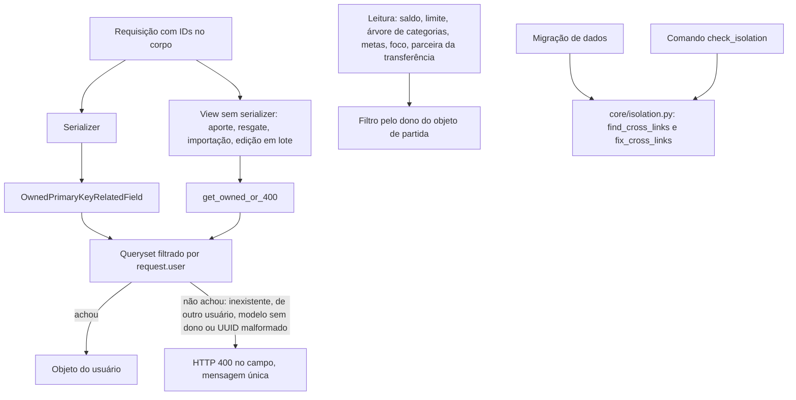

# Isolamento entre usuarios Design

**Spec**: `.specs/features/isolamento-entre-usuarios/spec.md`
**Status**: Approved

---

## Architecture Overview

A checagem de dono fica num campo de relação reutilizável, usado em todos os serializers que gravam uma relação. As views que leem o corpo da requisição sem serializer usam um helper com a mesma regra e a mesma mensagem. Na leitura, cada soma, lista ou detalhe que segue uma relação passa a filtrar pelo dono do objeto de partida. Os dados já gravados são corrigidos por uma migração de dados, que roda uma vez no `migrate` do deploy, e um comando de verificação lista o que sobrar.

A mudança fica toda no backend. O frontend já mostra erro por campo nos formulários e não precisa mudar nesta branch.

### Abordagens consideradas

| Abordagem | Como funciona | Por que não, ou por que sim |
| --------- | ------------- | --------------------------- |
| **Campo de relação próprio (escolhida)** | Um `PrimaryKeyRelatedField` que filtra o queryset por `request.user` e troca as mensagens por "Conta não encontrada." e as demais | Resolve no ponto de entrada, devolve o erro no campo (AD-010) e é um só lugar para as mensagens em português. Um teste-inventário garante que nenhuma relação nova escape |
| Validação no `save()` dos models | Cada model confere se as relações têm o mesmo `user` antes de gravar | Pega também gravações internas, mas o erro nasce fora do serializer e precisa ser traduzido para o campo. Não pega `QuerySet.update()`, e o sistema já usa isso (edição em lote) |
| `validate_<campo>` em cada serializer | Um método por relação | Repete a mesma regra em mais de 15 lugares, e uma relação nova sem o método passa sem aviso |

---

## Code Reuse Analysis

### Existing Components to Leverage

| Component | Location | How to Use |
| --------- | -------- | ---------- |
| Filtro do queryset no `__init__` dos serializers | `transactions/serializers.py:255-279`, `accounts/serializers.py:41-45` e `:73-78` | O padrão atual vira o campo reutilizável; esses serializers passam a usar o campo novo |
| `UserQuerySetMixin` | `core/mixins.py:1-13` | Mantido: já dá 404 para ID de outro usuário no endereço (ISOL-12) |
| `AccountService.get_balance` | `accounts/services.py:9-35` | Já calcula pela regra SALDO-01; a correção usa ela para recalcular o saldo guardado |
| Recalculo do total da fatura | `transactions/signals.py:75-93` | Mesma soma, repetida na correção para as faturas que perderem compras |
| Criação automática de categorias e da conta "Carteira" | `transactions/signals.py:35-73` | A base de testes cria cada usuário pelo ORM e já recebe esses dados |
| Container `backend` com Postgres 15 | `docker-compose.yml` | Roda os testes localmente, com o mesmo banco da produção |

### Integration Points

| System | Integration Method |
| ------ | ------------------ |
| DRF | O campo novo herda de `PrimaryKeyRelatedField` e funciona com `many=True` (tags) |
| Migrações | A correção é uma migração de dados em `transactions`, dependente das últimas migrações de `accounts`, `budgets`, `goals` e `reports`; roda no `migrate --noinput` do `entrypoint.sh` |
| CI | O `ci-backend.yml` passa a rodar os testes com um serviço Postgres |

---

## Components

### OwnedPrimaryKeyRelatedField

- **Purpose**: aceitar só IDs de objetos do usuário da requisição, com a mesma resposta para qualquer ID que não seja dele.
- **Location**: `core/fields.py`
- **Interfaces**:
  - `OwnedPrimaryKeyRelatedField(queryset, not_found_message, owner_field='user', **kwargs)`: o `get_queryset()` aplica `filter(**{owner_field: request.user})` sobre o queryset informado.
  - `to_internal_value(data)`: qualquer falha (inexistente, de outro usuário, categoria-modelo sem dono, UUID malformado ou tipo errado) vira `ValidationError(not_found_message)`.
  - Constantes `CONTA_NAO_ENCONTRADA`, `CARTAO_NAO_ENCONTRADO`, `CATEGORIA_NAO_ENCONTRADA`, `TAG_NAO_ENCONTRADA`.
- **Dependencies**: `request` no contexto do serializer. Sem ele, o queryset fica vazio.
- **Reuses**: o padrão dos serializers que já filtram no `__init__`.

### get_owned_or_400

- **Purpose**: a mesma regra para as views que leem IDs direto de `request.data`.
- **Location**: `core/fields.py`
- **Interfaces**:
  - `get_owned_or_400(queryset, user, pk, field_name, message, owner_field='user')`: devolve o objeto ou levanta `serializers.ValidationError({field_name: [message]})`.
- **Dependencies**: nenhuma além do DRF.
- **Reuses**: as mensagens de `OwnedPrimaryKeyRelatedField`.

### Relações graváveis que passam a usar o campo

| Serializer ou view | Campos | Requisito |
| ------------------ | ------ | --------- |
| `TransactionSerializer` | `account`, `credit_card`, `category`, `tags`, `target_account_id` | ISOL-02 |
| `CategorySerializer` | `parent` | ISOL-04 |
| `TransferSerializer`, `CreditCardExpenseSerializer` | `account_from`, `account_to`, `credit_card`, `category`, `tags` | ISOL-09 |
| `TransactionViewSet.bulk_update` | `category` (com `get_owned_or_400`, antes do `update()`) | ISOL-03 |
| `BudgetSerializer` | `category` | ISOL-05 |
| `GoalSerializer` | `account` | ISOL-06 |
| `GoalViewSet.deposit` e `withdraw` | `account_id`, `account_from` e `account_to` (com `get_owned_or_400`) | ISOL-09 |
| `FocusedMonitorItemSerializer` | `category`, `tag` | ISOL-07 |
| `CreditCardSerializer`, `InvoicePaymentSerializer` | `account_id` | ISOL-08, ISOL-09 |
| `ImportOFXView`, `ImportSpreadsheetView` | `account_id` (com `get_owned_or_400`) | ISOL-09 |

Cada campo mantém o filtro que já tinha além do dono (por exemplo, `is_active=True` nas contas do cartão e do pagamento de fatura). A regra de conta excluída (SALDO-35) fica com a spec `saldo`.

### Leituras que passam a filtrar pelo dono

| Onde | Mudança | Requisito |
| ---- | ------- | --------- |
| `TransactionSerializer.account_detail`, `category_detail`, `tags_detail` | Mostra só conta, categoria e tags do dono da transação; as de outro usuário saem como `null` ou ficam fora da lista | ISOL-15 |
| `TransactionSerializer.get_related_transaction` e a troca de conta da parceira no `update` | `filter(user=obj.user)` na busca da parceira | ISOL-14 |
| `CategorySerializer.get_subcategories` e `parent_name` | Subcategorias e nome do pai só do dono da categoria | ISOL-14, ISOL-15 |
| `GoalSerializer` (`account` e `deposits`) | Conta e movimentos só do dono da meta | ISOL-15 |
| `goals/signals.py:37` | `Goal.objects.filter(account=account, user=account.user)` | ISOL-14 |
| `AccountService.get_balance` e `CreditCardService.get_invoice_data` | Somam só transações do dono da conta ou do cartão | ISOL-14 |
| `ReportService`, subcategorias do monitor de foco (`reports/services.py:578-583`) | Busca de filhas só do usuário | ISOL-14 |
| `FocusedMonitorItemSerializer.category_name` e `tag_name`; `CreditCardSerializer.account` | Nome e conta só do dono | ISOL-15 |

As leituras por endereço (ISOL-12) e os filtros de listas, exportação e relatórios (ISOL-13) já filtram pelo usuário. Esta branch cobre esses casos com testes e não muda o código deles.

### core/isolation.py

- **Purpose**: encontrar e desfazer as ligações cruzadas já gravadas.
- **Location**: `core/isolation.py`
- **Interfaces**:
  - `find_cross_links(apps) -> list[CrossLink]`: cada item traz o tipo do registro, o ID dele, a relação cruzada e o ID do objeto de outro usuário (ISOL-16).
  - `fix_cross_links(apps) -> FixReport`: desfaz cada ligação e recalcula o que depende dela (ISOL-17, ISOL-18). É idempotente: rodar de novo não muda nada.
  - O parâmetro `apps` é o registro de models (`django.apps.apps` no comando, o registro histórico na migração).
- **Dependencies**: os models de `transactions`, `accounts`, `budgets`, `goals` e `reports`.
- **Reuses**: a fórmula de `AccountService.get_balance` e a soma do total da fatura.

O que a correção faz com cada ligação cruzada:

| Registro | Relação de outro usuário | Correção |
| -------- | ------------------------ | -------- |
| Transação | conta, cartão, fatura (pelo dono do cartão), categoria ou categoria-modelo | Relação vira `null` |
| Transação | tag | Tag sai da transação |
| Série recorrente | conta, cartão ou categoria | Relação vira `null` |
| Categoria | categoria-pai | Vira categoria raiz do próprio dono |
| Cartão | conta de pagamento | Relação vira `null` |
| Meta | conta | Relação vira `null` |
| Orçamento | categoria | Orçamento excluído |
| Monitor de foco | categoria ou tag | Monitor excluído |
| Registro de aporte ou resgate | conta de outro usuário que não o dono da meta | Registro excluído |

Depois, a correção recalcula:

- o saldo guardado (`Account.balance`) de cada conta que perdeu transações, pela regra SALDO-01;
- o total de cada fatura que perdeu compras;
- o `current_amount` de cada meta que perdeu registros, como aportes menos resgates restantes (AD-028).

### Migração de dados `transactions/migrations/0007_corrige_isolamento.py`

- **Purpose**: aplicar a correção uma vez, no deploy (ISOL-17).
- **Interfaces**: `RunPython(corrigir, reverse_code=noop)`, onde `corrigir(apps, schema_editor)` chama `fix_cross_links(apps)`.
- **Dependencies**: últimas migrações de `transactions`, `accounts`, `budgets`, `goals` e `reports`.

### Comando `check_isolation`

- **Purpose**: listar as ligações cruzadas (ISOL-16) e, com `--fix`, corrigi-las fora do deploy.
- **Location**: `transactions/management/commands/check_isolation.py`
- **Interfaces**: `python manage.py check_isolation [--fix]`; imprime uma linha por ligação e termina com o total. A saída traz só tipos e IDs, sem nomes, valores nem e-mails (AD-019).
- **Reuses**: `core/isolation.py`.

---

## Data Models (if applicable)

Nenhuma mudança de esquema. `Category.user` continua aceitando nulo por causa das categorias-modelo, que ficam fora de qualquer relação pelo filtro do dono (ISOL-10).

---

## Error Handling Strategy

| Error Scenario | Handling | User Impact |
| -------------- | -------- | ----------- |
| ID de outro usuário no corpo | `OwnedPrimaryKeyRelatedField` ou `get_owned_or_400` levanta erro no campo | HTTP 400, `{"account": ["Conta não encontrada."]}`, igual a um ID inexistente |
| ID inexistente ou UUID malformado no corpo | Mesmo tratamento | Mesma resposta |
| Categoria-modelo sem dono | O filtro por `request.user` não a encontra | Mesma resposta de categoria inexistente |
| Uma tag de outro usuário entre tags próprias | O campo `many=True` falha no item | HTTP 400 em `tags`, nada gravado |
| Aporte, resgate ou importação com conta de outro usuário | `get_owned_or_400` no lugar do `get_object_or_404` | Passa de 404 para 400, com o erro no campo (AD-010) |
| Edição em lote com categoria de outro usuário | Validação antes do `update()` | HTTP 400, nenhuma ocorrência alterada |
| ID de outro usuário no endereço | `UserQuerySetMixin`, sem mudança | HTTP 404, igual a inexistente |
| `tag_id` malformado no relatório de tag | Tratado como tag inexistente | HTTP 404, como para uma tag inexistente (hoje dá 500) |

---

## Risks & Concerns

| Concern | Location (file:line) | Impact | Mitigation |
| ------- | -------------------- | ------ | ---------- |
| Nenhum teste automatizado no repositório (OPS-01) | `api/tests.py:1-3`, `data_exchange/tests.py:1-3` | Sem os testes, a correção não tem como provar que funciona | T2 cria a base de testes com dois usuários; toda tarefa traz os próprios testes |
| O CI nunca dispara: filtra `fluxar-backend/**`, pasta que não existe dentro do repositório, e só roda na `main` (OPS-02) | `.github/workflows/ci-backend.yml:3-11` e `:18` | Nenhum PR roda verificação | T1 corrige os gatilhos e acrescenta Postgres e `manage.py test` |
| Saldo guardado atualizado por signals incrementais (FIN-10) | `transactions/signals.py:168-199` | O `QuerySet.update()` da correção não dispara signals, e o saldo ficaria errado | A correção recalcula o saldo das contas afetadas pela fórmula do SALDO-01; unificar as duas fontes fica com a spec `saldo` |
| A edição em lote usa `QuerySet.update()` sem validação nem signals (FIN-03) | `transactions/views.py:181-199` | Só a categoria é validada nesta branch | O resto da edição em lote fica com a spec `saldo` |
| Migração de dados que reaproveita código da aplicação | `core/isolation.py` | Se um model mudar no futuro, a migração antiga pode quebrar num banco novo | As funções recebem `apps` e usam só campos que existem hoje; em banco vazio a correção não encontra nada. Se quebrar, a migração pode ser esvaziada |
| `tag_id` malformado no relatório de tag dá erro 500 | `reports/services.py:1133` | Resposta diferente da de uma tag inexistente | T19 trata o UUID malformado como tag inexistente |
| `print` com valores e payload em `goals/views.py:52` e `:82` e `transactions/views.py:40-46` | idem | Dado financeiro em log (AD-019) | Fica com a spec `lgpd`; as tarefas que mexem nesses arquivos não acrescentam `print` |

---

## Tech Decisions (only non-obvious ones)

| Decision | Choice | Rationale |
| -------- | ------ | --------- |
| Onde fica a checagem de dono | Campo de relação reutilizável em `core/fields.py`, mais um teste-inventário | Um lugar para a regra e as mensagens; o teste falha se uma relação gravável nova não usar o campo (AD-010) |
| UUID malformado | Mesma resposta de ID inexistente | A resposta não varia com o formato do ID, e o DRF hoje responde em inglês |
| Quando a correção roda | Migração de dados, uma vez, no `migrate` do deploy; o comando `check_isolation` confere depois | Não depende de alguém lembrar de rodar um comando em produção |
| Onde ficam os testes | Pacote `tests/` na raiz, com uma pasta por feature (`tests/isolamento/`) | A feature atravessa seis apps, e a base de dois usuários é a mesma para todas as tarefas |
| Banco dos testes | Postgres 15 do `docker-compose.yml`, localmente e no CI | O mesmo banco da produção; o SQLite trata UUID e `update()` de outro jeito |

Duas decisões valem para as próximas features e foram registradas em `.specs/STATE.md`:

- **AD-032**: toda relação gravável usa `OwnedPrimaryKeyRelatedField` ou `get_owned_or_400`.
- **AD-033**: os testes usam o `TestCase` do Django e o `APITestCase` do DRF, ficam em `tests/<feature>/` e rodam no Postgres.
