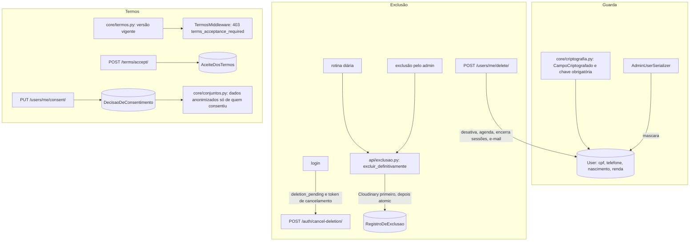

# Lgpd Design

**Spec**: `.specs/features/lgpd/spec.md`
**Status**: Approved

---

## Architecture Overview

A feature junta quatro frentes que hoje não existem ou estão incompletas.

1. **Guarda dos dados pessoais.** CPF, telefone, data de nascimento e renda ficam em texto puro, e o CPF é único. O painel admin mostra o CPF e o telefone inteiros. O nome original da imagem da meta vai no upload.
2. **Exclusão da conta.** Não existe rota de exclusão pelo próprio usuário, nem rotina agendada. A exclusão pelo admin apaga em cascata, sem registro, deixa o avatar no Cloudinary e leva junto os logs de auditoria do usuário.
3. **Logs.** Ainda há `print` com o payload inteiro da criação de categoria, uma função de e-mail sem uso que loga o e-mail completo e logs de erro com a exceção crua. O nome do administrador vai nas descrições do log de auditoria.
4. **Termos e consentimento.** O aceite não tem versão, não há bloqueio quando os termos mudam e não existe consentimento para uso dos dados na melhoria do produto.



### Abordagens consideradas

| Abordagem | Prós | Contras | Decisão |
| --------- | ---- | ------- | ------- |
| Pacote pronto de campos criptografados (`django-encrypted-model-fields` e similares) | Menos código | Pacotes pouco mantidos, presos a versões do Django; rotação de chave limitada | Recusada |
| Campo próprio sobre `cryptography.fernet.MultiFernet` | Dependência madura; rotação de chave por lista; tipos (data, decimal) tratados no campo | Um campo a manter | **Escolhida (AD-047)** |
| Rotina diária por Render Cron Job | Nativo | Serviço pago à parte; o plano atual é gratuito | Recusada |
| Rotina diária num agendador dentro do processo web | Sem serviço extra | O Render gratuito dorme sem tráfego; duplicaria em vários workers | Recusada |
| Rotina diária por GitHub Actions agendado chamando uma rota protegida por token | Gratuito, com histórico de execuções no GitHub | Depende do GitHub e de um segredo a mais | **Escolhida (AD-048)** |
| Versão dos termos editável no painel | Sem deploy | O texto dos termos está no frontend; versão e texto mudariam em momentos diferentes | Recusada; versão em `core/termos.py`, publicada junto com o texto |
| Cancelar a exclusão abrindo a sessão no próprio login | Um passo a menos | O cancelamento precisa ser escolha explícita (spec) | Recusada; o login devolve um token curto de cancelamento |

---

## Code Reuse Analysis

### Existing Components to Leverage

| Component | Location | How to Use |
| --------- | -------- | ---------- |
| `obrigatoria_em_producao` | `core/settings.py:21-34` | `FIELD_ENCRYPTION_KEY` e `ROTINA_DIARIA_TOKEN` obrigatórias com DEBUG desligado (LGPD-16) |
| Middleware da manutenção | `api/middleware.py` e `core/manutencao.py` | Mesmo padrão (rotas liberadas, autenticação pelo `SessaoJWTAuthentication`, corpo `{detail, code}`) para o bloqueio dos termos |
| Login com `LoginRecusado` | `api/serializers.py:204-253` | Novo código `deletion_pending`, conferido depois da senha |
| Sessões | `api/sessoes.py` (`encerrar_todas`, `criar_sessao`) | Pedido de exclusão (LGPD-05) e cancelamento (LGPD-08) |
| Proteção do último admin | `api/views.py:491-522` (`garantir_admin_restante`, `ULTIMO_ADMIN`) | Pedido de exclusão do único admin (LGPD-09) |
| Senha errada no campo | `ChangePasswordView` (`api/views.py:465-466`) | Mesmo formato em `password` (LGPD-04) |
| Envio de e-mail | `api/utils/email_service.py` (AD-011, `_mask_email`) | E-mail do pedido de exclusão; `_mask_email` nos logs e na auditoria |
| Exportação em XLSX | `data_exchange/services.py` (`ExportService.generate_xls`) | Download do fluxo de exclusão, sem a trava `exportacao_xlsx` (LGPD-02) |
| Normalização de descrição | `data_exchange/importacao/texto.py` (`normalizar_descricao`) | Descrições no conjunto anonimizado (LGPD-38) |
| `tratarErro`, `mensagemDeErro`, interceptor do `apiClient` | `fluxar-frontend/src/lib/erros.ts`, `src/services/apiClient.ts` | `terms_acceptance_required` e `deletion_pending` no frontend |

### Integration Points

| System | Integration Method |
| ------ | ------------------ |
| Sessão (AD-037) | Conta desativada não renova a sessão; o cancelamento cria uma sessão nova |
| Permissões (AD-044) | O download dos dados do fluxo de exclusão é essencial e fica fora das travas |
| Painel admin (AD-030) | Aqui: descrições sem nome, `admin_name` vira o e-mail mascarado, e os registros de ações de admin sobrevivem à exclusão só com o identificador. O detalhamento de antes e depois de cada ação fica com a feature `painel-admin` |
| Todas as features com dados do usuário | A exclusão definitiva apaga tudo que pende do usuário; uma lista de modelos em `api/exclusao.py`, com teste que falha se surgir um modelo novo com FK para o usuário fora dela |
| Deploy | Variáveis novas `FIELD_ENCRYPTION_KEY` e `ROTINA_DIARIA_TOKEN`; segredo do GitHub `ROTINA_DIARIA_TOKEN` e `API_URL`; dependência nova `cryptography` |

---

## Components

### Criptografia dos dados pessoais (`core/criptografia.py`, `api/models.py`)

- `CampoCriptografado(TextField)` com os subtipos `TextoCriptografado`, `DataCriptografada` e `DecimalCriptografado`.
  - Grava o token Fernet do valor convertido para texto.
  - Na leitura, devolve o tipo original.
  - `None` continua `None`.
- `MultiFernet` sobre `settings.FIELD_ENCRYPTION_KEYS`: a primeira chave grava e todas leem, para a rotação.
- `FIELD_ENCRYPTION_KEY` vem por `obrigatoria_em_producao`. Em desenvolvimento usa uma chave fixa só de dev. Em produção, sem a variável, a inicialização para com o erro que nomeia a variável (LGPD-15, LGPD-16).
- `User.cpf`, `phone_number`, `date_of_birth` e `monthly_income` passam a esses campos. O `unique` do CPF sai (LGPD-18).
- A migração de dados lê os valores antigos e grava criptografados (LGPD-24). O CPF passa a ser guardado só com os 11 dígitos.

### CPF, máscaras e uploads (`api/serializers.py`, `api/views.py`, `goals/serializers.py`)

- `validate_cpf` confere os dígitos verificadores e recusa com "CPF inválido." (LGPD-17). A existência do CPF em outra conta não é consultada (LGPD-18).
- `AdminUserSerializer`:
  - mostra o CPF como `***.***.***-12` e o telefone com só os 4 últimos dígitos;
  - não envia `date_of_birth` nem `monthly_income` (LGPD-19).
- Antes de salvar, o avatar e a imagem da meta recebem o nome `uuid4().hex` mais a extensão, e o upload ao Cloudinary vai com `use_filename=False` (LGPD-20).

### Logs sem dados pessoais (`core/logs.py`, código com `print` e `logger`)

- Saem os `print` de `transactions/views.py`, o `debug_serializer.py` da raiz e a função sem uso `api/utils/email.py` (`send_welcome_email`).
- Os comandos `audit_accounts` e `init_balances` passam a mostrar o id e o e-mail mascarado (LGPD-21, LGPD-22, LGPD-23).
- Os `logging.error(f"...{e}")` dos signals do Cloudinary e o `logger.exception` da gravação da importação passam a registrar só a classe do erro e os identificadores internos.
- `core/logs.py` traz `FiltroDeDadosPessoais`, um filtro de `logging` ligado a todos os handlers em `LOGGING`. Ele mascara e-mails e CPFs nas mensagens. É uma defesa a mais: a regra principal continua sendo não logar o dado.
- `SystemLog`:
  - `user` passa a `SET_NULL`;
  - ganha `usuario_ref` (UUID), preenchido em todo registro;
  - as descrições deixam de levar nomes;
  - `admin_name` passa a guardar o e-mail mascarado do administrador.

  A migração mascara os e-mails nas descrições já gravadas (LGPD-25) e preenche `usuario_ref`.

### Pedido de exclusão e cancelamento (`api/views.py`, `api/serializers.py`)

- `User` ganha `exclusao_pedida_em` e `exclusao_agendada_para`.
- `POST /api/users/me/delete/` com `{password}` (LGPD-03 a LGPD-06, LGPD-09):
  - senha errada: 400 `{password: ["Senha incorreta."]}`, sem mudar nada;
  - único admin ativo: 400 com a mensagem da spec;
  - com a senha certa: `is_active=False`, agenda a exclusão para agora + 30 dias, chama `encerrar_todas` e envia o e-mail com a data e como desistir;
  - a resposta traz `deletion_scheduled_for`. Uma falha no envio do e-mail não desfaz o pedido.
- **Login de uma conta com exclusão marcada e senha certa:** responde 400 `{detail, code: "deletion_pending", deletion_scheduled_for, cancel_token}` sem abrir sessão, e essa conferência vem antes do `account_disabled` (LGPD-07). `cancel_token` é assinado com `django.core.signing` e vale 15 minutos.
- `POST /api/auth/cancel-deletion/` com `{cancel_token}`:
  - reativa a conta;
  - limpa as datas;
  - abre a sessão da mesma forma que o login, com o access no corpo e o refresh no cookie (LGPD-08).
  
  Token inválido ou vencido recebe 400.
- "Esqueci a senha" continua funcionando e não cancela a exclusão (suposição da spec).
- `GET /api/users/me/export/` devolve o XLSX dos dados financeiros. É liberado em todos os planos, fica fora da trava e passa pelo bloqueio dos termos (LGPD-02). O arquivo tem uma aba por tipo de dado: transações, contas, cartões, metas e orçamentos.

### Exclusão definitiva (`api/exclusao.py`)

- `excluir_definitivamente(usuario, executor)`:
  1. Remove do Cloudinary o avatar e as imagens das metas. Se alguma remoção falhar, levanta uma exceção e nada é apagado; a conta continua desativada e marcada (LGPD-12).
  2. Abre um `atomic` e:
     - apaga os registros que protegem contas (`PagamentoDeFatura.conta` é `PROTECT`);
     - apaga os logs de auditoria do usuário que não são ações de administrador;
     - solta os que são ações de administrador (`user=None`, mantendo `usuario_ref`, conforme AD-030);
     - apaga o usuário em cascata (LGPD-10);
     - cria o `RegistroDeExclusao` (LGPD-11).
  3. O e-mail fica livre porque o usuário foi apagado (LGPD-14).
- `RegistroDeExclusao(usuario_id: UUID único, pedida_em, excluida_em, executada_por: USUARIO | ROTINA | ADMIN)`. Não guarda dado pessoal. A unicidade de `usuario_id` torna a repetição idempotente.
- `MODELOS_DO_USUARIO`: a lista dos modelos apagados. Um teste percorre `apps.get_models()` e falha se algum modelo com FK para `User` não estiver na lista nem na lista de exceções (`SystemLog`, `RegistroDeExclusao`, `TravaDePlano.atualizada_por`).
- **Exclusão pelo administrador:** `AdminUserDetailView.destroy` com `permanent` e `AdminHardDeleteView` chamam `excluir_definitivamente(usuario, 'ADMIN')`, na hora, inclusive com a exclusão já pendente (LGPD-13). A resposta deixa de levar o nome.

### Rotina diária (`api/management/commands/rotina_diaria.py`, `api/views.py`, `.github/workflows/rotina-diaria.yml`)

- O comando `rotina_diaria` apaga, uma a uma, as contas com `exclusao_agendada_para <= agora`. Cada conta é independente: uma falha deixa só aquela para a próxima execução (LGPD-10, LGPD-12).
- `POST /api/rotina-diaria/` exige o cabeçalho `Authorization: Bearer <ROTINA_DIARIA_TOKEN>`, comparado em tempo constante, roda a rotina e responde `{excluidas, falhas}`.
  - Sem o token configurado, a rota responde 404.
  - Ela fica fora do bloqueio de termos e de manutenção.
- O workflow agendado do GitHub (`cron: '0 6 * * *'`, 3h de Brasília) chama a rota com os segredos `API_URL` e `ROTINA_DIARIA_TOKEN`. O `DEPLOY.md` explica como configurar.

### Termos e consentimento (`core/termos.py`, `api/models.py`, `api/middleware.py`)

- `core/termos.py` define `VERSAO_VIGENTE`, `VIGENTE_DESDE`, `MUDANCAS` (uma lista curta do que mudou) e `SERVICOS` (Render, Vercel, Resend, Brevo e Cloudinary, com a finalidade de cada um).
- `GET /api/terms/` (público) devolve `{version, effective_date, changes, services}`.
- `AceiteDosTermos(user, versao, aceito_em)` e `DecisaoDeConsentimento(user, consentiu, versao_da_politica, decidido_em)` só acumulam registros (LGPD-30, LGPD-35).
- `User` ganha dois caches, para o middleware não consultar o histórico:
  - `versao_dos_termos_aceita`;
  - `consentimento_melhoria`.
- **Migração (LGPD-39):**
  - cria os modelos;
  - deixa `versao_dos_termos_aceita` nulo em todos os usuários;
  - deixa o consentimento desligado;
  - mantém os campos antigos `terms_accepted` e `terms_accepted_at` só como histórico, sem uso no código.
- **Cadastro:** exige `terms_accepted=true` e grava o aceite da versão vigente (LGPD-26, LGPD-27). Aceita `product_improvement_consent` (padrão `false`) e grava a decisão quando o valor é `true` (LGPD-33).
- **`TermosMiddleware`**, registrado depois do middleware da manutenção:
  - Para o usuário autenticado que não aceitou a versão vigente, responde 403 `{detail, code: "terms_acceptance_required", version}` (LGPD-29).
  - Rotas liberadas:
    - login, renovação, `/auth/me`, logout;
    - `GET /api/terms/` e `POST /api/terms/accept/`;
    - `GET /api/users/me/export/` e `POST /api/users/me/delete/`;
    - `POST /api/auth/cancel-deletion/` e `/api/rotina-diaria/`;
    - `/api/health/` e os prefixos do Django admin e dos estáticos.
- `POST /api/terms/accept/` com `{version}` exige a versão vigente (outra versão recebe 400) e grava o aceite (LGPD-28, LGPD-30).
- `/auth/me` traz `terms: {accepted_version, current_version}` e `product_improvement_consent`.
- `GET` e `PUT /api/users/me/consent/` com `{consent}` gravam a decisão com a versão vigente e atualizam o cache (LGPD-34, LGPD-35).

### Conjunto anonimizado (`core/conjuntos.py`, comando `exportar_dados_de_melhoria`)

- `dados_para_melhoria()` lê só os usuários com o consentimento ligado no momento da geração (LGPD-36, LGPD-37).
- Cada linha traz só o tipo, o valor, o mês e o ano, o nome normalizado da categoria e a descrição normalizada sem dígitos (LGPD-38). Ficam de fora:
  - o id do usuário, da conta e da transação;
  - nomes de conta e de cartão;
  - o dia da transação.
- As linhas saem embaralhadas.
- O comando grava um CSV. Nenhum outro uso existe hoje. O que já foi gerado não é refeito quando alguém retira o consentimento (LGPD-37).

### Frontend

| Arquivo | Mudança | Requisitos |
| ------- | ------- | ---------- |
| `src/app/(app)/configuracoes/page.tsx` | Aba "Privacidade": consentimento com interruptor e o histórico da decisão; "Excluir minha conta", com o download do XLSX, a confirmação pela senha (erro no campo) e a data da exclusão | LGPD-01 a LGPD-04, LGPD-34 |
| `src/app/auth/login/page.tsx` | `deletion_pending`: mostra a data e "Cancelar exclusão", que chama `cancel-deletion` e entra | LGPD-07, LGPD-08 |
| `src/app/auth/register/page.tsx` | Segunda caixa, desmarcada, para o consentimento; texto de segurança só com o que o app faz | LGPD-32, LGPD-33 |
| `src/app/termos/page.tsx` | Versão e data vindas de `GET /api/terms/`; seções de finalidades (com a melhoria do produto e o treino de modelos) e de serviços; segurança sem "ponta a ponta"; exportação no fluxo de exclusão para todos | LGPD-31, LGPD-32 |
| `src/app/sobre/page.tsx` | Texto de segurança só com o que o app faz | LGPD-32 |
| `src/app/termos/aceite/page.tsx` (nova) e interceptor do `apiClient` | 403 `terms_acceptance_required` leva à tela de aceite, que mostra `changes` e chama `POST /terms/accept/`; dali dá para baixar os dados e pedir a exclusão | LGPD-28, LGPD-29 |
| `src/app/(admin)/admin/usuarios/[id]/page.tsx` | Mostra o CPF e o telefone mascarados como vêm da API | LGPD-19 |
| `src/services/goals.ts` | A imagem da meta vai com um nome genérico | LGPD-20 |

---

## Data Models

```python
# api/models.py
class User:
    cpf = TextoCriptografado(null=True, blank=True)          # sem unique
    phone_number = TextoCriptografado(null=True, blank=True)
    date_of_birth = DataCriptografada(null=True, blank=True)
    monthly_income = DecimalCriptografado(null=True, blank=True)
    exclusao_pedida_em = DateTimeField(null=True, blank=True)
    exclusao_agendada_para = DateTimeField(null=True, blank=True, db_index=True)
    versao_dos_termos_aceita = CharField(max_length=20, null=True, blank=True)
    consentimento_melhoria = BooleanField(default=False)

class AceiteDosTermos:      user FK CASCADE, versao, aceito_em
class DecisaoDeConsentimento: user FK CASCADE, consentiu, versao_da_politica, decidido_em
class RegistroDeExclusao:   usuario_id UUID unique, pedida_em null, excluida_em, executada_por
class SystemLog:            user FK SET_NULL, usuario_ref UUID null
```

---

## Error Handling Strategy

| Error Scenario | Handling | User Impact |
| -------------- | -------- | ----------- |
| Produção sem `FIELD_ENCRYPTION_KEY` | `ImproperlyConfigured` com o nome da variável | Deploy falha na hora |
| Senha errada no pedido de exclusão | 400 no campo `password` | Erro embaixo do campo |
| Único admin pede a exclusão | 400 com a mensagem da LGPD-09 | Aviso |
| E-mail do pedido falha | Log com o e-mail mascarado; pedido vale | Tela mostra a data da exclusão |
| Login durante o prazo | 400 `deletion_pending` com a data e o token | Tela oferece cancelar |
| Token de cancelamento vencido | 400 | Pede para entrar de novo |
| Cloudinary fora do ar na exclusão definitiva | Nada apagado; conta segue marcada | Rotina tenta no dia seguinte |
| Termos não aceitos | 403 `terms_acceptance_required` | Tela de aceite |
| Aceite de versão que não é a vigente | 400 no campo `version` | Recarrega a tela de aceite |
| CPF com dígito errado | 400 "CPF inválido." | Erro no campo |
| Rota da rotina sem token ou com token errado | 404 sem token configurado; 401 com token errado | Nenhum |

---

## Risks & Concerns

| Risk | Likelihood | Impact | Mitigation |
| ---- | ---------- | ------ | ---------- |
| Perda da `FIELD_ENCRYPTION_KEY` torna os dados ilegíveis | Baixa | Alto | `DEPLOY.md` manda guardar a chave fora do Render; a lista de chaves permite rotação sem perder as antigas |
| Migração de criptografia em produção | Média | Alto | A migração roda no Pre-Deploy com a chave já configurada; teste com dados antigos; leitura confere que o valor volta igual |
| Todos os usuários atuais precisam aceitar os termos no próximo acesso | Certa | Médio | É o que a spec pede (LGPD-39); a tela de aceite mostra o que mudou e deixa baixar os dados e pedir a exclusão |
| Novo modelo com FK para `User` esquecido na exclusão | Média | Alto | Teste que compara `MODELOS_DO_USUARIO` com os modelos do projeto |
| GitHub Actions agendado atrasado ou desligado | Baixa | Baixo | A rotina pega todas as vencidas na próxima execução; o comando também roda à mão no Render Shell |
| Dependência nova `cryptography` | Baixa | Baixo | Biblioteca padrão de mercado; entra no `pip-audit` do CI |

---

## Tech Decisions

| Decision | Choice | Rationale |
| -------- | ------ | --------- |
| Criptografia dos dados pessoais | Campo próprio sobre `MultiFernet`, chave em `FIELD_ENCRYPTION_KEY` (AD-047) | Rotação de chave; tipos preservados; sem pacote abandonado |
| Rotina diária | Comando mais rota protegida por token, chamada por GitHub Actions agendado (AD-048) | Gratuito e com histórico; roda à mão se preciso |
| Versão dos termos | `core/termos.py`, publicada junto com o texto do frontend | Versão e texto mudam juntos |
| Cancelamento da exclusão | Token assinado de 15 minutos devolvido pelo login | O cancelamento é uma escolha explícita, sem abrir sessão no login |
| Logs de auditoria na exclusão | `user` `SET_NULL` e `usuario_ref`; os de ações de admin ficam, os demais saem | AD-030 |
