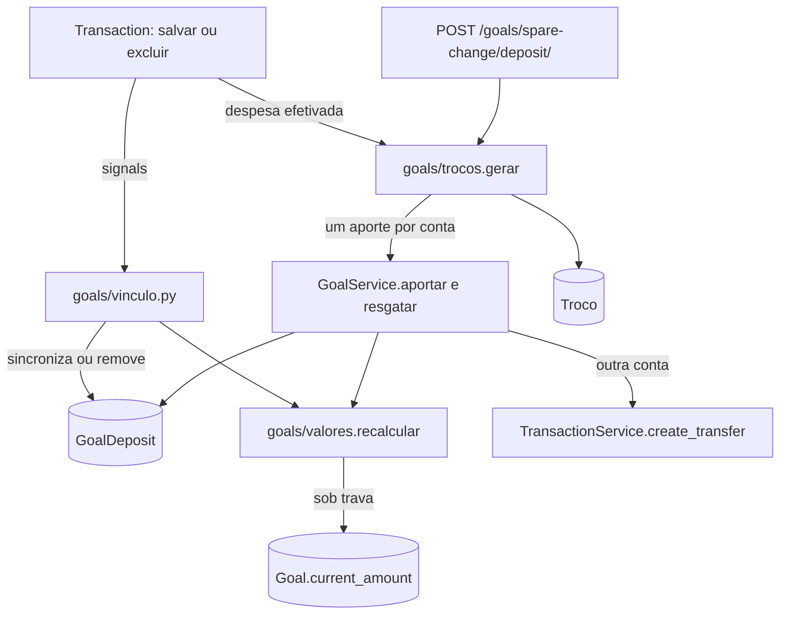

# Metas Design

**Spec**: `.specs/features/metas/spec.md`
**Status**: Approved

---

## Architecture Overview

Hoje o valor de uma meta é um número solto, `Goal.current_amount`. Ele recebe incrementos em três lugares:

- no aporte;
- no resgate;
- num signal que reparte toda transação de um cofrinho entre as metas dele, com arredondamento por meta e piso em zero.

Excluir uma transação apaga o registro da meta, mas não mexe no número, e é por isso que aparece dinheiro que não existe (FIN-09). O aporte feito a partir do próprio cofrinho infla a meta (FIN-20). E o cofrinho de trocos é calculado no navegador a cada abertura (FE-10).

O design aplica às metas a mesma regra que o saldo já usa (AD-038). O valor da meta passa a ser sempre derivado dos registros de aporte e resgate, recalculado sob trava, e cada mudança nas transações ligadas a esses registros acompanha na mesma operação.

| Peça | Onde | O que faz |
| ---- | ---- | --------- |
| Valor da meta | `goals/valores.py` (novo) | `calcular(meta)`: aportes menos resgates, contando os registros sem transferência e os com a transferência efetivada (META-01). `recalcular(*ids)` grava `current_amount` sob `select_for_update`, em ordem de id |
| Saldo livre | `goals/valores.py` | `saldo_livre(cofrinho)`: saldo da conta (AD-038) menos a soma de todas as metas dela, inclusive as arquivadas (META-02) |
| Vínculo com as transações | `goals/vinculo.py` (novo), chamado pelos signals de `Transaction` | Ao excluir ou alterar uma perna de transferência ligada a um registro: exclui, sincroniza valor e data, ou desliga o registro; recalcula; e recusa se alguma meta ficaria negativa (META-06 a META-09) |
| Aporte e resgate | `goals/services.py` | Origem e destino podem ser outra conta (transferência) ou o saldo livre (sem transferência), com os limites da spec, sob trava da meta e do cofrinho (META-12 a META-22) |
| Trocos | `goals/trocos.py` (novo) e modelos `ConfiguracaoDeTrocos` e `Troco` | Troco gerado no backend quando a despesa é efetivada; depósito por conta de origem, idempotente pelo status de cada troco e serializado por trava (META-35 a META-45) |

### Abordagens consideradas

| Abordagem | Prós | Contras | Decisão |
| --------- | ---- | ------- | ------- |
| Manter o rateio automático e só corrigir a exclusão | Mudança pequena | Rateio com arredondamento por meta e piso em zero continua errando (FIN-37, FIN-38); contradiz AD-028 | Recusada |
| Valor derivado na leitura, sem coluna | Nunca diverge | Lista de metas soma o histórico de cada uma; concorrência do resgate precisa de trava em algo | Recusada |
| `current_amount` como resultado de `recalcular()` sob trava, como `Account.balance` (AD-045) | Mesma regra do saldo; trava da meta serializa resgates (META-22); lista barata | Todo caminho que muda registros chama `recalcular` | **Escolhida** |
| Trocos calculados no navegador (hoje) | Sem backend | Repetem depósito e saem da conta errada (FE-10) | Recusada |
| Trocos gerados no backend quando a despesa é efetivada | Lembra o que já foi depositado; depósito por conta | Duas tabelas novas | **Escolhida** |

---

## Code Reuse Analysis

### Existing Components to Leverage

| Component | Location | How to Use |
| --------- | -------- | ---------- |
| Saldo sob trava | `accounts/saldo.py` (AD-038) | Padrão de `recalcular()`; o saldo livre lê `Account.balance` |
| Transferência | `transactions/services.py` (`create_transfer`, `editar_transferencia`) | Aporte e resgate com outra conta; a recusa do próprio cofrinho como origem vem da SALDO-17 |
| Leitura de valor e data | `core/valores.py` (`ler_valor`, `dinheiro`), `core/datas.py` (`hoje`, `ler_data`) | Valores dos aportes, das mensagens ("R$ <valor>") e da sugestão mensal no fuso de Brasília (META-24) |
| Relação do usuário | `core/fields.py` (`get_owned_or_400`, `OwnedPrimaryKeyRelatedField`) | Conta de origem ou destino (META-20) e cofrinho da meta (META-26) |
| Paginação | `core/pagination.py` (`PaginacaoPadrao`, CONTRATO-02) | Histórico da meta (META-32) |
| Trava de plano | `core/travas.py` (`RecursoLiberado('metas')`) | Já nas rotas; vale também para as rotas novas de cofrinhos e trocos (META-33) |
| Exclusão de conta | `accounts/views.py` (`AccountViewSet.destroy`) | A interface usa a exclusão comum para o cofrinho vazio (META-30) |
| Frontend: `MoneyInput`, `formatarMoeda`, `lerData`, `tratarErro`, `RecursoBloqueado` | `fluxar-frontend/src/` | Formulários e telas de metas |

### Integration Points

| System | Integration Method |
| ------ | ------------------ |
| Saldo (AD-038) | O saldo do cofrinho continua vindo do razão; metas não mexem no saldo, só a transferência mexe |
| Transações | Signals `pre_save`, `post_save` e `pre_delete` de `Transaction` chamam `goals/vinculo.py` e `goals/trocos.py`; uma recusa (META-09) levanta `ValidationError`, e o `ATOMIC_REQUESTS` desfaz tudo |
| Permissões (AD-044) | `limite_metas` continua na criação; o cofrinho criado pela meta não conta no limite de contas |
| Gestão do salário (futura) | A divisão com destino numa meta usa `GoalService.aportar`; desfazer a divisão exclui a transferência, e META-06 remove o aporte |

---

## Components

### Modelos

- `GoalDeposit` ganha:
  - `eh_correcao`: registro de correção da META-11;
  - `transacao_saida` e `transacao_entrada`: FKs `SET_NULL` para as duas pernas da transferência, preenchidas no aporte e no resgate. Com elas, o vínculo é direto, sem procurar pelo `transaction_id`;
  - o `transaction_id` atual é mantido para os registros antigos.
- `Goal` ganha `valor_antes_da_correcao` (nulo), que guarda o aviso único da META-11 até o usuário confirmar.
- `ConfiguracaoDeTrocos(user OneToOne, ativo, meta FK SET_NULL, ativado_em)`.
- `Troco(user, despesa FK SET_NULL, conta FK SET_NULL, valor, status PENDENTE|DEPOSITADO|DESCARTADO, aporte FK GoalDeposit SET_NULL, criado_em)`.
- Todos cascateiam com o usuário (META-34).

### Valor e saldo livre (`goals/valores.py`)

- `calcular(meta)`: soma dos registros da meta, com sinal pelo tipo. Um registro conta quando:
  - não tem transação ligada (saldo livre, correção, registros antigos sem transação);
  - ou todas as transações ligadas a ele estão efetivadas (AD-002).

  Registros antigos com `transaction_id` são resolvidos pelas transações com esse `transfer_id` ou `id` (META-01, META-10).
- `recalcular(*meta_ids)`: trava as metas em ordem de id e grava `current_amount`. Devolve as metas que ficariam negativas, para quem chamou decidir a recusa.
- `saldo_livre(cofrinho)`: `cofrinho.balance - soma(current_amount das metas do cofrinho)`.

### Vínculo com as transações (`goals/vinculo.py` e `goals/signals.py`)

- O signal de rateio automático (`handle_transaction_for_goals`) sai. Uma transação comum num cofrinho muda só o saldo livre (META-03).
- **Exclusão:** em `pre_delete` de uma perna ligada a um registro, o registro é marcado para remoção. Em seguida o valor das metas afetadas é recalculado sem ele. Se alguma ficaria negativa, a exclusão é recusada com a mensagem da META-09 (META-06, META-09).
- **Alteração:** em `post_save` de uma perna ligada, há três casos (META-07 a META-09):
  - se a perna de entrada de um aporte não está mais no cofrinho da meta, ou a perna de saída de um resgate não sai mais dele, o registro é removido;
  - senão, o valor e a data do registro passam a ser os da transferência;
  - depois, as metas são recalculadas, e se alguma ficaria negativa a operação é recusada.
- A exclusão de uma transferência apaga as duas pernas (`sync_transfer_delete`). O vínculo trata o registro uma vez só, porque o registro aponta para as duas pernas e é removido na primeira.

### Aporte e resgate (`goals/services.py`, `goals/views.py`)

- `aportar(meta, valor, data, conta=None)`:
  - `conta=None` significa saldo livre. O corpo indica isso com `from_free_balance: true`, que exclui `account_id`.
  - Trava a meta e o cofrinho.
  - Meta arquivada é recusada com "Metas arquivadas não recebem aportes." (META-21).
  - Com conta, cria a transferência pela `create_transfer` (a origem igual ao cofrinho cai na SALDO-17) e o registro ligado às duas pernas (META-12).
  - Sem conta, confere o saldo livre e recusa com "O saldo livre do cofrinho é de R$ <valor>." (META-13, META-14).
- `resgatar(meta, valor, data, conta=None)`:
  - `conta=None` significa saldo livre, indicado no corpo com `to_free_balance: true`.
  - Trava a meta e o cofrinho.
  - Recusa acima do valor da meta com "A meta tem R$ <valor> para resgatar." (META-17).
  - Com conta, recusa acima do saldo do cofrinho com "O cofrinho tem só R$ <valor>." (META-18) e cria a transferência (META-15).
  - Sem conta, registra sem transferência (META-16).
- A trava da meta serializa resgates simultâneos, e o segundo resgate lê o valor já recalculado (META-22).
- Valor e conta seguem o padrão atual: `ler_valor` para o valor (META-19) e `get_owned_or_400` com a mensagem de ID inexistente para a conta (META-20).
- O status `COMPLETED` é derivado de `current_amount >= target_amount`, e a meta concluída continua aceitando aportes (META-23).
- A sugestão mensal usa `hoje()`, com mínimo de 1 mês (META-24).

### Cofrinhos e cadastro

- `GET /api/goals/piggy-banks/`: um item por cofrinho com metas do usuário, com `{account_id, name, balance, goals_total, free_balance}` (META-02, META-04).
- `GoalSerializer`:
  - `account` aceita só contas `PIGGY_BANK` ativas do usuário; sem conta, cria um cofrinho novo (META-25, META-26);
  - nome vazio ou alvo menor que R$ 0,01 dão 400 no campo (META-27);
  - trocar o cofrinho com valor maior que zero dá 400 com "Resgate o valor da meta antes de trocar o cofrinho." (META-28);
  - o campo `deposits` sai da lista e do detalhe (META-31).
- Exclusão: recusa com "Resgate o valor da meta antes de excluí-la." quando o valor é maior que zero (META-29). A resposta de sucesso informa `piggy_bank_empty: true` quando o cofrinho fica sem metas e com saldo zero, para a interface perguntar (META-30).
- `GET /api/goals/{id}/history/`: paginado com `PaginacaoPadrao`, do mais recente ao mais antigo, com `type`, `amount`, `date`, `account`, `account_name`, `transaction` (o `transfer_id` ou nulo) e `is_correction` (META-32).

### Correção dos valores gravados (migração `goals/00xx_recalcula_metas`)

- Recalcula cada meta pela regra da META-01 (META-10).
- Se o resultado é negativo, grava um registro de correção (`DEPOSIT`, `eh_correcao=True`, descrição "Correção do valor da meta") que leva a meta a zero. O valor antes da correção vai para `valor_antes_da_correcao` (META-11).
- O `GoalSerializer` expõe `correction: {before, after}` enquanto o campo estiver preenchido. `POST /api/goals/{id}/dismiss-correction/` limpa o aviso, e é isso que faz o aviso aparecer uma vez só.
- O comando `sync_goals` sai, porque o recálculo passa a ser a regra.

### Trocos (`goals/trocos.py`, `goals/views.py`)

- `GET /api/goals/spare-change/` devolve `{active, goal, paused, pending_total, pending_count}`. `PUT` recebe `{active, goal}`:
  - ativar grava `ativado_em = agora` (META-35);
  - desativar mantém os pendentes (META-45).
- `paused` é verdadeiro quando a meta escolhida está arquivada ou foi excluída (META-44).
- **Geração:** no `post_save` de `Transaction`, quando a despesa entra efetivada:
  - condições: trocos ativos e não pausados; despesa `EXPENSE` com conta; conta que não é cofrinho; descrição diferente de "Ajuste de saldo"; criada depois de `ativado_em`;
  - o troco é a diferença até o próximo real inteiro; valor inteiro não gera troco (META-36).
- **Despesa editada ou excluída:** o troco pendente é recalculado ou removido; o troco depositado fica como está (META-41, META-42).
- **Depósito**, em `POST /api/goals/spare-change/deposit/`:
  - trava a configuração do usuário e lê os trocos pendentes;
  - para cada conta ativa, faz um `aportar` com a soma dos trocos dela e marca esses trocos como depositados, ligados ao aporte;
  - trocos de conta excluída são marcados como descartados;
  - responde `{deposits: [{account_id, amount}], discarded}` (META-38, META-43).
  - Um segundo pedido não encontra mais trocos pendentes (META-39); um pedido simultâneo espera a trava (META-40).

### Frontend

| Arquivo | Mudança | Requisitos |
| ------- | ------- | ---------- |
| `src/app/(app)/metas/page.tsx` | Metas agrupadas por cofrinho, com o saldo, a soma das metas e o saldo livre; aviso "O cofrinho <nome> tem R$ <valor> a menos do que as metas somam."; sai o texto que explica o rateio | META-04, META-05 |
| `src/components/goals/GoalDepositForm.tsx` | Origem: outras contas, sem o próprio cofrinho, ou "Saldo livre do cofrinho (R$ x)"; mensagens do backend por `tratarErro` | META-12 a META-14, META-21 |
| `src/components/goals/GoalWithdrawForm.tsx` | Destino: outras contas ou o saldo livre; limites mostrados; mensagens do backend | META-15 a META-18 |
| `src/components/goals/GoalForm.tsx` | Cofrinho existente só entre contas `PIGGY_BANK` ativas; troca de cofrinho com a mensagem do backend | META-25 a META-28 |
| Exclusão da meta | Mensagem da META-29; com `piggy_bank_empty`, pergunta se exclui o cofrinho e chama a exclusão da conta | META-29, META-30 |
| `src/components/goals/GoalHistory.tsx` e `GoalDetails.tsx` | Histórico paginado, com o componente `Paginacao`; aviso único da correção com "Entendi", que chama `dismiss-correction` | META-11, META-32 |
| `src/components/goals/SpareChangeBank.tsx` | Usa as rotas de trocos: ativar e desativar, escolher a meta, total e quantidade pendentes, depositar, mostrar descartados e pausado | META-35, META-37, META-43 a META-45 |

---

## Error Handling Strategy

| Error Scenario | Handling | User Impact |
| -------------- | -------- | ----------- |
| Excluir ou mudar transação que deixaria meta negativa | 400 com a mensagem da META-09; nada é gravado | Toast com a mensagem |
| Aporte acima do saldo livre, resgate acima da meta ou do cofrinho | 400 com as mensagens da META-14, META-17 e META-18 | Toast ou erro no campo |
| Aporte em meta arquivada | 400 com a mensagem da META-21 | Toast |
| Conta de outro usuário ou inexistente | 400 no campo, com a mensagem de ID inexistente (AD-010) | Erro no campo |
| Cofrinho que não é `PIGGY_BANK` | 400 no campo `account` | Erro no campo |
| Excluir meta ou trocar cofrinho com valor | 400 com as mensagens da META-28 e META-29 | Toast |
| Depósito de trocos repetido | 200 com `deposits` vazio | Nada é depositado de novo |

---

## Risks & Concerns

| Risk | Likelihood | Impact | Mitigation |
| ---- | ---------- | ------ | ---------- |
| Registros antigos do rateio mudam o valor das metas no recálculo | Alta | Médio | É o que a spec manda (META-10); os negativos viram zero com o aviso único |
| Recusa da META-09 bloqueia a exclusão de uma transferência antiga | Média | Baixo | A mensagem diz o que fazer; o resgate pode ser desfeito antes |
| Signals de `Transaction` ficam mais pesados | Média | Baixo | O vínculo só consulta registros quando a transação é uma perna de transferência ligada ou uma despesa com trocos ativos; a importação usa o recálculo adiado do saldo, e os trocos só contam despesas criadas depois da ativação |
| Despesa em lote (importação) gera muitos trocos | Média | Baixo | Um troco por despesa; o depósito agrupa por conta |

---

## Tech Decisions

| Decision | Choice | Rationale |
| -------- | ------ | --------- |
| Valor da meta | `current_amount` sempre resultado de `goals/valores.recalcular()` sob trava (AD-045) | Mesma regra do saldo; corrige FIN-09 e serializa resgates |
| Vínculo do registro com a transferência | FKs para as duas pernas | Sincronização direta (META-07, META-08) sem procurar pelo `transfer_id` |
| Saldo livre como origem ou destino | Campo booleano no corpo, sem conta | Não existe conta "saldo livre"; evita confundir com o próprio cofrinho |
| Trocos | Gerados no backend na efetivação da despesa, depositados por conta | Corrige FE-10; o status de cada troco garante a idempotência |
