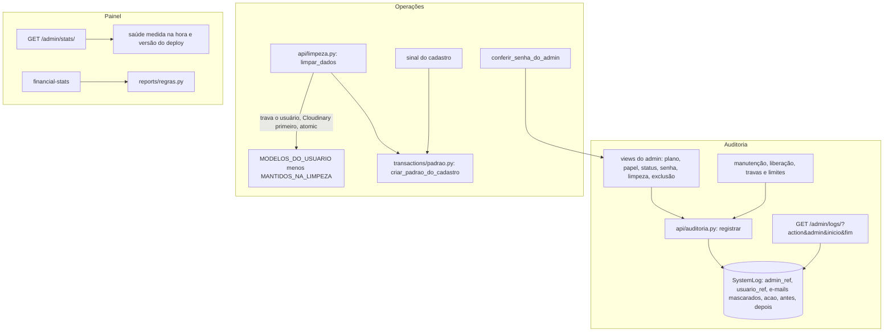

# Painel admin Design

**Spec**: `.specs/features/painel-admin/spec.md`
**Status**: Implemented

---

## Architecture Overview

As specs anteriores já resolveram parte do que a spec descreve:

- `lgpd` trocou o `CASCADE` do `SystemLog` por `SET_NULL` com `usuario_ref`, mascarou os e-mails do log e criou `excluir_definitivamente`.
- `contratos-frontend-backend` paginou as listas do admin.
- O frontend não cai mais no "Usuário Mock".

O que falta se divide em três frentes.

1. **Log de auditoria.**
   - O log guarda o antes e o depois só dentro de um texto livre.
   - Não guarda quem é o administrador, só o e-mail mascarado dele.
   - Não tem filtros.
   - Várias ações não deixam registro: arquivar em lote, exclusão definitiva e mudança do modo manutenção sem antes.
2. **Operações sobre usuários.**
   - Mudar o plano pede a senha do administrador, contra ADMIN-19.
   - Cada rota recusa a senha errada com um texto diferente.
   - A limpeza apaga nove tipos de dado e não recria o padrão do cadastro.
   - A limpeza não trava contra uma limpeza simultânea.
   - A limpeza apaga as imagens das metas pelo sinal, mesmo quando a transação volta atrás.
3. **Telas.**
   - O dashboard calcula a receita com preços fixos e mostra "API HEALTH CHECK OK" fixo.
   - O backend devolve `status` "Operacional" e `api_version` "1.2.5" fixos.
   - As configurações mostram "Uptime", "PostgreSQL 15.4" e "Limpar Cache".
   - O detalhe do usuário tem a aba "Assinatura" simulada.
   - Um erro ao carregar o usuário volta para a lista sem mostrar o erro.



### Abordagens consideradas

| Abordagem | Prós | Contras | Decisão |
| --------- | ---- | ------- | ------- |
| Manter o antes e o depois no texto da descrição | Sem migração | Não dá para filtrar nem mostrar lado a lado; cada view escreve de um jeito | Recusada |
| Campos `antes` e `depois` em JSON no `SystemLog`, gravados por um único `registrar` | Formato único; a tela mostra os valores sem interpretar texto | Uma migração e a troca das chamadas diretas | **Escolhida (AD-049)** |
| Limpeza com uma lista própria de modelos | Explícita | Esquece os modelos novos (classes, plano do salário, vínculos) quando eles chegarem | Recusada |
| Limpeza derivada de `MODELOS_DO_USUARIO` menos os mantidos | O teste de completude da LGPD já obriga todo modelo novo a entrar na lista, e a limpeza o apaga sem mudança | Exige dizer o que fica | **Escolhida (AD-050)** |
| Imagens das metas apagadas depois do commit (`on_commit`) | Uma falha do banco mantém as imagens | Uma falha do Cloudinary deixa imagens órfãs, sem nova tentativa | Recusada |
| Imagens das metas apagadas antes, como na exclusão (LGPD-12) | Mesma regra da exclusão; uma falha do Cloudinary não apaga nada no banco | Uma falha do banco depois do Cloudinary perde as imagens já removidas | **Escolhida**: a garantia de ADMIN-25 vale para o banco, como em LGPD-12 |
| Versão escrita no código a cada deploy | Simples | Esquece de mudar; hoje está "1.2.5" há meses | Recusada |
| Versão lida de `APP_VERSION`, com `RENDER_GIT_COMMIT` como alternativa | O Render preenche o commit sozinho em todo deploy | Mostra um hash quando `APP_VERSION` não está definida | **Escolhida (AD-051)** |

---

## Code Reuse Analysis

### Existing Components to Leverage

| Component | Location | How to Use |
| --------- | -------- | ---------- |
| `PaginacaoPadrao` | `core/pagination.py:22-63` | Lista de usuários e logs, 20 por página (CONTRATO-02) |
| `ParametrosConhecidosMixin` | `core/filtros.py` | Os filtros novos do log entram em `parametros_permitidos`; parâmetro desconhecido continua 400 |
| `EhAdministrador` | `core/permissions.py:59-72` | Todas as rotas do admin |
| `garantir_admin_restante`, `recusar_a_propria_conta`, `recusar_remocao_de_admin` | `api/views.py:609-640` | Continuam antes de mudar o papel, desativar, limpar e excluir; ADMIN-27 usa `recusar_a_propria_conta` com HTTP 400 |
| `excluir_definitivamente` e `MODELOS_DO_USUARIO` | `api/exclusao.py` | A exclusão pelo admin (ADMIN-28); a lista de modelos é a base da limpeza |
| `_remover_do_cloudinary` | `api/exclusao.py:75-86` | Ganha o parâmetro `incluir_avatar`, para a limpeza remover só as imagens das metas |
| `_mask_email` | `api/utils/email_service.py:26-34` | E-mail mascarado do administrador e do usuário no log (AD-019) |
| Sinal `initialize_user_data` | `transactions/signals.py:36-75` | O corpo vira `criar_padrao_do_cadastro`, chamado pelo sinal e pela limpeza |
| `reports/regras.py` | `regras.despesas`, `regras.receitas` | Estatísticas financeiras do usuário (ADMIN-29) |
| `encerrar_todas` | `api/sessoes.py` | Continua ao desativar e ao redefinir a senha |
| `tratarErro` | `fluxar-frontend/src/lib/erros.ts` | Erros do painel, com o `admin_password` no campo da senha (CONTRATO-30) |
| `Paginacao` | `fluxar-frontend/src/components/ui/paginacao.tsx` | Log global e log do usuário |

### Integration Points

| System | Integration Method |
| ------ | ------------------ |
| Cloudinary | `cloudinary.uploader.destroy` para as imagens das metas na limpeza, antes do `atomic`; "not found" conta como removida |
| Render | `RENDER_GIT_COMMIT` (preenchida pelo Render) e `APP_VERSION` (opcional, no painel do Render) |

---

## Components

### Log de auditoria estruturado (AD-049)

- **Purpose**: registrar toda ação de administrador num formato único, sem dado pessoal, e permitir filtrar.
- **Location**: `api/models.py`, `api/auditoria.py` (novo), `api/serializers.py`, `api/views.py`
- **Interfaces**:
  - `SystemLog` ganha:
    - `admin_ref` (UUID, nulo, indexado);
    - `usuario_email` (e-mail mascarado do usuário afetado);
    - `antes` e `depois` (JSON, nulos).
  - `admin_name` continua com o e-mail mascarado do administrador ou "Sistema".
  - As ações viram constantes em `Acoes`: `CHANGE_PLAN`, `CHANGE_ROLE`, `CHANGE_STATUS`, `RESET_PASSWORD`, `CLEAR_DATA`, `DELETE_ACCOUNT`, `UPDATE_MAINTENANCE`, `UPDATE_TESTING_UNLOCK`, `UPDATE_PLAN_LOCK` e `UPDATE_PLAN_LIMIT`. Os registros antigos (`UPDATE_PROFILE`, `ARCHIVE_ACCOUNT`, `UPDATE_SETTING`) continuam como estão.
  - `registrar(admin, acao, usuario=None, antes=None, depois=None, descricao='')` grava o registro.
    - Preenche `admin_ref`, os dois e-mails mascarados e o `usuario_ref`.
    - A descrição é um texto curto, sem nome nem e-mail.
    - Todas as chamadas diretas a `SystemLog.objects.create` feitas por administradores passam por ele.
  - Mudar plano, papel e status de uma vez grava um registro por campo alterado. Campo que não mudou não gera registro.
  - `SystemLogSerializer` devolve `id`, `action`, `description`, `admin_id`, `admin_email`, `user_id`, `user_email`, `before`, `after` e `timestamp`.
  - `excluir_definitivamente` passa a limpar também o `usuario_email` dos registros mantidos. Sobre o usuário excluído fica só o `usuario_ref` (ADMIN-11).
  - A exclusão pelo admin grava `DELETE_ACCOUNT` antes de excluir, e o registro sobrevive com o `usuario_ref`.
- **Dependencies**: `_mask_email`.
- **Reuses**: o padrão de antes e depois que `gravar_liberacao` e `gravar_trava` já aplicam no texto.

### Consulta do log

- **Purpose**: achar uma ação num log longo e garantir que ele não se edita.
- **Location**: `api/views.py` (`AdminGlobalLogsView`, `AdminUserLogsView`)
- **Interfaces**:
  - `GET /api/admin/logs/?action=&admin=<uuid>&inicio=YYYY-MM-DD&fim=YYYY-MM-DD&page=` filtra por ação, por administrador e por período, com os dois dias incluídos. A ordem é do mais recente para o mais antigo.
  - Data inválida recebe 400 no campo.
  - `GET /api/admin/users/<id>/logs/` filtra por `usuario_ref` e funciona com o usuário já excluído.
  - `POST`, `PUT`, `PATCH` e `DELETE` nas duas rotas recebem 405 (ADMIN-15). As views continuam `ListAPIView`.
- **Reuses**: `PaginacaoPadrao`, `ParametrosConhecidosMixin`.

### Senha do administrador

- **Purpose**: pedir a senha só nas ações sensíveis, com a mesma resposta em todas.
- **Location**: `api/views.py`
- **Interfaces**:
  - `conferir_senha_do_admin(request)` recusa com 403 `{"admin_password": ["Senha do administrador incorreta."]}` quando a senha falta ou está errada (ADMIN-18). Vale para todas as ações abaixo.
  - Pedem senha (ADMIN-17):
    - excluir: `DELETE` com `permanent` e `hard-delete/`;
    - arquivar: `DELETE` simples e em lote;
    - limpar;
    - redefinir a senha;
    - mudar o papel;
    - mudar `is_active` para falso.
  - Mudar só o plano, ou reativar a conta, não pede senha (ADMIN-19).
  - `AdminUserSerializer` deixa graváveis só `plan`, `role` e `is_active`. Nome, preferências e notificações saem do painel.
- **Reuses**: `recusar_remocao_de_admin`.

### Padrão do cadastro (AD-050)

- **Purpose**: um único lugar que define o que um cadastro novo recebe.
- **Location**: `transactions/padrao.py` (novo), `transactions/signals.py`
- **Interfaces**:
  - `criar_padrao_do_cadastro(usuario)` cria as categorias padrão, com as subcategorias, e a conta Carteira.
  - O sinal do cadastro passa a chamar essa função.
  - A spec `classes-de-despesa` acrescenta aqui as classes Essencial e Dispensável e a classe inicial de cada categoria (CLASSE-01, CLASSE-24). Com isso, a limpeza as recria sem outra mudança.

### Limpeza dos dados (AD-050)

- **Purpose**: deixar o usuário como um cadastro novo, tudo ou nada.
- **Location**: `api/limpeza.py` (novo), `api/exclusao.py`, `api/views.py` (`AdminClearUserDataView`)
- **Interfaces**:
  - `MANTIDOS_NA_LIMPEZA` lista o que fica: `Sessao`, `EmailVerificationToken`, `PasswordResetToken`, `AceiteDosTermos`, `DecisaoDeConsentimento` e `admin.LogEntry`. O `User`, com login, senha, perfil, plano e papel, não está em `MODELOS_DO_USUARIO` e fica (ADMIN-23).
  - `limpar_dados(usuario)`:
    1. Remove do Cloudinary as imagens das metas; falha levanta `LimpezaFalhou` e nada é apagado (ADMIN-24).
    2. Dentro de `transaction.atomic()`, trava a linha do usuário com `select_for_update`, de modo que uma segunda limpeza simultânea espera a primeira (ADMIN-26).
    3. Zera as imagens das metas, para o sinal não tentar de novo.
    4. Apaga cada modelo de `MODELOS_DO_USUARIO` que não está em `MANTIDOS_NA_LIMPEZA`, na ordem da lista. `PagamentoDeFatura` vem antes das contas (ADMIN-21).
    5. Chama `criar_padrao_do_cadastro` (ADMIN-22).
  - Uma exceção no meio desfaz a transação inteira (ADMIN-25). Duas limpezas seguidas terminam com um único conjunto padrão, porque cada uma apaga o padrão anterior.
  - A view:
    - confere a senha;
    - recusa o próprio administrador com 400 (ADMIN-27);
    - chama `limpar_dados`;
    - grava `CLEAR_DATA`;
    - responde 200 com as estatísticas novas do usuário;
    - transforma `LimpezaFalhou` em 503 `{detail, code: "clear_failed"}`.
  - A view entra em `SemTransacaoPorRequisicao`, para a remoção do Cloudinary ficar fora da transação, como na exclusão.
- **Reuses**: `_remover_do_cloudinary(usuario, incluir_avatar=False)`.

### Dashboard e saúde

- **Purpose**: só números reais no dashboard e nas configurações.
- **Location**: `api/views.py` (`AdminStatsView`), `core/settings.py`, `DEPLOY.md`, `.env.example`
- **Interfaces**:
  - `GET /api/admin/stats/` devolve:
    - `total_users`: todos os cadastros, ativos e arquivados;
    - `users_by_plan`: `{COMMON, PREMIUM, PREMIUM_PLUS}`;
    - `paid_users_percentage`: texto com uma casa decimal;
    - `recent_users`: os 5 últimos;
    - `health`: `{api: "ok", database: {status: "ok"|"error", latency_ms: int|null, version: str|null}}`;
    - `version`.
  - O banco é medido na hora com `SELECT 1` e `connection.pg_version`. Um `DatabaseError` dá `status` "error" e latência nula.
  - Saem `estimated_revenue`, `conversion_rate`, `premium_users`, `status`, `db_status`, `db_latency` e `api_version` (ADMIN-05).
  - `VERSAO_DO_SISTEMA`:
    - lê `APP_VERSION`;
    - sem ela, usa os 7 primeiros caracteres de `RENDER_GIT_COMMIT`;
    - sem nenhuma das duas, "desenvolvimento".
- **Reuses**: a medição de latência que já existe.

### Estatísticas financeiras do usuário

- **Purpose**: os números do painel batem com os que o usuário vê.
- **Location**: `reports/services.py` (`get_user_financial_stats`)
- **Interfaces**:
  - Receitas e despesas dos últimos 30 dias, por `report_date`, pelas regras de `reports/regras.py`. Ficam fora os ajustes de saldo e as contas excluídas.
  - O saldo é a soma das contas ativas.
  - A data base é `core.datas.hoje`.
- **Reuses**: `regras.despesas`, `regras.receitas`.

### Frontend do painel

- **Location**: `src/services/admin.ts`, `src/app/(admin)/admin/dashboard/page.tsx`, `src/app/(admin)/admin/configuracoes/page.tsx`, `src/app/(admin)/admin/usuarios/page.tsx`, `src/app/(admin)/admin/usuarios/[id]/page.tsx`
- **Dashboard** (ADMIN-07):
  - cards de total, de cada plano e de "Usuários em planos pagos";
  - cadastros recentes;
  - saúde da API e do banco com a latência e a versão, e o banco com erro quando vier "error".
- **Configurações** (ADMIN-02, ADMIN-03, ADMIN-04):
  - modo manutenção, liberação para testes e travas;
  - a saúde e a versão vindas da API;
  - saem "Uptime", "PostgreSQL 15.4", "Build" e "Limpar Cache".
- **Log**: filtros de ação, administrador e período, mais a coluna de antes e depois (ADMIN-12, ADMIN-13). O filtro de administrador lista os usuários com papel ADMIN.
- **Detalhe do usuário**:
  - Uma falha ao carregar mostra o erro com "Tentar de novo", sem dados e com todas as ações desabilitadas (ADMIN-01).
  - A aba "Assinatura" sai (ADMIN-06), e a mudança de plano vai para a visão geral.
  - O log do usuário mostra o antes e o depois (ADMIN-14).
- **Confirmações**:
  - Limpar e excluir mostram o que será apagado e só confirmam com o e-mail do usuário digitado igual e a senha (ADMIN-20).
  - Mudar o papel, arquivar e redefinir a senha pedem a senha. Mudar o plano não pede (ADMIN-17, ADMIN-19).
  - O erro da senha aparece no campo (ADMIN-18).
  - Depois da limpeza, a tela usa as estatísticas devolvidas pela API.

---

## Data Models

### SystemLog (campos novos)

```python
admin_ref = models.UUIDField(null=True, blank=True, db_index=True)
usuario_email = models.CharField(max_length=255, blank=True, default='')
antes = models.JSONField(null=True, blank=True)
depois = models.JSONField(null=True, blank=True)
```

**Relationships**: nenhuma nova; `admin_ref` e `usuario_ref` são só identificadores, para sobreviverem à exclusão das contas.

---

## Error Handling Strategy

| Error Scenario | Handling | User Impact |
| -------------- | -------- | ----------- |
| Senha do administrador ausente ou errada | 403 `{admin_password: ["Senha do administrador incorreta."]}` | Mensagem no campo da senha |
| Administrador limpa os próprios dados | 400 `{detail}` | Toast com a mensagem |
| Cloudinary falha na limpeza | 503 `{detail, code: "clear_failed"}`, nada apagado | Toast com a mensagem do backend |
| Falha no meio da limpeza | O `atomic` desfaz tudo; 500 sem detalhe | Toast genérico; os dados continuam |
| Banco fora do ar na saúde | `database.status` "error", latência nula | O card do banco mostra erro |
| Erro ao carregar o usuário | Erro com "Tentar de novo"; ações desabilitadas | Nenhum dado de exemplo |
| Escrita no log | 405 | — |
| Data inválida no filtro do log | 400 no campo | Toast pelo `tratarErro` |

---

## Tech Decisions

| Decision | Choice | Rationale |
| -------- | ------ | --------- |
| AD-049 | Log de auditoria estruturado: `registrar` único, `admin_ref`, e-mails mascarados, `antes` e `depois` em JSON, ações em constantes | Filtro por administrador e antes e depois sem interpretar texto; nenhum dado pessoal além do e-mail mascarado |
| AD-050 | A limpeza apaga `MODELOS_DO_USUARIO` menos `MANTIDOS_NA_LIMPEZA` e recria o padrão por `criar_padrao_do_cadastro` | Os modelos das features seguintes entram na limpeza pelo teste de completude da LGPD; o padrão do cadastro fica num só lugar |
| AD-051 | Versão do sistema por `APP_VERSION`, com `RENDER_GIT_COMMIT` como alternativa | Nada escrito no código; o Render preenche o commit em todo deploy |
| Total de usuários | Todos os cadastros, ativos e arquivados | É o que o dashboard mostra hoje; a porcentagem de planos pagos usa a mesma base |
| ADMIN-21 e ADMIN-22 com modelos que ainda não existem | Classes, plano da gestão do salário e vínculos entram na limpeza quando as specs deles criarem os modelos; o teste de completude da LGPD obriga a lista, e `criar_padrao_do_cadastro` recebe as classes em CLASSE-01 e CLASSE-24 | Não dá para testar modelos que não existem; a estrutura garante a cobertura sem retrabalho |
| Teste com `estimated_revenue` | `tests/contratos/test_dinheiro.py:158` passa a conferir o formato de `paid_users_percentage` | ADMIN-05 retira a receita; o teste mudava junto com a regra |
