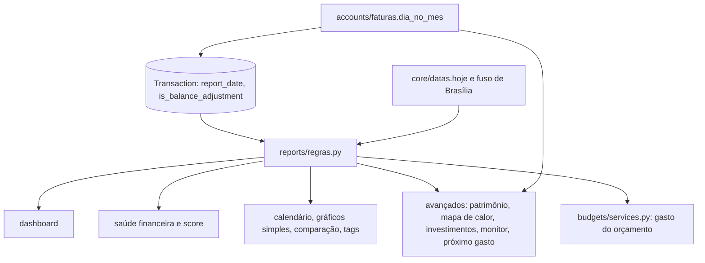

# Relatórios Design

**Spec**: `.specs/features/relatorios/spec.md`
**Status**: Approved

---

## Architecture Overview

Hoje cada função de `reports/services.py` (1.344 linhas) escolhe as próprias transações:

- uma conta as compras no cartão pelo mês da fatura, outra pela data;
- algumas somam despesas pendentes;
- o mapa de calor usa UTC;
- o histórico de investimentos anda de 30 em 30 dias;
- vários blocos fazem conta em `float`.

O orçamento (`budgets/services.py`) tem uma terceira regra. Por isso os números não batem de uma tela para outra.

O design concentra as regras num módulo só e faz cada relatório usá-lo.

| Peça | Onde | O que faz |
| ---- | ---- | --------- |
| Data no relatório | `Transaction.report_date`, mantida no `save()` | A data em que a transação conta nos relatórios. Compra no cartão: a data da compra mais N-1 meses na parcela N, com o último dia quando o dia não existe (REL-01, REL-02, AD-006). Demais transações: a `date` |
| Ajuste de saldo | `Transaction.is_balance_adjustment` | Marca o lançamento criado pelo ajuste de saldo, em vez de reconhecê-lo pela descrição (REL-03, REL-05) |
| Regras comuns | `reports/regras.py` (novo) | Despesas, "A pagar", receitas, limites do mês e hora em Brasília, meses do calendário, patrimônio (atual e no fim de um mês), dinheiro guardado e faturas do mês, tudo em `Decimal` |
| Relatórios | `reports/services.py` | Cada função passa a chamar `reports/regras.py`; sai todo `float` em valor de dinheiro |
| Orçamentos | `budgets/services.py` | O gasto usa as despesas de `reports/regras.py` (REL-06) |
| Parâmetro `months` | `reports/views.py` | Inteiro de 1 a 24; fora disso, 400 (REL-12) |
| Tela | `relatorios/page.tsx` e `dashboard/page.tsx` | "A pagar", patrimônio dividido, taxa indisponível, "Sem histórico para comparar" e erro por bloco |

### Abordagens consideradas

| Abordagem | Prós | Contras | Decisão |
| --------- | ---- | ------- | ------- |
| Calcular a data da parcela em Python em cada relatório | Sem campo novo | Filtro por período não vai para o banco; cada relatório repete a regra | Recusada |
| Anotação SQL com a data da compra mais o deslocamento | Sem migração de dados | Expressão de data com último dia do mês difícil em SQL portável; repetida em cada consulta | Recusada |
| Campo `report_date` mantido no `save()` e preenchido por migração (AD-046) | Filtro e índice no banco; uma regra só | Caminhos com `QuerySet.update()` que mudam datas precisam recalcular | **Escolhida** |
| Reconhecer o ajuste de saldo pela descrição "Ajuste de saldo" (como os trocos fazem hoje) | Sem campo | Uma despesa que o usuário chamar assim some dos relatórios | Recusada; campo próprio, preenchido pela migração a partir da descrição nos registros antigos |

---

## Code Reuse Analysis

### Existing Components to Leverage

| Component | Location | How to Use |
| --------- | -------- | ---------- |
| Último dia do mês | `accounts/faturas.py` (`dia_no_mes`, AD-006) | Parcelas em `report_date` (REL-02) e projeções (REL-11) |
| Hoje em Brasília | `core/datas.py` (`hoje`, `BRASILIA`) | Limites do mês e hora do mapa de calor (REL-08, REL-09) |
| Saldo das contas | `accounts/saldo.py` (AD-038) | Patrimônio atual; o patrimônio no fim de um mês usa a mesma soma até aquela data |
| Limite disponível | `accounts/faturas.py` (`limite_disponivel`) | A mesma noção de "compras não pagas" para o patrimônio (REL-13) |
| `dinheiro()` | `core/valores.py` (AD-041) | Só no resultado final de cada valor (REL-10) |
| `TIPOS_DE_DESPESA` | `transactions/filtros.py` | Os relatórios usam as despesas de `reports/regras.py`; a constante continua servindo à lista e à exportação |
| `ParametrosConhecidosMixin` | `core/filtros.py` | `months` validado nas rotas que o aceitam |
| `tratarErro`, `formatarMoeda` | `fluxar-frontend/src/lib/` | Erro por bloco com "Tentar de novo" e valores |

### Integration Points

| System | Integration Method |
| ------ | ------------------ |
| Faturas (AD-039) | `date` continua sendo o vencimento da compra no cartão; `report_date` usa `purchase_date` (ou `date` nas compras antigas sem data da compra) |
| Saldo e ajuste de saldo | `adjust-balance` grava `is_balance_adjustment=True`; os trocos (`goals/trocos.py`) passam a usar o campo |
| Importação | Transações importadas ganham `report_date` pelo `save()`; a importação em lote não usa `QuerySet.update()` para datas |
| Metas | Aportes e resgates são transferências: ficam fora das despesas e entram no dinheiro guardado (REL-20) |
| Permissões | As travas de cada relatório (`relatorios_avancados`, `comparacao_mensal`, `analise_por_tag`, `calendario`) continuam como estão |

---

## Components

### Campos na transação (`transactions/models.py`)

- `report_date = DateField(db_index=True)`. É recalculada no `Transaction.save()`:
  - `CREDIT_CARD` com `purchase_date`: `dia_no_mes` aplicado à `purchase_date` mais `(installment_number or 1) - 1` meses, mantendo o dia da compra.
  - `CREDIT_CARD` sem `purchase_date` (compras antigas): a `date`, porque cada parcela antiga já tem o próprio vencimento.
  - Demais tipos: a `date`.
- `is_balance_adjustment = BooleanField(default=False)`.
- Migração `transactions/00xx_relatorios`: cria os dois campos; preenche `report_date` pela mesma regra e `is_balance_adjustment` nas transações com a descrição "Ajuste de saldo".
- O restante criado pelo pagamento parcial copia `purchase_date` e `installment_number`, e por isso mantém a mesma data no relatório da compra original.

### Regras comuns (`reports/regras.py`)

- `limites_do_mes(ano, mes)` e `mes_atual()` pelo calendário de Brasília (REL-08).
- `meses_do_calendario(fim, quantidade)`: lista de `(ano, mes)` sem pular nem repetir (REL-17).
- `despesas(usuario, inicio, fim)`, um queryset com `report_date` no período e duas partes (REL-01 a REL-03, REL-07):
  - `EXPENSE` efetivadas;
  - todas as `CREDIT_CARD` do usuário, em qualquer status.
  
  Ficam de fora transferências, pagamento de fatura e ajustes. Contas excluídas continuam, porque o filtro é pelo usuário, não pela conta ativa.
- `a_pagar(usuario, inicio, fim)`: `EXPENSE` pendentes com `date` no período, exceto ajustes (REL-04).
- `receitas(usuario, inicio, fim)`: `INCOME` efetivadas por `date`, exceto ajustes (REL-05).
- `patrimonio(usuario, em=None)`, que devolve `{disponivel, reservas, investimentos, faturas_em_aberto, total}` (REL-13 a REL-16):
  - **Sem data:** saldos atuais das contas ativas, por tipo, e compras no cartão pendentes.
  - **Com data:** saldo de cada conta ativa até `em` (`initial_balance` mais as efetivadas com data de efetivação até `em`; na compra no cartão paga, a data de efetivação é o `payment_date`). As faturas em aberto são as compras no cartão com `report_date` até `em` e ainda não pagas nela (pendentes, ou com `payment_date` depois de `em`).
- `dinheiro_guardado(usuario, inicio, fim)`: soma das entradas efetivadas (`TRANSFER_IN`) em contas `PIGGY_BANK` ou `INVESTMENT` cuja perna parceira sai de uma conta de outro tipo, menos as saídas (`TRANSFER_OUT`) dessas contas para contas de outro tipo (REL-20). Movimento entre duas contas de reserva ou de investimento não conta. Aporte do saldo livre não tem transferência, então não conta.
- `faturas_do_mes(usuario)`: compras no cartão pendentes ligadas a faturas não pagas com `due_date` no mês atual de Brasília (REL-18).
- `hora_em_brasilia(campo)`: a expressão que converte `created_at` para `America/Sao_Paulo` antes de extrair hora e dia da semana (REL-09).

### Relatórios (`reports/services.py`)

| Função | Mudança | Requisitos |
| ------ | ------- | ---------- |
| `_get_date_range` | Limites por `mes_atual()` e `hoje()` | REL-08 |
| `get_dashboard_summary` | Despesas, receitas e "A pagar" (`payable`) pelas regras; `total_current_invoices` por `faturas_do_mes`; `net_worth` pelo `patrimonio()` e `net_worth_breakdown` com as quatro partes; os cartões seguem com o limite disponível | REL-01 a REL-05, REL-13 a REL-15, REL-18 |
| `get_financial_health_metrics` | Liquidez com só disponível; `saved_this_month` por `dinheiro_guardado`; `savings_rate` = guardado / receitas, `null` sem receitas; score de orçamentos = 20 − 5 × estourados, mínimo 0 | REL-14, REL-19 a REL-22 |
| `get_calendar_data`, `get_simple_charts`, `get_tag_distribution` | Despesas e receitas pelas regras, por `report_date` | REL-01 a REL-05 |
| `get_monthly_comparison`, `get_tag_insights` | Meses por `meses_do_calendario`; `months` validado na view | REL-12, REL-17 |
| `get_advanced_charts` | Evolução do patrimônio pelo `patrimonio(em=fim do mês)`; mapa de calor pela hora de Brasília; investimentos mês a mês; monitor de foco e próximo grande gasto pelas regras; projeção com `dia_no_mes`; tudo em `Decimal` | REL-09 a REL-11, REL-16, REL-17 |

As chaves das respostas são mantidas. Entram só `payable`, `net_worth_breakdown` e `saved_this_month`, e `savings_rate` passa a poder ser `null`.

### Orçamentos (`budgets/services.py`)

- O gasto é a soma de `despesas(usuario, início do mês, fim do mês)` filtrada pela categoria do orçamento e pelas subcategorias dela (REL-06).

### Exportação em PDF (`data_exchange/services.py`)

- A linha de uma transação sem conta (ou com a conta de outro usuário, ISOL-15) leva a conta em branco, e o arquivo é gerado (REL-25).

### Frontend

| Arquivo | Mudança | Requisitos |
| ------- | ------- | ---------- |
| `src/app/(app)/dashboard/page.tsx` e `src/components/dashboard/` | Card "A pagar"; patrimônio com disponível, reservas, investimentos e faturas em aberto; faturas do mês | REL-04, REL-15, REL-18 |
| `src/app/(app)/relatorios/page.tsx` | Taxa de poupança "Indisponível" quando `null`; "Sem histórico para comparar" quando a média é zero (monitor de foco e comparações); cada bloco carrega com o próprio estado de erro e "Tentar de novo", sem `Promise.all` derrubando a tela | REL-22 a REL-24 |
| `src/types/reports.ts` | Campos novos e `savings_rate` opcional | REL-15, REL-22 |

---

## Error Handling Strategy

| Error Scenario | Handling | User Impact |
| -------------- | -------- | ----------- |
| `months` fora de 1 a 24 ou não inteiro | 400 `{detail: "O parâmetro months aceita de 1 a 24."}` | Aviso; só acontece fora da tela |
| Receitas zero no mês | `savings_rate: null` | "Indisponível" |
| Média zero numa comparação | A interface troca a porcentagem pelo texto | "Sem histórico para comparar" |
| Falha de um bloco | O bloco mostra o erro e "Tentar de novo" | Os outros blocos continuam |
| Transação sem conta no PDF | Conta em branco | Arquivo gerado |

---

## Risks & Concerns

| Risk | Likelihood | Impact | Mitigation |
| ---- | ---------- | ------ | ---------- |
| `report_date` desatualizada por um `QuerySet.update()` que mude `date` ou `purchase_date` | Baixa | Médio | Hoje só `colocar()` muda a `date` da compra, e a `report_date` não depende dela quando há `purchase_date`; um teste fixa que editar a compra recalcula |
| Números do dashboard mudam para quem já usa o app | Certa | Médio | É a correção pedida; as chaves das respostas são as mesmas |
| Histórico do patrimônio mês a mês fica mais caro | Média | Baixo | Uma agregação por conta e por mês, no máximo 24 meses; cache fica para a frente de performance (PERF-02) |
| `get_advanced_charts` é grande e sem testes por bloco | Alta | Médio | Uma task por grupo de blocos, com testes do Independent Test de cada história |

---

## Tech Decisions

| Decision | Choice | Rationale |
| -------- | ------ | --------- |
| Data das despesas nos relatórios | Campo `report_date` mantido no `save()` (AD-046) | Uma regra, filtrável no banco, sem mexer no `date` (vencimento) da AD-039 |
| Ajuste de saldo | Campo `is_balance_adjustment` | Não depende da descrição |
| Regras comuns | `reports/regras.py` usado por relatórios e orçamentos | Os números batem entre as telas (REL-06, REL-19) |
| Respostas | Mesmas chaves, mais `payable`, `net_worth_breakdown` e `saved_this_month` | O frontend atual continua funcionando enquanto a tela é ajustada |
