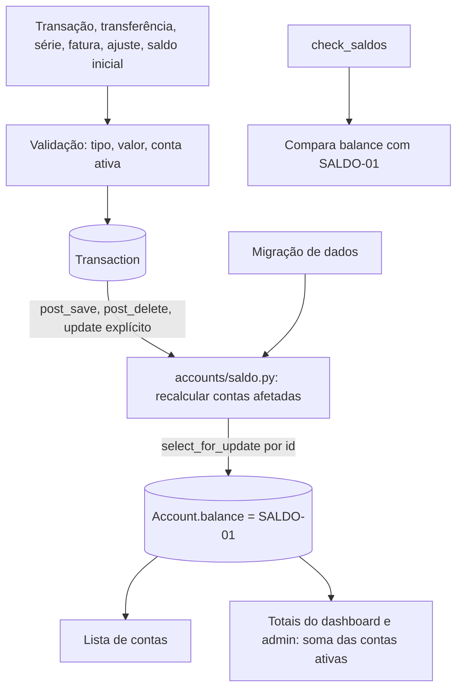

# Saldo Design

**Spec**: `.specs/features/saldo/spec.md`
**Status**: Approved

---

## Architecture Overview

O saldo deixa de ser mantido por incrementos e passa a ser **recalculado a partir do razão** sempre que algo muda numa conta.

A regra de SALDO-01 tem uma implementação só, em `accounts/saldo.py`: saldo inicial + entradas efetivadas − saídas efetivadas do dono. Os signals de `Transaction` chamam `recalcular()` para cada conta afetada (a antiga e a nova). Os caminhos que usam `QuerySet.update()` chamam `recalcular()` explicitamente.

`recalcular()` trava as linhas das contas com `select_for_update`, na ordem do id, antes de somar. Isso resolve três requisitos sem código específico:
- **Concorrência (SALDO-44):** a segunda operação espera a primeira terminar e soma já vendo o que ela gravou.
- **Efetivação dupla (SALDO-45):** a transação conta uma vez só, porque o saldo vem do status gravado.
- **Erros acumulados (SALDO-01 a SALDO-08):** não existe incremento que possa ficar errado.

Toda requisição roda numa transação de banco (`ATOMIC_REQUESTS`), e os services que movem dinheiro usam `transaction.atomic()` próprio. Com isso, uma falha no meio desfaz tudo (SALDO-10).

As regras de cada operação ficam nos serializers, nas views e nos services de hoje:
- tipos aceitos no endpoint genérico;
- contas excluídas;
- transferências com as duas pernas sincronizadas;
- séries que só mexem nas pendentes;
- pagamento e estorno de fatura sob trava.

Os totais do dashboard passam a somar o `balance` guardado das contas ativas, o mesmo valor que aparece na lista de contas (SALDO-28).

### Abordagens consideradas

| Abordagem | Como funciona | Decisão |
| --------- | ------------- | ------- |
| **Recalcular do razão a cada mudança (escolhida)** | Soma as transações efetivadas da conta, sob trava, e grava no `balance` | Uma regra só; atende concorrência e efetivação dupla por construção; os caminhos com `update()` só precisam chamar `recalcular` |
| Corrigir os incrementos atuais | Mantém os signals com `F('balance') ± impacto` e conserta cada caminho | Cada novo caminho com `update()` volta a abrir o mesmo bug; a concorrência ainda exigiria trava |
| Calcular só na leitura, sem campo guardado | Toda tela soma o razão | Uma agregação por conta em cada listagem e total; o `balance` já existe e é lido em vários lugares |

---

## Code Reuse Analysis

### Existing Components to Leverage

| Component | Location | How to Use |
| --------- | -------- | ---------- |
| `AccountService.get_balance` | `accounts/services.py:9-36` | A fórmula vira a de `accounts/saldo.py`; `get_balance` passa a delegar |
| `_recalcular_saldos` | `core/isolation.py:88-99` | Mesma fórmula; a migração de dados desta feature segue o mesmo padrão com `apps` |
| `TransactionService.create_transfer` | `transactions/services.py:49-72` | Ganha as validações de SALDO-11 e SALDO-17 |
| `pay_invoice` e `unpay_invoice` | `accounts/services.py:119-248` | Ganham trava, atomicidade e a reversão do estorno |
| `get_owned_or_400` e `OwnedPrimaryKeyRelatedField` | `core/fields.py` | Os querysets de conta passam a filtrar `is_active=True` onde a spec recusa conta excluída |
| `init_balances` e `audit_accounts` | `accounts/management/commands/` | Base do comando `check_saldos` |
| Base de testes | `tests/isolamento/base.py` | Referência para a base com contas e cartão em `tests/saldo/` |

### Integration Points

| System | Integration Method |
| ------ | ------------------ |
| Banco | `DATABASES['default']['ATOMIC_REQUESTS'] = True` e `select_for_update` nas contas e na fatura |
| Frontend | O ajuste de saldo chama a rota nova; o pagamento de fatura exige uma fatura escolhida; a edição de transferência envia a conta da perna; a exclusão de conta mostra a mensagem do backend |

---

## Components

### Data de hoje (`core/datas.py`)

- **Purpose**: AD-008.
- **Interfaces**: `hoje() -> date`, que devolve `timezone.localdate(timezone=ZoneInfo('America/Sao_Paulo'))`. O `TIME_ZONE` global continua UTC; os relatórios ficam com a feature `relatorios`.

### Saldo (`accounts/saldo.py`)

- **Purpose**: a única implementação de SALDO-01.
- **Interfaces**:
  - `calcular(conta) -> Decimal`: soma só as transações do dono da conta, como no isolamento.
  - `recalcular(*conta_ids)`: ignora `None`, trava as contas com `select_for_update` em ordem de id e grava o `balance`.
- `transactions/signals.py`: os signals de saldo (`pre_save` com o estado antigo, `post_save` e `post_delete`) passam a chamar `recalcular(conta_antiga, conta_nova)` no lugar dos incrementos.
- `accounts/signals.py`: a criação da conta e a mudança do saldo inicial também chamam `recalcular` (SALDO-43), e a resposta da criação passa a trazer o saldo certo.

### Valor das operações (`core/valores.py`)

- **Purpose**: SALDO-09.
- **Interfaces**: `validar_valor_positivo(valor)`, que recusa zero e negativos com "O valor deve ser maior que zero.". É usado no `amount` de `TransactionSerializer`, `TransferSerializer`, `CreditCardExpenseSerializer` e `InvoicePaymentSerializer`, e no aporte e no resgate de meta.
- O limite de duas casas já vem do `DecimalField`.

### Endpoint genérico de transações (`transactions/serializers.py`)

- **SALDO-18**: na criação, `type` aceita só `INCOME` e `EXPENSE`.
- **SALDO-19**: na edição, a mudança de tipo só vale entre `INCOME` e `EXPENSE`.
- **SALDO-46**: uma `CREDIT_CARD` não pode ir para `COMPLETED` pelo endpoint, só pelo pagamento da fatura.
- **SALDO-35**: o campo `account` filtra `is_active=True`.
- **SALDO-36**: editar ou excluir uma transação de conta excluída, ou uma transferência com uma perna em conta excluída, recebe 400 com "Esta transação é de uma conta excluída e não pode ser alterada.". A validação fica no serializer e no `perform_destroy`.

### Contas (`accounts/views.py` e `accounts/serializers.py`)

- **Exclusão** (SALDO-32 a SALDO-34):
  - saldo diferente de zero ou transações pendentes na conta recebem 400 com as mensagens da spec;
  - a exclusão continua sendo `is_active=False`.
- **SALDO-34**: `is_active` vira somente leitura no serializer, para não excluir sem passar pela regra.
- **Ajuste de saldo** (SALDO-40 a SALDO-42): rota nova `POST /api/accounts/{id}/adjust-balance/` com `{"new_balance": "999.90"}`.
  - A diferença é calculada em `Decimal`.
  - Com diferença diferente de zero, cria uma transação `INCOME` ou `EXPENSE` efetivada, com a data de `hoje()` e a descrição "Ajuste de saldo".
  - Com diferença zero, responde 200 sem criar nada.
  - Conta excluída recebe 400.

### Transferências (`transactions/services.py`, `transactions/serializers.py` e `transactions/signals.py`)

- **Criação** (SALDO-11, SALDO-12 e SALDO-17):
  - origem igual ao destino recebe 400 com "A conta de origem e a de destino devem ser diferentes.";
  - as duas contas precisam estar ativas;
  - as duas pernas nascem no mesmo `atomic`, com o mesmo status;
  - a descrição enviada é respeitada.
- **Edição** (SALDO-13 a SALDO-15): um serviço `editar_transferencia(perna, dados)`:
  - aplica `amount`, `date` e `status` às duas pernas;
  - troca a conta da perna editada (`account`) e a da outra perna (`target_account_id`);
  - recusa a mudança de tipo;
  - recalcula as contas envolvidas, antigas e novas.
  - O signal `sync_transfer_update` deixa de existir.
- **Exclusão** (SALDO-16): continua apagando as duas pernas, e o recálculo vem dos signals.

### Séries recorrentes (`transactions/serializers.py` e `transactions/views.py`)

- **SALDO-20**: as 11 ocorrências geradas nascem `PENDING`, e a primeira segue o status enviado.
- **SALDO-21**: o `bulk_update`:
  - aplica `description`, `amount`, `category`, `account` e `type` só às ocorrências `PENDING` da série;
  - também atualiza o modelo da série;
  - valida conta e categoria com `get_owned_or_400`, a conta precisando estar ativa, e o tipo só entre `INCOME` e `EXPENSE`;
  - recalcula as contas afetadas.
- **SALDO-22**: o `bulk_delete` por série apaga só as pendentes e marca `RecurringTransaction.is_active=False`.

### Fatura (`accounts/services.py` e `accounts/views.py`)

- **SALDO-23 e SALDO-26**: `pay_invoice` roda em `atomic`, com `select_for_update` na fatura.
  - Com a fatura já `PAID`, a tentativa recebe 400 com "Fatura já está paga.".
  - O identificador de tentativa (FATURA-30, AD-007) fica com a feature `faturas`.
- **SALDO-24, SALDO-25 e SALDO-27**: `unpay_invoice`:
  - recusa a fatura que não está paga, com 400;
  - volta as compras pagas para `PENDING`, sem `account` e sem `payment_date`, como antes do pagamento;
  - recalcula a conta de pagamento;
  - roda em `atomic`.

### Totais (`reports/services.py`)

- **SALDO-28 a SALDO-31**: `total_balance`, `net_worth`, `total_liquid_balance`, o saldo de investimentos e o `get_user_financial_stats` do admin passam a somar `Account.balance` das contas `is_active=True`.
  - Saldo líquido: tipos `CHECKING`, `SAVINGS` e `WALLET`.
  - Saldo total: qualquer tipo.

### Comandos e dados existentes

- **`cleanup_db`** (SALDO-47):
  - deixa de apagar contas excluídas que têm transações;
  - perde a opção `--all-transactions`, que zerava saldos e apagava histórico.
- **Migração `transactions/0008_corrige_saldos`** (SALDO-37 e SALDO-38):
  - volta para `PENDING` as ocorrências de série efetivadas com data posterior a `hoje()`, exceto a primeira de cada série, que é a mais antiga;
  - recalcula o `balance` de todas as contas com a fórmula de SALDO-01, usando os modelos históricos.
- **Comando `check_saldos`** (SALDO-39): lista `<id da conta> <saldo exibido> <saldo calculado>` para cada divergência, e o total no fim. Não mostra nomes.

### Frontend

- **`balance-adjustment-dialog.tsx`**: chama `POST /accounts/{id}/adjust-balance/` com o novo saldo em texto decimal, sem conta em ponto flutuante (CON-06).
- **`invoice-payment-dialog.tsx`**: exige uma fatura escolhida e remove o caminho que criava `INVOICE_PAYMENT` pelo endpoint genérico (SALDO-18, CON-09).
- **`transfer-form-dialog.tsx`**: a edição envia `account` (a perna editada), `target_account_id`, `amount`, `date` e `description`, os campos que o backend usa.
- **`contas/page.tsx`**: a exclusão mostra a mensagem do backend (SALDO-32 e SALDO-33).

---

## Data Models (if applicable)

Nenhuma mudança de esquema. `RecurringTransaction.is_active` já existe e passa a ser usado. A migração 0008 só altera dados.

---

## Error Handling Strategy

| Error Scenario | Handling | User Impact |
| -------------- | -------- | ----------- |
| Valor zero, negativo ou com mais de duas casas | 400 em `amount` | Mensagem no campo |
| Tipo especial no endpoint genérico, ou mudança de tipo | 400 em `type` | Mensagem no campo |
| Efetivar compra no cartão fora da fatura | 400 em `status` | "Compras no cartão são efetivadas pelo pagamento da fatura." |
| Conta excluída numa operação nova | 400 no campo da conta | "Conta não encontrada." (o mesmo campo do isolamento, que filtra só as contas ativas) |
| Editar ou excluir transação de conta excluída | 400 | Mensagem de SALDO-36 |
| Excluir conta com saldo ou com pendentes | 400 | Mensagens de SALDO-32 e SALDO-33 |
| Transferência com origem igual ao destino | 400 | Mensagem de SALDO-17 |
| Segundo pagamento da mesma fatura | 400 | "Fatura já está paga." |
| Estorno de fatura não paga | 400 | "Esta fatura não está paga." |
| Falha no meio de uma operação | Rollback | Nenhum saldo muda |

---

## Risks & Concerns

| Concern | Location (file:line) | Impact | Mitigation |
| ------- | -------------------- | ------ | ---------- |
| Views que capturam exceção e respondem 400 depois de gravar parte da operação | `goals/views.py:34-97` | Com o `ATOMIC_REQUESTS`, o 400 devolvido pela própria view confirma a transação | Os services de meta, transferência e fatura usam `atomic` próprio, e a falha levanta exceção dentro dele |
| Uma agregação por conta a cada gravação | `accounts/saldo.py` | Custo pequeno: uma soma indexada por conta | Índice em `(account, status)` se as listas crescerem; fica para PERF |
| Trava de contas em ordem diferente em duas operações | `accounts/saldo.py` | Deadlock | Trava sempre em ordem crescente de id |
| `ATOMIC_REQUESTS` também envolve o envio de e-mail | `api/views.py` (cadastro) | A transação fica aberta até 10 s | Aceitável no volume atual; o envio não grava nada depois |
| A migração reaproveita uma fórmula que a aplicação também tem | `transactions/migrations/0008_corrige_saldos.py` | Duas cópias da fórmula | A migração usa modelos históricos, como a 0007 do isolamento; o `check_saldos` confere as duas |
| `date.today()` em metas e relatórios | `goals/services.py:36` e outros | Datas em UTC | Metas e relatórios ficam com as features deles; aqui só o ajuste de saldo e a migração usam `hoje()` |

---

## Tech Decisions (only non-obvious ones)

| Decision | Choice | Rationale |
| -------- | ------ | --------- |
| Como manter o saldo | Recalcular do razão sob trava | Uma regra só e concorrência resolvida por construção |
| Atomicidade | `ATOMIC_REQUESTS` mais `atomic` nos services | Garante SALDO-10 em toda rota, inclusive nas que não passam por um service |
| Estorno de fatura | As compras voltam ao estado anterior ao pagamento (pendentes, sem conta e sem data de pagamento) | O recálculo devolve exatamente o valor pago (SALDO-24) |
| Data de hoje | `hoje()` no fuso de Brasília, sem mudar o `TIME_ZONE` global | AD-008 sem mexer nos relatórios agora |

Esta decisão vale para as próximas features e foi registrada em `.specs/STATE.md`:
- **AD-038**: o `Account.balance` é sempre o resultado de `accounts/saldo.py`. Nenhum código grava o saldo diretamente; quem muda transações por `QuerySet.update()` chama `recalcular()` para as contas afetadas.
