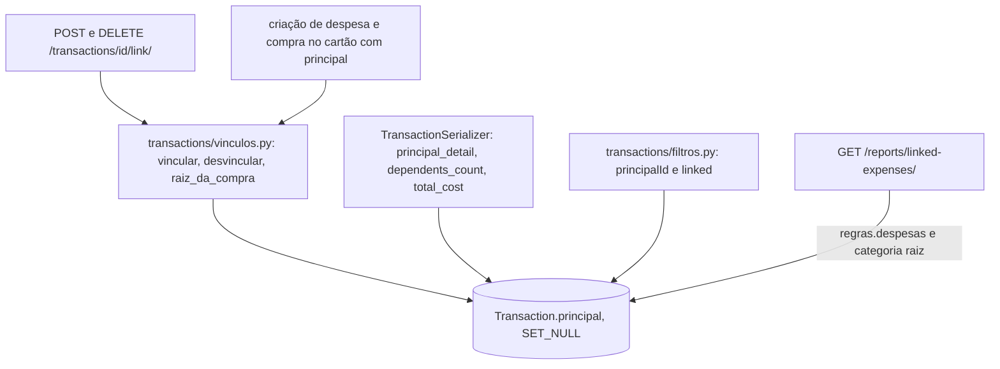

# Vínculo entre transações Design

**Spec**: `.specs/features/vinculo-entre-transacoes/spec.md`
**Status**: Approved

---

## Architecture Overview

O vínculo é um campo novo na transação: `principal`. Ele aponta para a transação principal e usa `SET_NULL`. Excluir a principal desfaz os vínculos e mantém as dependentes (VINCULO-14).

Numa compra parcelada, o vínculo fica sempre na primeira parcela, que é a raiz da compra. Escolher qualquer parcela, como principal ou como dependente, leva o vínculo para a raiz (VINCULO-12). O custo total soma todas as parcelas das compras envolvidas (VINCULO-27).

As regras ficam num módulo só, `transactions/vinculos.py`:

- um nível só;
- só despesas e compras no cartão;
- troca de principal;
- repetição sem erro.

Todas as rotas passam por esse módulo. Antes de conferir as regras, ele trava as duas transações em ordem de id. Assim, dois pedidos simultâneos não montam um ciclo nem um segundo nível (VINCULO-19).

O vínculo não muda saldo, fatura nem orçamento, porque nenhum cálculo lê o campo novo (VINCULO-17, VINCULO-28). O relatório de gastos puxados usa as mesmas transações de `regras.despesas` e agrupa pela categoria raiz.



### Abordagens consideradas

| Abordagem | Prós | Contras | Decisão |
| --------- | ---- | ------- | ------- |
| Reaproveitar `parent_transaction` | Sem campo novo | É a ligação das parcelas, com exclusão em cascata | Recusada |
| Modelo de vínculo à parte | Permite metadados | Um nível só e uma principal por dependente cabem num campo; tabela a mais em toda consulta | Recusada |
| Campo `principal` na transação, com `SET_NULL` | Uma principal por dependente por construção; excluir a principal desfaz os vínculos sozinho | Regras de nível conferidas no código, sob trava | **Escolhida (AD-054)** |
| Vínculo em cada parcela | Simples de gravar | O custo e o filtro teriam que juntar parcelas soltas | Recusada; vínculo na raiz da compra |
| Custo total gravado | Leitura rápida | Muda com edição, exclusão e parcelas | Recusada; calculado por página numa consulta agregada |

---

## Code Reuse Analysis

### Existing Components to Leverage

| Component | Location | How to Use |
| --------- | -------- | ---------- |
| Compra inteira de uma parcela | `transactions/services.py:18-24` | `raiz_da_compra(transacao)` usa `parent_transaction_id or pk` |
| `create_credit_card_expense` | `transactions/services.py:207-250` | Ganha `principal`; o vínculo vai na raiz, na mesma transação do banco |
| `OwnedPrimaryKeyRelatedField` | `core/fields.py` | Campo `principal`; nova mensagem `TRANSACAO_NAO_ENCONTRADA = 'Transação não encontrada.'` (VINCULO-11) |
| `filtrar_transacoes` | `transactions/filtros.py:88` | Ganha `principalId` e `linked`; a lista e as exportações já chamam |
| `ParametrosConhecidosMixin` | `core/filtros.py` | Os parâmetros novos entram na lista, em `PARAMETROS_DA_EXPORTACAO` e na rota do relatório |
| `RecursoLiberado('vinculos')` e `exigir_recurso` | `core/travas.py` | Trava de criar, trocar, filtrar e do relatório; desfazer fica livre (VINCULO-20, VINCULO-21) |
| `regras.despesas` e `_get_date_range` | `reports/regras.py`, `reports/services.py` | Mesmas regras de tipo e período dos gráficos de despesa (VINCULO-35) |
| `TIPOS_DE_DESPESA` | `transactions/filtros.py` | `EXPENSE` e `CREDIT_CARD` |
| `RecursoBloqueado`, `usePlan` | frontend | Ações de vínculo e relatório travados |
| `TransactionFilters` | frontend | Ganha "Com vínculo" |

### Integration Points

| System | Integration Method |
| ------ | ------------------ |
| Lista de transações | `principalId` e `linked=true` (AD-022) |
| Tela Relatórios | Seção "Gastos puxados" com `GET /reports/linked-expenses/` |

---

## Components

### Regras do vínculo (AD-054)

- **Location**: `transactions/models.py`, `transactions/migrations/`, `transactions/vinculos.py` (novo)
- **Interfaces**:
  - `Transaction.principal`: FK para `self`, `SET_NULL`, nulo, `related_name='dependentes'`. Um `CheckConstraint` impede que uma transação seja principal de si mesma.
  - `vincular(dependente, principal)` trabalha sobre as raízes das compras:
    1. Trava as duas raízes com `select_for_update`, em ordem de id.
    2. Recusa receita, transferência e pagamento de fatura: `"Só despesas e compras no cartão podem ser vinculadas."` (VINCULO-05).
    3. Recusa ligar a transação a ela mesma: `"Uma transação não pode ser vinculada a ela mesma."` (VINCULO-08).
    4. Recusa principal que já é dependente: `"Uma transação dependente não pode ser principal."` (VINCULO-06).
    5. Recusa dependente que já tem dependentes: `"Uma transação principal não pode virar dependente."` (VINCULO-07).
    6. Se a dependente já tem essa principal, não muda nada (VINCULO-10).
    7. Senão, grava a principal nova, trocando a anterior se houver (VINCULO-09).
  - `desvincular(dependente)` limpa `principal` da raiz (VINCULO-04).
  - A troca de tipo para receita, no `TransactionSerializer.update`, limpa a principal da transação e a das dependentes dela (VINCULO-16).
  - Uma ocorrência recorrente se liga sozinha; nada copia o vínculo para a série (VINCULO-13).
  - Logs só com ids (VINCULO-23).
  - O campo novo não exige mudança em `MODELOS_DO_USUARIO`, porque as transações já são apagadas com a conta (VINCULO-22).

### Rotas de vínculo

- **Location**: `transactions/views.py`
- **Interfaces**:
  - `POST /api/transactions/{id}/link/ {principal}`:
    - com o recurso `vinculos` liberado, liga ou troca e devolve 200 com a transação;
    - com o recurso travado, responde 403 `plan_locked` (VINCULO-02, VINCULO-09, VINCULO-10, VINCULO-20);
    - principal de outro usuário ou inexistente recebe 400 `{"principal": ["Transação não encontrada."]}`;
    - id da dependente de outro usuário recebe 404 (VINCULO-11).
  - `DELETE /api/transactions/{id}/link/` desfaz o vínculo e devolve 200 com a transação, mesmo com o recurso travado (VINCULO-04, VINCULO-21).

### Gasto relacionado

- **Location**: `transactions/serializers.py`, `transactions/services.py`, `transactions/views.py`
- **Interfaces**:
  - `POST /api/transactions/` (EXPENSE) e `POST /api/transactions/credit-card-expense/` aceitam `principal` opcional.
  - O vínculo é gravado na mesma transação do banco que cria o gasto. Se o vínculo for recusado, a resposta é 400 e nada fica gravado (VINCULO-01, VINCULO-18).
  - Enviar `principal` com o recurso travado responde 403 `plan_locked`.

### Campos na API

- **Location**: `transactions/serializers.py`, `transactions/views.py`
- **Interfaces** (VINCULO-26):
  - `principal`: id da principal da compra, ou nulo.
  - `principal_detail`: `{id, description, date}` ou nulo.
  - `dependents_count`: a quantidade de dependentes.
  - `total_cost`: texto com duas casas; nulo quando não há dependentes.
    - É a soma de todas as parcelas da compra principal mais todas as parcelas das compras dependentes (VINCULO-27).
    - Numa parcela, os campos são os da compra, lidos da raiz.
  - Na lista, o custo e a contagem saem de uma consulta agregada por página, sem uma consulta por linha.
  - Os totais por categoria não mudam (VINCULO-28).

### Filtros

- **Location**: `transactions/filtros.py`, `transactions/views.py`, `data_exchange/views.py`
- **Interfaces**:
  - `principalId=<id>` traz a principal e as dependentes, com as parcelas das compras (VINCULO-29).
  - `linked=true` traz as principais e as dependentes, com as parcelas (VINCULO-30).
  - Id inválido, de outro usuário ou inexistente recebe 400 `{"principalId": ["Transação inválida no filtro: <valor>."]}` (VINCULO-32). `linked` diferente de `true` recebe 400 no campo.
  - Com o recurso travado, usar um dos dois filtros responde 403 `plan_locked` (VINCULO-20).
  - As exportações aceitam os dois filtros e não levam o vínculo no arquivo (VINCULO-33).

### Relatório de gastos puxados

- **Location**: `reports/services.py`, `reports/views.py`
- **Interfaces**:
  - `GET /api/reports/linked-expenses/?month=&year=&period=&days=`, com os mesmos parâmetros de período dos gráficos simples e a trava `vinculos`.
  - As dependentes entram por `regras.despesas` do período, por `report_date` (VINCULO-35). Uma parcela entra quando a raiz da compra dela tem principal.
  - Agrupa pela categoria raiz da principal e pela categoria raiz da dependente, subindo a árvore inteira. Sem categoria vira "Sem categoria".
  - A resposta é `{groups: [{category_id, category_name, color, total, pulled: [{category_id, category_name, color, amount}]}], period: {start_date, end_date}}`, do maior total para o menor. Os valores são texto com duas casas (VINCULO-34).

### Frontend

- **Location**:
  - `src/types/transactions.ts`, `src/services/vinculos.ts` (novo);
  - `src/components/transactions/*`, `src/app/(app)/transacoes/page.tsx`;
  - `src/components/transactions/transaction-filters.tsx`, `src/services/import-export.ts`;
  - `src/components/reports/GastosPuxados.tsx` (novo), `src/app/(app)/relatorios/page.tsx`.
- **Lista** (VINCULO-24, VINCULO-25, VINCULO-31):
  - A principal mostra "Custo total R$ X" com a quantidade de dependentes.
  - Clicar abre `/transacoes?principalId=<id>`, que mostra a principal e as dependentes, com descrição, categoria e valor.
  - A dependente mostra "Por causa de: <descrição>, dd/mm/aaaa".
- **Ações** (VINCULO-01 a VINCULO-04):
  - "Lançar gasto relacionado" abre o formulário de despesa com a principal.
  - "Vincular a um gasto" abre a busca por descrição, data ou valor entre as despesas e compras no cartão.
  - "Desfazer vínculo" fica disponível sempre.
  - Com o recurso travado, as duas primeiras ações aparecem travadas.
- **Filtro** (VINCULO-30, VINCULO-33): "Com vínculo" no `TransactionFilters`, na lista e na exportação, travado pelo plano.
- **Relatório** (VINCULO-36, VINCULO-37):
  - Seção "Gastos puxados" na tela Relatórios, dentro de `RecursoBloqueado chave="vinculos"`.
  - Cada grupo aparece como "Lazer puxou R$ 180,00 de Transporte".
  - Sem vínculos, mostra "Nenhum gasto vinculado no período.".

---

## Data Models

```python
# Transaction
principal = models.ForeignKey('self', null=True, blank=True, on_delete=models.SET_NULL, related_name='dependentes')
# CheckConstraint(~Q(principal=F('id')), name='transacao_nao_e_principal_de_si_mesma')
```

---

## Error Handling Strategy

| Error Scenario | Handling | User Impact |
| -------------- | -------- | ----------- |
| Tipo que não se vincula, dependente como principal, principal como dependente, ela mesma | 400 com a mensagem da spec | Toast |
| Principal de outro usuário ou inexistente | 400 no campo `principal` | Erro no campo ou toast |
| Recurso travado ao criar, trocar, filtrar ou abrir o relatório | 403 `plan_locked` | Aviso do plano |
| Filtro com id inválido | 400 `{"principalId": [...]}` | Toast |
| Vínculo recusado ao lançar o gasto relacionado | 400 e nada gravado | Erro no formulário |

---

## Tech Decisions

| Decision | Choice | Rationale |
| -------- | ------ | --------- |
| AD-054 | Campo `Transaction.principal` (`SET_NULL`) na raiz da compra; regras em `transactions/vinculos.py` sob trava das duas raízes em ordem de id; custo total calculado por página; relatório pelas regras de despesa e categoria raiz | Uma principal por dependente por construção, nenhum efeito em saldo ou totais, e um nível só garantido mesmo com pedidos simultâneos |
| Desfazer travado | Livre mesmo com o recurso travado | VINCULO-21: o usuário não perde o controle do que já organizou |
| Teste de travas | `vinculos` sai de `SEM_ROTA` em `tests/permissoes/test_travas_de_recurso.py` | A chave passa a ter rotas |
